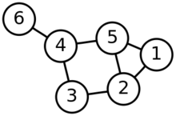

# 复杂网络链路预测

去年做的复杂网络链路预测，最近做一些之前没做的文档记录，基于这篇文章：吕琳媛. 复杂网络链路预测[J]. 电子科技大学学报, 2010, 39(5):651-661。该文章写的不错，可以作为复杂网络在链路预测方面的综述文章，本文是对该文的摘录和（数学）补充，重点在基于相似性的链路预测。[toc]<!--more-->
<h1>1. 问题描述</h1>
定义 $G(V,E)$ 是一个无向网络，其中 $V$ 为节点集合， $E$ 为边集合。网络总的节点数为 $N$ ，边数为 $M$ 。该网络共有 $N(N-1)/2$ 个节点对（若是有向图，网络最多有 $N(N-1)$ 个节点对），即全集 $U$ 。

给定一种链路预测的方法，对每对没有连边的节点对 $(x, y) ( \in U \setminus E)$ （这里 $\setminus$ 是集合中减法运算符）赋予一个分数值 $S_{xy}$ ，然后将所有未链接的节点对按照该分数从大到小排序，排名越靠前的节点对存在连边的概率最大。
<h1>2. 评价方法</h1>
为了测试算法准确性，将已知的连边 $E$ 分为训练集 $E^T$ 和测试集 $E^P$ 两部分。在计算分数值时只能使用测试集中的信息。显然 $E = E^T \cup E^P$ ，且 $E^T \cap E^P = \varnothing$ 。

这里，将属于 $U$ 但不属于 $E$ 的边定义为不存在的边。衡量链路预测算法精确度的指标有 AUC 、 Precision 和 Ranking Score 共3种，它们对预测精确度衡量的侧重点不同：
<ul>
	<li>AUC（area under the receiver operating characteristic curve）从整体上衡量算法的精确度；</li>
	<li>Precision：只考虑对排在前 $L$ 位的边是否预测准确；</li>
	<li>Ranking Score：更多考虑对所预测的边的排序。</li>
</ul>
<h2>2.1 AUC</h2>
AUC 可以理解为在测试集中的边的分数值有比随机的一个不存在的边的分数值高的概率。也就是说，每次随机从测试集中选取一条边与随机选择的不存在的边进行比较，如果测试集中的边的分数值大于不存在的边的分数值，就加1分；如果两个分数值相等，就加0.5分。独立地比较 $n$ 此，如果一有 $n'$ 次测试集中的边的分数值大于不存在的边的分数，有 $n''$ 次两分数值相等，则 AUC 定义为：

$$
\text{AUC} = \frac{n' + 0.5 n''} {n}
$$

显然，如果所有分数都是随机产生的， AUC $= 0.5$ 。因此， AUC 大于 $0.5$ 的程度衡量了算法在多大程度上比随机选择的方法精确。
<h2>2.2 Precision</h2>
Precision 定义为在前 $L$ 个预测边中被预测准确的比例。如果有 $m$ 个预测准确，即排在前 $L$ 的边中有 $m$ 个在测试集中，即 Precision 定义为：

$$
\text{Precision} = \frac{m}{L}
$$

显然， Precision 越大预测准确率越高。如果两个算法 AUC 相同，但算法1的 Precision 高于算法2，说明算法1更好，因为其倾向于把真正连边的节点对排在前面。
<h2>2.3 Ranking Score</h2>
Ranking Score 主要考虑测试集中的边在最终排序中的位置（值越大，测试集中的节点对的排名越靠前，反之靠后，是整体的趋势，并无预测准确的关系）。令 $H = U - E^T$ 为未知边的集合（相当于测试集中的边和不存在的边的集合）， $r_i$ 表示未知边 $i \in E^P$ 在排序中的排名。则该条未知边的 Ranking Score 值为 $RS_i = r_i / |H|$ ，其中 $|H|$ 表示集合 $H$ 中元素的个数遍历所有在测试集中的边，得到系统的 Ranking Score 值为：

$$
\text{RS} = \frac{1}{|E^P|} \sum_{i \in E^P} RS_i = \frac{1}{|E^P|} \sum_{i \in E^P} \frac{r_i}{|H|}
$$
<h1>3. 基于相似性的链路预测</h1>
基于节点间相似性，应用节点间的相似性进行链路预测的一个重要前提假设就是两个节点之间相似性（或者相近性）越大，它们之间存在链接的可能性就越大。

最简单的是直接利用节点的属性，比方说通过两个人的属性向量衡量相似性（计算向量距离得到），但这样考虑的是两个节点的相似程度，没考虑边。若放在网络中，每个点的所连接到的其它顶点都可视为属性，若有两个节点有着大量共有的节点，可以说这两个节点相似（即存在边的可能性更大），该方法称为基于共同邻居的相似性指标。这种相似性的定义完全基于网络的结构信息，故也称为<strong>结构相似性</strong>。
<h2>3.1 基于局部信息的相似性指标</h2>
这类方法中最简单的一种就是刚提到的<strong>基于共同邻居的相似性指标</strong>，基于这个指标衍生出很多计算相似性的方法。其中前 6 个是考虑两端节点度的影响，从不同角度的不同方式产生的 6 个相似性指标（第一列和第二列前 2 个）。
<table>
<tbody>
<tr>
<td style="text-align: center;" width="142"><strong>名称</strong></td>
<td style="text-align: center;" width="142"><strong>定义</strong></td>
<td style="text-align: center;" width="142"><strong>名称</strong></td>
<td width="142">

<strong>定义</strong>

</td>
</tr>
<tr>
<td width="142">共同邻居（CN）</td>
<td width="142">$$
S_{xy} = |\Gamma(x) \cap \Gamma(y)|
$$</td>
<td width="142">大度节点不利指标（HDI）</td>
<td width="142">$$
S_{xy} = \frac{|\Gamma(x) \cap \Gamma(y)|}{\max\{k(x),k(y)\}}
$$</td>
</tr>
<tr>
<td width="142">Salton指标</td>
<td width="142">$$
S_{xy} = \frac{|\Gamma (x) \cap \Gamma (y)|} {\sqrt{k(x) \times k(y)}}
$$</td>
<td width="142">LHN-I指标</td>
<td width="142">$$
S_{xy} = \frac{| \Gamma(x) \cap \Gamma (y)|}{k(x) \times k(y)}
$$</td>
</tr>
<tr>
<td width="142">Jaccard指标</td>
<td width="142">$$
S_{x,y}=\frac{|\Gamma(x) \cap \Gamma(y)|}{| \Gamma(x) \cup \Gamma(y) |}
$$</td>
<td width="142">优先链接指标（PA）</td>
<td width="142">$$
S_{xy} = k(x) \times k(y)
$$</td>
</tr>
<tr>
<td width="142">Sorenson指标</td>
<td width="142">$$
S_{xy} = \frac{2|\Gamma(x) \cap \Gamma(y)|}{k(x) + k(y)}
$$</td>
<td width="142">Adamic-Adar指标（AA）</td>
<td width="142">$$
S_{xy} = \sum_{z \in \Gamma(x) \cap \Gamma (y)} \frac{1}{\lg{k(z)}}
$$</td>
</tr>
<tr>
<td width="142">大度节点有利指标（HPI）</td>
<td width="142">$$
S_{xy} = \frac{|\Gamma(x) \cap \Gamma(y)|}{\min\{k(x),k(y)\}}
$$</td>
<td width="142">资源分配指标（RA）</td>
<td width="142">$$
S_{xy} = \sum_{z \in \Gamma(x) \cap \Gamma (y)} \frac{1}{k(z)}
$$</td>
</tr>
</tbody>
</table>
上表中，总结的 10 种均是基于局部信息的相似性指标的定义公式。下面说明下符号含义：
<ul>
	<li> $S_{xy}$ 表示 $x$ 与 $y$ 两个节点构成边的概率值（或者分数值，越大构成边的概率越高）；</li>
	<li>对于网络中的节点 $x$ ，定义它的邻居为 $\Gamma ( x )$ ， $k ( x ) = \Gamma ( x )$ 为节点 $x$ 的度；</li>
	<li>$\Gamma(x)$ 与 $\Gamma(y)$ 分别表示节点 $x$ 与 $y$ 联接的节点集合。</li>
</ul>
<h3>3.1.1 共同邻居（CN）</h3>

$$
S_{xy} = |\Gamma(x) \cap \Gamma(y)|
$$

<ul>
	<li>$\Gamma(x)$ 与 $\Gamma(y)$ 分别表示节点 $x$ 与 $y$ 联接的节点集合，而经过取交集后，就是两个节点共有的邻居点集合，再计算这个共同邻居节点集合的元素个数。得到共同邻居。</li>
	<li>$S_{xy}$ 值的范围在 $0$ （即没有共同的邻居）到所有节点个数（即两个节点的邻居们完全一样）。</li>
</ul>
<h3>3.1.2 Salton 指标（余弦相似性）</h3>
$$
S_{xy} = \frac{|\Gamma (x) \cap \Gamma (y)|} {\sqrt{k(x) \times k(y)}}
$$
<ul>
	<li>这个 Salton 指标可以看成是上一个共同邻居计算完成后，再将该结果除以这两个节点的度的乘积的开方。</li>
	<li>$S_{xy}$ 值的范围在 $0$ （即没有共同的邻居）到所有节点个数的开平方（即两个节点的邻居们完全一样）。</li>
</ul>
<h3>3.1.3 Jaccard 指标</h3>
$$
S_{x,y}=\frac{|\Gamma(x) \cap \Gamma(y)|}{| \Gamma(x) \cup \Gamma(y) |}
$$
<ul>
	<li>与 Salton 指标的计算形式类似，分子部分仍旧是两个节点的共同邻居数，而这里分母则是两个节点邻居节点的并集。</li>
	<li>$S_{xy}$ 值的范围在无法计算（即没有共同的邻居，上述公式的分母部分为 $0$ ）到 $1$ （即两个节点的邻居们完全一样）之间。此外，可以发现分子（两个节点的邻居的交集的元素个数）要小于等于分母（两个节点的邻居的并集的元素个数）。那就有 $S_{xy}$ 的取值要么在 $(0, 1]$ 上，要么是无法计算（没有共同邻居，分母为 $0$ ）。</li>
</ul>
<h3>3.1.4 Sorenson 指标</h3>
$$
S_{xy} = \frac{2|\Gamma(x) \cap \Gamma(y)|}{k(x) + k(y)}
$$
<ul>
	<li>同样分子是共同邻居的个数，不过是两倍，考虑到分母是两个节点的度加和的形式，分子是两倍也就很好理解了（以上包括后面的公式中，分母的作用一般都是用于规范化，将值锁定在一个固定的区间上）。</li>
	<li>$S_{xy}$ 值的范围为 $(0,1]$ ，不可能为 $0$ （此时分母为 $0$ ），但可能为 $1$ （两个节点拥有的邻居完全一样，对应的度也必然相同）。</li>
</ul>
<h3>3.1.5 大度节点有利指标（HPI）</h3>
$$
S_{xy} = \frac{|\Gamma(x) \cap \Gamma(y)|}{\min\{k(x),k(y)\}}
$$
<ul>
	<li>这里称为大度节点有利，与下面的不利对应。简单解释下，假设有边 $a$ 和边 $b$ ，这两条边各自存在共同邻居，但 $a$ 边中两个节点的度比 $b$ 边中两个节点的度都要小，使用上述公式，那么边 $a$ 的存在概率 $S_{a}$ 要大于边 $b$ 的存在概率 $S_{b}$ 。</li>
	<li>换句话说，在共同邻居数目相同的情况下，边存在的概率取决于这条边中（某节点）的度。</li>
	<li>$S_{xy}$ 值的范围为 $[0,1]$ ， $0$ 是没有共同邻居， $1$ 则表示两个节点的共同邻居是度最小的那个节点的所有邻居。</li>
</ul>
<h3>3.1.6 大度节点不利指标（HDI）</h3>
$$
S_{xy} = \frac{|\Gamma(x) \cap \Gamma(y)|}{\max\{k(x),k(y)\}}
$$
<ul>
	<li>与上一个相反。</li>
	<li>$S_{xy}$ 值的范围为 $[0,1]$ 。</li>
</ul>
<h3>3.1.7 LHN-I 指标</h3>
$$
S_{xy} = \frac{| \Gamma(x) \cap \Gamma (y)|}{k(x) \times k(y)}
$$
<ul>
	<li>分子是两个节点的共同邻居，分母是两个节点的度的乘积。</li>
	<li>$S_{xy}$ 值的范围为 $[0,1]$ 。只考虑极端情况，当不存在共同邻居时， $S_{xy}$ 的值为 $0$ ，当有一个共同邻居，且两个节点的度数均为 $1$ 时， $S_{xy}$ 的值为 $1$ ，而当两个节点的度数大于 $1$ 时， $S_{xy}$ 的就会变小，但总是在 $[0,1]$ 上。</li>
</ul>
<h3>3.1.8 优先链接指标（PA）</h3>
$$
S_{xy} = k(x) \times k(y)
$$
<ul>
	<li>只考虑两个节点的度数关系，不考虑局部的结构信息（共同邻居）。想法是：如果两个节点的度数越大（将度视为一种属性），那么可能就越相似。</li>
</ul>
<h3>3.1.9 Adamic-Adar 指标（AA）</h3>
$$
S_{xy} = \sum_{z \in \Gamma(x) \cap \Gamma (y)} \frac{1}{\lg{k(z)}}
$$
<ul>
	<li>个人觉得该算法的思想是：依次在两层，分别用两种不同的相似指标计算。第一层（即共同邻居）是基于共同邻居节点的集合（存在共同邻居，越相似，这一步相当于过滤筛选），第二层是基于度（两个节点的度越大，越相似）。</li>
	<li>此外， $\frac{1}{\lg k(z)}$ 也相当于将信息传播出去的权重。</li>
</ul>
<h3>3.1.10 资源分配指标（RA）</h3>
$$
S_{xy} = \sum_{z \in \Gamma(x) \cap \Gamma (y)} \frac{1}{k(z)}
$$
<ul>
	<li>与上一种方法类似，不同在于传播的权重为 $\frac{1}{k(z)}$。</li>
</ul>
<h2>3.2 基于路径的相似性指标</h2>
基于路径的相似性指标有3个：局部路径指标（LP）、 Katz 指标和 LHN-II 指标。
<h3>3.2.1 局部路径指标（LP）</h3>
局部路径指标（local path，LP），是在共同邻居指标的基础上考虑三阶邻居的贡献，其定义为 $S = A^2 + \alpha A^3$ ，其中 $\alpha$ 为可调节参数，用于控制三阶路径的作用。当 $a = 0$ 时， LP 指标就等于共同邻居（CN） 。其中 $A$ 为网络的邻接矩阵。注意，$( A^n )_{xy}$ 表示节点 $x$ 和 $y$ 之间长度为 $n$ 的路径数（这里的“路径数”即 $n$ 前面说的阶数，如 CN 的路径数是二阶）。
<h3>3.2.2 Katz 指标</h3>
CN 考虑的是二阶路径（两节点的邻居）， LP 考虑的是三阶路径，那么可以说该指标考虑的是所有路径数（即 n 阶路径）。对短路径赋予较大权重，长路径赋予较小权重。定义为 $S = \beta A + \beta^2 A^2 + \beta^3 A^3 + ... = (I - \beta A)^{-1} - I$ （这里的 $ I $ 是单位矩阵，即主对角线上的元素均为 $1$ ，其余元素均为 $0$），其中 $\beta$ 为权重衰减因子，为了保证数列的收敛性， $\beta$ 的取值须小于邻接矩阵 $A$ 最大特征值的倒数。
<blockquote><strong>如何求解矩阵 $A$ 的最大特征值
</strong>1. 计算出 $A$ 的特征多项式 $|A -\lambda E|$（这里的 $ I $ 是单位矩阵，即主对角线上的元素均为 $1$ ，其余元素均为 $0$ 。单位矩阵通常用 $E$ 或 $I$ 来表示）；
2. 求出特征方程 $|A - \lambda_i E|=0$ 的全部根 $\lambda_i$ ；
3. 找出全部根 $\lambda_i$ 中最大的即最大特征根。
补充：若要求解特征方程，还需要：将 $\lambda_i$ 代入 $(A-\lambda_i E)X=0$ 求出基础解系，即得 $A$ 的对应于 $\lambda_i$ 的特征向量，而基础解系的线性组合为 $A$ 的对应于 $\lambda_i$ 的全部特征向量。

例 求解矩阵 $A = \begin{pmatrix}
3 &amp; -1 \\
-1 &amp; 3
\end{pmatrix}$ 的最大特征值。

解：计算特征多项式方程，即
$$
|A - \lambda E| = \begin{vmatrix}
3-\lambda &amp; -1 \\
-1 &amp; 3-\lambda
\end{vmatrix}
=(3-\lambda)^2 - 1
=0
$$

解得 $A$ 的两个特征值： $\lambda_1 = 4, \lambda_2 = 2$ 。最大的特征值是 $\lambda_1 = 4$ 。

<strong>如何求解矩阵 $A$ 的逆矩阵 $A^{-1}$
</strong>

参考：【图文】计算方法之计算矩阵的特征值和特征量_百度文库
http://wenku.baidu.com/link?url=ffhzuCGJZ8gOy31EHJyQuTedr_rq-gitPpwF7w1S_aldBK-cJ8MiwDH02cvjkJKLfQw2X7adMLg0KQ5nwcdeSX5nih_xwVGJ9o2t9dJoxf7

<strong>计算逆矩阵的方法有四种</strong>
<ol>
	<li>用公式，若 $|A| \neq 0$ ，则 $A^{-1} = \frac{1}{|A|} A^*$ ，其中 $A^*$ 为矩阵 $A$ 的伴随矩阵；</li>
	<li>初等变换法：将 $(A | E)$ 的形式经由初等变换变为 $(E|A^{-1})$ 的形式；</li>
	<li>用定义求 $B$ ，使 $AB = E$ 或 $BA = E$ ，则 $A$ 可逆，且 $A^{-1} = B$ ；</li>
	<li>用分块矩阵。这里我省略下。</li>
</ol>
参考：考研数学《复习全书》</blockquote>
<h3>3.2.3 LHN-II 指标</h3>
该指标与 Katz 参数类似，也是考虑所有路径，不同在于 LHN-II 中每一项不再是 $(A^n)_{xy}$ ，而变为 $(A^n)_{xy} / E[(A^n)_{xy}]$ ，其中 $E[(A^n)_{xy}] = \frac{k_x k_y}{M} \lambda_1^{n-1}$ 为节点 $x$ 和 $y$ 之间长度为 $n$ 的路径数的期望值。整理后得到 LHN-II 的最终表达式为 $S=M \lambda_1 D^{-1} \left ( I - \frac{\phi A}{\lambda_1} \right )^{-1} D^{-1}$ ，其中 $\lambda_1$ 为 $A$ 的最大特征值， $\phi$ 为参数取值小于 $1$ ， $M$ 为网络边数， $D$ 这里没有写到。
<h2>3.3 基于随机游走的相似性指标</h2>
<strong>有一类相似性算法是基于随机游走定义的</strong>：平均通勤时间（average commute time）、Cos+ 指标、有重启的随机游走（random walk with restart）、SimRank 指标，以及新提出的两种基于局部随机游走的指标。
<h3>3.3.1 平均通勤时间（average commute time，ACT）</h3>
设 $m(x,y)$ 为一个随机粒子从节点 $x$ 到节点 $y$ 需要走的平均步数，则节点 $x$ 和 $y$ 的平均通勤时间定义为：

$$
n(x,y) = m(x,y) + m(y, x)
$$

其数值解可通过求该网络拉普拉斯矩阵的伪逆 $L^+$ 获得，即：

$$
n(x, y) = M(l^+_{xx}  + l^+_{yy} - 2l^+_{xy})
$$
<blockquote><strong>拉普拉斯矩阵的计算方法</strong>

给定一个有 $n$ 个顶点的图 $G$ ，它的拉普拉斯矩阵 $L:=(l_{i,j})_{n \times n}$ ，定义为：
$$L = D - A$$
其中 $D$为图的度矩阵， $A$ 为图的邻接矩阵。度矩阵在有向图中，只需要考虑出度或者入度中的一个。除了提到的计算方法外，经过计算有如下发现：
<ol>
	<li>若 $i = j$ ，则 $l_{i,j} = deg(v_i)$ ，$deg(v_i)$ 为顶点 $v_i$ 的度；</li>
	<li>若 $i \neq j$ ，但顶点 $v_i$ 和顶点 $v_j$ 相邻，则 $l_{i, j} = -1$ ；</li>
	<li>其它情况： $l_{i,j} = 0$ 。</li>
</ol>
<strong>例</strong> 计算图 $G$ 的拉普拉斯矩阵，图 $G$ 如下：

其对应的度矩阵为：
$$
\begin{pmatrix}
2 &amp; 0 &amp; 0 &amp; 0 &amp; 0 &amp; 0\\
0 &amp; 3 &amp; 0 &amp; 0 &amp; 0 &amp; 0\\
0 &amp; 0 &amp; 2 &amp; 0 &amp; 0 &amp; 0\\
0 &amp; 0 &amp; 0 &amp; 3 &amp; 0 &amp; 0\\
0 &amp; 0 &amp; 0 &amp; 0 &amp; 3 &amp; 0\\
0 &amp; 0 &amp; 0 &amp; 0 &amp; 0 &amp; 1
\end{pmatrix}
$$
其对应的邻接矩阵为：
$$
\begin{pmatrix}
0 &amp; 1 &amp; 0 &amp; 0 &amp; 1 &amp; 0\\
1 &amp; 0 &amp; 1 &amp; 0 &amp; 1 &amp; 0\\
0 &amp; 1 &amp; 0 &amp; 1 &amp; 0 &amp; 0\\
0 &amp; 0 &amp; 1 &amp; 0 &amp; 1 &amp; 1\\
1 &amp; 1 &amp; 0 &amp; 1 &amp; 0 &amp; 0\\
0 &amp; 0 &amp; 0 &amp; 1 &amp; 0 &amp; 0
\end{pmatrix}
$$
由 $L = D - A$ 得拉普拉斯矩阵为：
$$
\begin{pmatrix}
2 &amp; -1 &amp; 0 &amp; 0 &amp; -1 &amp; 0 \\
-1 &amp; 3 &amp; -1 &amp; 0 &amp; -1 &amp; 0 \\
0 &amp; -1 &amp; 2 &amp; -1 &amp; 0 &amp; 0 \\
0 &amp; 0 &amp; -1 &amp; 3 &amp; -1 &amp; -1\\
-1 &amp; -1 &amp; 0 &amp; -1 &amp; 3 &amp; 0 \\
0 &amp; 0 &amp; 0 &amp; -1 &amp; 0 &amp; 1
\end{pmatrix}
$$

<strong>矩阵伪逆的计算方法</strong>

$A$ 为 $m \times n$ 矩阵， $r$ 代表矩阵的秩。
<ul>
	<li>若矩阵 $A$ 是方阵，且 $|A| \neq 0$ ，则存在 $AA^{-1} = E$ ；</li>
	<li>若 $A$ 不是方阵，或者 $|A| = 0$ ，那么只能求 $A$ 的伪逆，伪逆的计算有三种方法（SVD，QR，直接求解）。</li>
</ul>
这里只给出直接求解方法的公式：
$$A^{-1} = (A^TA)^{-1} A^T$$

参考：矩阵的逆、伪逆、左右逆，最小二乘，投影矩阵
http://www.cnblogs.com/AndyJee/p/5082508.html
求伪逆的三种方法：直接，SVD，QR
http://www.blogbus.com/shijuanfeng-logs/238839798.html</blockquote>
<h3>3.3.2 基于随机游走的余弦相似性（Cos+）</h3>
在向量 $v_x = \Lambda^{\frac{1}{2}} U^T e_x$ 展开的欧式空间内， $L^+$ 中的元素 $l_{xy}^+$ 可表示为两个向量 $v_x$ 和 $v_y$ 的内积，即 $l^+_{xy} = v^T_x v_y$ ，其中 $U$ 是一个标准正交矩阵，是由 $L^+$ 特征向量按照对应的特征根从大到小排列所得， $\Lambda$ 为以特征根为对角元素的对角矩阵，上标 $T$ 表示矩阵转置， $e_x$ 表示一个一维向量且只有第 $x$ 个元素为 $1$ ，其他都为 $0$ 。由此定义余弦相似性为：

$$
S_{xy}^{cos+} = cos(x,y)^+ = \frac{l_{xy}^+}{l_{xx}^+ l_{yy}^+}
$$
<blockquote><strong>内积与欧式空间</strong>

<strong>定义</strong> 设 $V$ 是一个实线性空间，如果对于 $V$ 中任意两个向量 $\alpha$ 和 $\beta$ 都指定了一个实数与之对应，这个实数记作 $&lt;\alpha, \beta&gt;$ ，且满足以下条件：
<ol>
	<li><strong>对称性</strong>： $&lt;\alpha, \beta&gt; = &lt;\beta, \alpha&gt;$ ；</li>
	<li><strong>齐次性</strong>： $&lt;k \alpha, \beta&gt; =k &lt;\alpha, \beta&gt;$ ；</li>
	<li><strong>加性</strong>： $&lt;\alpha + \beta, \gamma&gt; = &lt;\alpha, \gamma&gt; + &lt;\beta, \gamma&gt;$ ；</li>
	<li><strong>非负性</strong>： $&lt;\alpha, \alpha&gt; \geq 0$ ，等号成立的充分必要条件是 $\alpha = 0$ 。</li>
</ol>
其中， $\alpha$ 和 $\beta$ 是 $V$ 中任意向量， $k$ 是任意实数，则称<strong>实数 $&lt;\alpha, \beta&gt;$ 为 $\alpha$ 和 $\beta$ 的内积</strong>，称定义了内积的实线性空间 $V$ 为<strong>实内积空间或欧几里得空间</strong>，简称<strong>欧式空间</strong>。

参考：第二节 欧式空间的基本概念
http://wenku.baidu.com/link?url=nTkZNhmA9zdKhfX7bkZKtqAGk0Ahq7ZON5aF_2YWk_Jh-Jyn8OkjRL_cxeQgSeGVGAeRF5Yr8EKLvJ58bnPmrPmu3g-kuDQm1SRfyAxgAH_

<strong>Schmidt 正交化（正交规范化方法）</strong>

设向量组 $\alpha_1,\alpha_2,\alpha_3$ 线性无关，其正交规范化方法步骤如下：
令 $\beta_1 = \alpha_1$
$$
\beta_2 = \alpha_2 - \frac{(\alpha_2, \beta_1)}{(\beta_1, \beta_1)} \beta_1 \\
\beta_3 = \alpha_3 - \frac{(\alpha_3, \beta_1)}{(\beta_1, \beta_1)} \beta_1 - \frac{(\alpha_3, \beta_2)}{(\beta_2, \beta_2)} \beta_2
$$
则 $\beta_1, \beta_2, \beta_3$ 两两正交。再将 $\beta_1, \beta_2, \beta_3$ 单位化，取
$$
\gamma_1 = \frac{\beta_1}{|\beta_1|}, \gamma_2 = \frac{\beta_2}{|\beta_2|}, \gamma_3 = \frac{\beta_3}{|\beta_3|}
$$
则 $\gamma_1 , \gamma_2, \gamma_3$ 是正交规范化向量组（即两两正交且均是单位向量）。

<strong>正交矩阵
</strong>

设 $A$ 是 $n$ 阶矩阵，满足 $AA^T = A^TA = E$ ，则 $A$ 是正交矩阵。
$A$ 是正交矩阵 $\Leftrightarrow A^T \Leftrightarrow A^{-1} \Leftrightarrow A$ 的列（行）向量组是正交规范向量组。
如 $A$ 是正交矩阵，则行列式 $|A| = 1$ 或 $-1$ 。

<strong>标准正交矩阵</strong>：不理解，猜测是正交规范化后的正交矩阵。

<strong>对角矩阵</strong>

<strong>定义</strong> 是一个主对角线以外的元素皆为 $0$ 的矩阵。</blockquote>
<h3>3.3.3 重启的随机游走（random walk with restart）</h3>
该指标可以看成是网页排序算法（PageRank）的拓展应用，其假设随机游走粒子每走一步时都以 $1-c$ 的概率返回初始位置。 $P$ 为网络的马尔科夫概率转移矩阵，其元素 $P_{xy} = a_{xy} / k_x$ 表示节点 $x$ 处的粒子下一步走到节点 $y$ 的概率。如果 $x$ 和 $y$ 相连则 $a_{xy}=1$ ，否则为 $0$ 。某一粒子初始时刻在节点 $x$ 处，则 $t+1$ 时刻该粒子到达网络各个节点的概率向量为：

$$
q_x(t+1) = c P^T q_x (t) + (1-c) e_x
$$

式中 $e_x$ 表示初始状态（其定义与 cos+ 中相同）。不难得到上式的<strong>稳态解</strong>为 $q_x = (1-c)(I - cP^T)^{-1} e_x$ ，其中元素 $q_{xy}$ 为从节点 $x$ 出发的粒子最终以多少概率走到节点 $y$ 。由此定义 RWR 相似性为：

$$
S_{xy}^{RWR} = q_{xy} + q_{yx}
$$
<blockquote><strong>模型的稳态解</strong>

这个模型是指的数理模型，包括数学模型和物理模型，所谓的数学模型是指的各种方程和公式，用以描述该化学或者物理过程中各种物理量发生的变化和守恒情况。物理模型通常是指的对该问题的描述和简化，包括假设条件和边界条件。
<strong>稳态解是相对于瞬时解或者说是动态解来说的</strong>，另外在模拟过程中还有冷态和热态的说法，这个概念就不一样了。扯远了。<strong>所谓的稳态解是指的在整个物理或者化学过程中，各种量达到一种平衡时的解</strong>。也就是模拟计算时依据和得到的数据都是正常开工情况下的数据。此时因为各种物理量都基本达到平衡，数据波动很小。而<strong>瞬时解</strong>模拟的是开工时的状态，也就是各种物理量均未达到平衡。各种量都存于变化的状态，数据波动大。

参考：什么叫模型的稳态解?急！！！！_百度作业帮
http://www.zybang.com/question/623813384b0b084631ceaad9f8b9f817.html</blockquote>
关于 RWR 的一种快速算法参见原文的文献[41]，该指标已被应用于推荐系统的算法研究中[42] 。
<h3>3.3.4 SimRank（SimR）</h3>
SimRank 指标简称 SimR 。它的基本假设是，如果两节点所连接的节点相似，则该两节点相似。它的自洽定义式为：

$$
S_{xy}^{SimR} = C\frac{\sum_{z \in \Gamma(x)} \sum_{z' \in \Gamma(y)} S_{zz'}^{SimR} }{k_x k_y}
$$

式中 假定 $s_{xx} = 1 ; C \in [0,1]$ 为相似性传递时的衰减参数。 SimR 指标可以用于描述两个分别从节点 $x$ 和 $y$ 出发的粒子何时相遇。
<h3>3.3.5 局部随机游走指标（local random walk，LRW）</h3>
该指标与上述 4 种基于随机游走的相似性不同，其只考虑有限步数的随机游走过程。一个粒子 $t$ 时刻从节点 $x$ 出发，定义 $\pi_{xy} ( t )$ 为 $t+1$ 时刻这个粒子正好走到节点 $y$ 的概率，那么可得到系统演化方程：

$$
\pi_x(t+1) = P^T \pi_x (t), t \geq 0
$$

式中 $\pi_x (0)$ 为一个 $N \times 1$ 的向量，只有第 $x$ 个元素为 $1$ ，其他为 $0$ ，即 $\pi_x (0) = e_x$ 。设定各个节点的初始资源分布为 $q_x$ ，基于 $t$ 步随机游走的相似性为：

$$
S_{xy}^{LRW} (t) = q_x \cdot  \pi_{xy}(t) + q_y \cdot  \pi_{yx}(t)
$$
<h3>3.3.6 叠加的局部随机游走指标（superposed random walk，SRW）</h3>
叠加的局部随机游走指标（superposed random walk）简称 SRW  。在 LRW 的基础上将 $t$ 步及其以前的结果加总便得到 SRW 的值，即：

$$
S_{xy}^{SRW}(t) = \sum_{l=1}^{t} S_{xy}^{LRW} (l) = q_x \sum_{l=1}^{t} \pi_{xy}(l) + q_y \sum_{l=1}^{t} \pi_{yx}(l)
$$

这个指标的目的就是给邻近目标节点的点更多的机会与目标节点相连。
<h2>3.4 权重在链路预测中的作用</h2>
<strong>含权网络的链路预测</strong>是一个重要方向，但目前还没有系统的工作，虽然没有关于含权链路预测的明确答案，但这里将 3 种局部算法 CN 、 AA 和 RA 拓展为含权形式，定义如下：

$$
S_{xy}^{WCN} = \sum_{z \in \Gamma (x) \cap \Gamma (y)} w(x,z)^\alpha + w(z,y)^\alpha \\
S_{xy}^{WAA} = \sum_{z \in \Gamma (x) \cap \Gamma (y)} \frac{w(x,z)^\alpha + w(z,y)^\alpha}{\lg(1+s(z))} \\
S_{xy}^{WRA} = \sum_{z \in \Gamma (x) \cap \Gamma (y)} \frac{w(x,z)^\alpha + w(z,y)^\alpha}{s(z)}
$$

式中， $w(x,y)$ 为连接节点 $x$ 和 $y$ 的连边的权重； $s(x) = \sum_{z \in \Gamma(x)} w(x,z)^{\alpha}$ 为节点 $x$ 的强度（我想这里也可以换成计算节点 $y$ 的强度，换汤不换药）； $\alpha$ 参数用于调节权重在预测中的作用，当 $\alpha = 0$ 时， WCN 、 WAA 和 WRA 指标分别回到各自不含权的形式。
<h1>4. 基于最大似然估计的链路预测</h1>
链路预测的另一类方法是基于最大似然估计的。基于最大似然估计方法的一个最大问题是计算复杂度太高,因此并不适合在规模较大的网络中应用。这里主要提出两种模型（这里不给出具体实现了，详细实现可以参考原文）：
<ol>
	<li>层次结构模型</li>
	<li>随机分块模型</li>
</ol>
虽然随机分块模型的平均表现要好于层次结构模型，尤其是预测错误连边时，但二者都存在计算时间复杂度高的情况。
<h1>5. 概率模型</h1>
运用概率模型进行链路预测的基本思路就是建立一个含有一组可调参数的模型，然后使用优化策略寻找最优的参数值，使得所得到的模型能够更好地再现真实网络的结构和关系特征，网络中两个未连边的节点对连边的概率就等于在该组最优参数下它们之间产生连边的条件概率。如果将边的存在性（存在或不存在）看成是边的一种属性,那么链路预测问题就转变为预测边的属性问题 [47] 。

两个常用的框架为概率关系模型框架（probabilistic relational models）和有向无环概率实体关系框架（directed acyclic probabilistic entity relationship） 。它们的区别在于对数据库的表达方式不同，前者基于关系模型（relational models），后者基于实体关系模型（entity-relationship model）。

概率模型的优势在于较高的预测精确度，它不仅使用了网络的结构信息还涉及节点的属性信息。但是计算的复杂度以及非普适性的参数使其应用范围受到限制。
<h1>6. 总结与展望</h1>
每种方法都有各自的优势和局限性，基于最大似然估计虽然也是基于网络结构，但针对了整个网络结构不单纯局限于某一方面，但计算复杂度高，用于大规模网络的可能性较低。概率模型是传统的数据挖掘模型，考虑网络结构和节点信息，但同样也是计算复杂性以及外在的节点属性获取的难度，造成不具有普适性。

复杂网络研究包括很多科学分支，其中部分研究立足于揭示网络演化的驱动因素。仅以无标度网络（scale-free networks）为例，已报道的可产生幂律度分布的机制就包括了富者愈富（rich-get-richer）机制 、好者变富（good-get-richer）机制 、优化设计（optimal design）驱动、哈密顿动力学（hamiltonian dynamics）驱动、聚生（merging and regeneration）机制、稳定性限制（stability constraints）驱动等等。
<blockquote><strong>幂律分布</strong>

自然界与社会生活中存在各种各样性质迥异的幂律分布现象，因而对它们的研究具有广泛而深远的意义。借助于有效的物理和数学工具以及强大的计算机运算能力，科学家们对幂律分布的本质有了进一步深层次的理解。数学模型 $y=cx^{-r}$。</blockquote>
基于网络结构的链路预测方法有望在网络理论的帮助下得到发展和完善：一方面是如何以网络系综理
论为基础，建立网络链路预测的理论框架，并产生对实际预测有指导作用的理论结论；另一方面是如何通过网络的结构信息，借助复杂网络的分析工具，设计高效的算法处理大规模网络的链路预测问题。此外，前尚缺乏对于大规模真实数据在应用层面的深入分析和研究。
