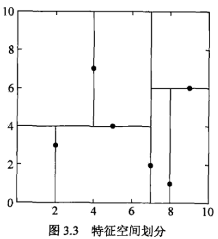
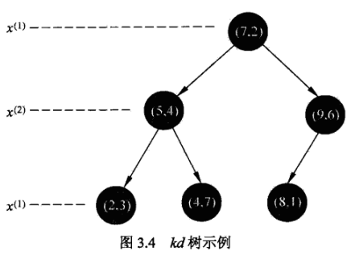
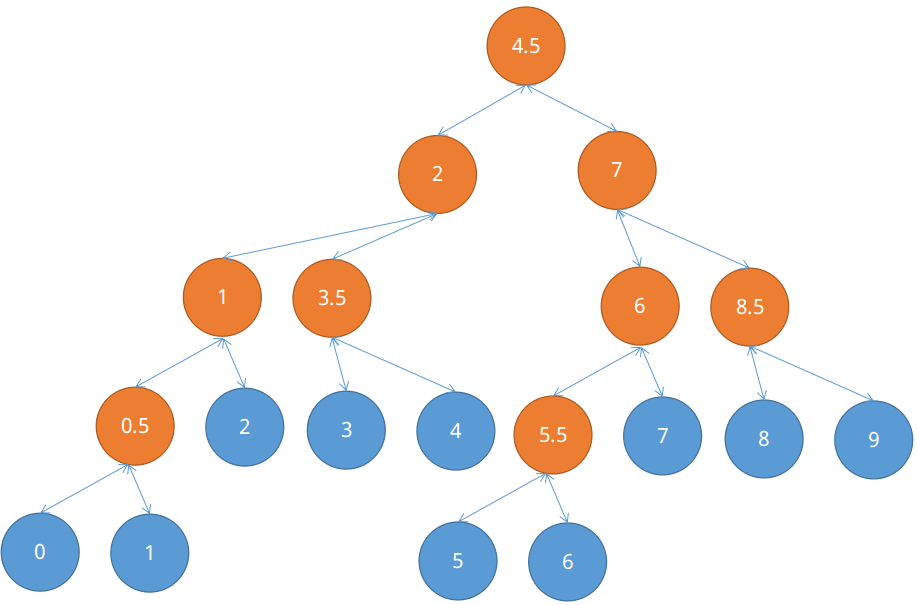
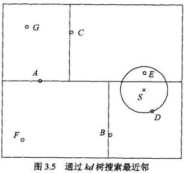

# 【未完待续】k近邻法系列2：kd树的构造、搜索与 Python 实现

实现 k 近邻法时，主要考虑的问题是如何对训练数据集进行快速 k 近邻搜索，这点在特征空间的维数较大及训练数据容量大是有其必要。

k 近邻法最简单的实现方法是线性扫描（linear scan），这时要计算输入实例与每一个训练实例的距离，当训练集很大时计算非常耗时，这种方法是不可行的。

为了提高 k 近邻搜索的效率，可以考虑使用特殊的结构存储训练数据以减少计算距离的次数，具体方法很多，下面介绍其中的 kd 树方法（ kd 树是存储 k 维空间数据的树结构，这里的 k 与 k 近邻法的 k 意义不同）。[toc]<!--more-->
<h1>1. 构造 kd 树</h1>
kd 树是一种对 k 维空间中的实例点进行存储以便对其进行快速检索的树形数据结构， kd 树是二叉树，表示对 k 维空间的一个划分（partition），构造 kd 树相当于不断地用垂直于坐标轴的超平面将 k 维空间切分，构成一系列的 k 维超矩形区域。kd 树的每一个节点对应于一个 k 维超矩形区域。

<strong>构造 kd 树的方法如下</strong>：
<ul>
<li>构造根节点，使根节点对应于 k 维空间中包含所有实例点的超矩形区域；</li>
<li>通过下面的递归方法，不断地对 k 维空间进行切分，分成子节点，在超矩形区域（结点）上选择一个坐标轴和在此坐标轴上的一个切分点，确定一个超平面，这个超平面通过选定的切分点并垂直于选定的坐标轴，将当前超矩形区域切分为左右两个子区域（子节点）；</li>
<li>这时，实例被分到两个子区域。这个过程直到子区域内没有实例时终止（终止时的节点为叶结点）。在此过程中，将实例保存在相应的结点上。</li>
</ul>
通常，依次选择坐标轴对空间切分，<strong>选择训练实例点在选定坐标轴上的中位数</strong>（median，一组数据按大小顺序排列，处在中间位置的一个数或最中间两个数的平均值）<strong>为切分点，这样得到的 kd 树是平衡的</strong>。注意，<strong>平衡的 kd 树搜索时的效率未必是最优的</strong>。

下面给出构造 kd 树的算法：
<h2>1.1 算法2 构造平衡 kd 树</h2>
<ul>
<li>输入： k 维空间数据集 $T=\{x_1, x_2, ..., x_N\}$ ，其中 $x_i = (x_i^{(1)},x_i^{(2)}, ...,x_i^{(k)}), i=1,2,..., N$ ；</li>
<li>输出： kd 树。</li>
</ul>
<ol>
<li>开始：构造根结点，根结点对应于包含 $T$ 的 k 维空间的超矩形区域。选择 $x^{(1)}$ 为坐标轴，以 $T$ 中所有实例的 $x^{(1)}$ 坐标的中位数为切分点，将根结点对应的超矩形区域切分为两个子区域。切分通过切分点并与坐标轴 $x^{(1)}$ 垂直的超平面实现。
由根节点生成深度为 $1$ 的左、右子节点：左子结点对应坐标 $x^{(1)}$ 小于切分点的子区域，右子节点对应于坐标$x^{(1)}$ 大于切分点的子区域。
将落在切分超平面上的实例点保存在根节点。</li>
<li>重复：对深度为 $j$ 的结点，选择 $x^{(l)}$ 为切分的坐标轴， $l=j(mod k ) + 1$ ，以该结点的区域中所有实例的 $x^{(l)}$ 坐标的中位数为切分点，将该结点对应的超矩形区域切分为两个子区域。切分由通过切分点并与坐标轴 $x^{(l)}$ 垂直的超平面实现。
由该结点生成深度为 $j+1$ 的左、右子结点：左子结点对应坐标 $x^{(l)}$ 小于切分点的自区域，右子结点对应坐标 $x^{(l)}$ 大于切分点的子区域。
将落在切分超平面上的实例点保存在该结点。</li>
<li>直到两个子区域没有实例存在时停止。从而形成 kd 树的区域划分。</li>
</ol>
<h2>1.2 例题</h2>
例2 给定一个二维空间的数据集：$T = \{(2,3)^T, (5,4)^T, (9,6)^T, (4,7)^T, (8,1)^T, (7,2)^T\}$ 构造平衡 kd 树。

<strong>特征空间划分</strong>

解：根节点对应包含数据集 $T$ 的矩形，选择 $x^{(l)}$ 轴，6 个数据点的 $x^{(l)}$ 坐标的中位数是 7 ，以平面 $x^{(1)}=7$ 将空间分为左、右两个子矩形（子结点）。接着，左矩形以 $x^{(2)}=4$ 分为两个子矩形，右矩形以 $x^{(2)}=6$ 分为两个子矩形，如此递归，最后得到如下图所示的特征空间划分和 kd 树。

<strong>构造出的 kd 树</strong>

<h2>1.3 Python 代码</h2>
<strong>首先并没有实现 kd 树</strong>，而是实现了一个以中位数作为当前列表划分的二叉树（即一个不正确的示例，按理说每个结点都应该是一个实例，而不是说只有叶子），结点是当前这组数的中位数，<strong>叶子是每个实例（叶子数量 = 实例数量）</strong>，即除叶子以外的结点都是当前所在层划分的中位数。实现的是一个一维的结构，代码如下：
<h3>1.3.1 一个不正确的代码示例</h3>
首先声明，该代码不具有扩展性，仅适应于一维特征的情况（既然是写错的示例，也就无所谓啦）。

<strong>0到9十个数字构成的错误二叉树</strong>

不正确的地方在于：
<ol>
<li><strong>叶子结点作为实例点是错误的。</strong>而叶子以前的结点只是那一层实例集的中位数；</li>
<li><strong>最近邻的计算是错误的。</strong>计算得到的是近似最近邻，具体分析详见后文中 <strong>搜索 kd 树 </strong>给出的配图。</li>
</ol>
<h3>1.3.2 构造 kd 树简化版代码</h3>
这里的简化，是与后面搜索 kd 树时候的代码相比而言的，同时在实现上更加精简——基于一个 Node 类的构造函数递归地来构造 kd 树。具体看代码吧！
<h1>2. 搜索 kd 树</h1>
下面介绍如何利用 kd 树进行 k 近邻所有。通过 kd 树可省去大部分数据点的搜索，减少搜索计算量（用空间换时间）。这里以最近邻为例加以叙述，同样的方法还可以应用到 k 近邻。

<strong>给定一个目标点，搜索其最近邻的流程</strong>：
<ol>
<li>首先找到包含目标点的叶结点；</li>
<li>然后从该叶结点出发，依次退回到父节点；</li>
<li>不断查找与目标点最近邻的结点，当确定不可能存在更近邻的结点时终止。</li>
</ol>
这样搜索就被限制在空间的局部区域上，效率大为提高。

<strong>特征空间划分</strong>

包含目标点的叶结点对应包含目标点的最小超矩形区域：<strong>以此叶结点的实例点为当前最近点。目标点的最近邻一定在以目标点为中心并通过当前最近点的超球体的内部</strong>（如上图）。<strong>然后返回当前结点的父结点，如果父结点的另一子结点的超矩形区域与超球体相交，那么在相交的区域内寻找与目标点更近的实例点。如果存在这样的点，将此点作为新的当前最近点</strong>。算法转到更上一级的父结点，继续上述过程。如果父结点的另一子结点的超矩形区域与球体不相交，或不存在比当前最近点更近的点，则停止搜索。

下面叙述用 kd 树的最近邻搜索算法。
<h2>2.1 算法3 搜索 kd 树算法</h2>
<ul>
<li>输入：已构造的 kd 树；目标点 x ；</li>
<li>输出：x 的最近邻。</li>
</ul>
<ol>
<li>在 kd 树中找出包含目标点 x 的叶结点：从根节点出发，递归地向下访问 kd 树。若目标点 x 当前维度的坐标小于切分点的坐标，则移动到左子结点，否则移动到右子结点。直到子结点为叶结点为止；</li>
<li>以此叶结点为”当前最近点“；</li>
<li>递归地向上回退，在每个结点进行以下操作；
<ol>
<li>如果该结点保存的实例点比当前最近点距离目标点更近，则以该实例点为”当前最近点“；</li>
<li>当前最近点一定存在该子结点对应的区域。检查该子结点的父结点的另一子结点对应的区域是否有更近的点。具体地，检查另一子结点对应的区域是否以目标点为球心、以目标点与”当前最近点“间的距离为半径的超球体相交：
<ol>
<li>如果相交，可能在另一个子结点对应的区域内存在距目标点更近的点，移动到另一个子结点。接着，递归地进行最近邻搜索；</li>
<li>如果不相交，向上回退。</li>
</ol>
</li>
</ol>
</li>
<li>当回退到根结点时，搜索结束。最后的”当前最近点“即为 x 的最近邻点。</li>
</ol>
如果实例点是随机分布的，kd 树搜索的平均计算复杂度是 $O(\log N)$ ，这里 $N$ 是训练实例数。<strong>kd 树更适用于训练实例数远大于空间维数时候的 k 近邻搜索</strong>。当空间维数接近训练实例数时，其效率会迅速下降，几乎接近线性扫描（linear scan）。
<h2>2.2 例题（看后更易懂原理）</h2>
通过例题说明搜索方法：

给定一个如图所示的 kd 树，根节点为 A ，其子结点为 B、C 等，树上共存储 7 个实例点；另有一个输入目标实例点 S ，求 S 的最近邻。

<strong>通过 kd 树搜索最近邻</strong>

解：
<ul>
<li>首先在 kd 树中找到包含 S 的叶结点 D （图中右下区域），以点 D 作为<strong>近似最近邻</strong>。真正最近邻一定在以点 S 为中心通过点 D 的圆的内部；</li>
<li>然后返回结点 D 的父结点 B ，在结点 B 的另一子结点 F 的区域内搜索最近邻。结点 F 的区域与圆不相交，不可能有最近邻点。</li>
<li>继续返回上一级父结点 A ，在结点 A 的另一子结点 C 的区域内搜索最近邻。结点 C 的区域与圆相交；</li>
<li>该区域在圆内的实例点有点 E ，点 E 比点 D 更近，称为新的最近邻近似；</li>
<li>最后得到点 E 是点 S 的最近邻。</li>
</ul>
<h2>2.3 Python 代码</h2>
pass
<h1>3. 本章摘要</h1>
<ol>
<li>k近邻法是基本且简单的分类与回归方法。k 近邻法的基本做法是：对给定的训练实例点和输入实例点，首先确定输入实例点的 k 个最近邻训练实例点，然后利用这 k 个训练实例点的类的多数来预测输入实例点的类。</li>
<li>k 近邻模型对应于基于训练数据集对特征空间的一个划分。k 近邻法中，当训练集、距离度量、k值及分类决策规则确定后，其结果唯一确定。</li>
<li>k 近邻法三要素：<strong>距离度量</strong>、<strong>k 值选择</strong>和<strong>分类决策规则</strong>。
<ol>
<li>常用的距离度量是欧氏距离及更一般的 $L_p$ 距离；</li>
<li>$k$ 值小时，$k$ 近邻模型更复杂； $k$ 值大时，$k$ 近邻模型更简单。$k$ 值反应了对近似误差与估计误差之间的权衡，通常由交叉验证选择最优的 $k$ ；</li>
<li>常用的分类决策规则是多数表决，对应于经验风险最小化。</li>
</ol>
</li>
<li>k 近邻法的实现需要考虑如何快速搜索 k 个最近邻点。kd 树是一种便于对 k 维空间中的数据进行快速检索的数据结构。kd 树是二叉树，表示对 k 维空间的一个划分，其每个节点对应于 k 维空间划分中的一个超矩形区域。利用 kd 树可以省去对大部分数据点的搜索，从而减少搜索的计算量。（用空间换时间构造树形结构，加快搜索）</li>
</ol>
k 近邻法由 Cover 与 Hart 提出。
