

# 深度神经网络的必知技巧

作者是南京大学的 Xiu-Shen Wei，由于给的是英文原文——《Must Know Tips/Tricks in Deep Neural Networks》 (by Xiu-Shen Wei)，这里对其翻译学习。<strong>在此，将会介绍搭建、训练深度网络的实现细节或技巧，</strong>因本人水平有限，如有错译请在下方留言，不胜感激<strong>。</strong>[toc]<!--more-->
深度神经网络，特指卷积神经网络（简称 CNN ）这种计算模型，它通过多层的处理，可以学习到数据在不同层级上的抽象表征。在视觉目标识别、目标检测、文本识别等其它领域（如新药物发现和基因组学），相比以往的模型有很大显著的提高，甚至达到当前最先进的水平。

此外，大量深度学习方面的优秀论文和高质量的开源框架公布出来。当然也有不少优秀的卷积神经网络教程或框架使用手册。然而还是缺少一个能将最近以来深度卷积网络方面的知识进行详细总结的概述。

因此，我收集并总结了关于深度卷积网络的实现细节。<strong>在此，将会介绍搭建、训练深度网络的实现细节或技巧。</strong>
<h1>0. 介绍</h1>
下面所讲的内容是在假设你已知深度学习的基础知识之上展开的，这里将会展现深度神经网络的实践细节，特别是与图像处理有关的卷积神经网络，内容将会包括八个方面：
<ol>
	<li>数据扩增</li>
	<li>图像预处理</li>
	<li>网络初始化</li>
	<li>训练技巧</li>
	<li>激活函数选择</li>
	<li>正则化</li>
	<li>结果的图像分析</li>
	<li>多深度网络模型的集成</li>
</ol>
此外，对应的幻灯片可以在<a href="http://lamda.nju.edu.cn/weixs/slide/CNNTricks_slide.pdf" target="_blank">这里</a>下载到。若所讲材料和幻灯片有问题或错误，请及时联系我更改。
<h1>1. 数据扩增</h1>
因为深度网络需要在大规模的训练图像上来满足性能，所以当原始图像中的训练数据集规模不够多时，较好的办法是扩增数据来提升模型性能。换言之，数据扩增对于训练深度网络来说是必须的。

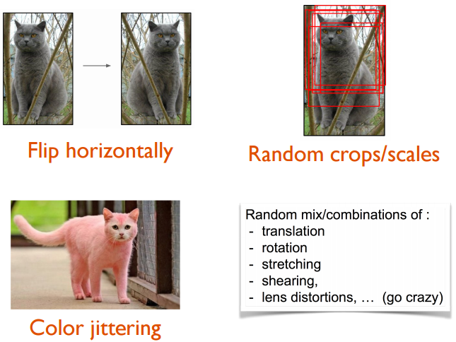

<strong>常见的数据扩增方法</strong>

有很多种方法都可以做到扩增数据，如常见的<strong>水平翻转</strong>图像，<strong>随机剪裁</strong>和<strong>颜色抖动</strong>。此外，<strong>也可以将这几种处理过程进行任意组合</strong>，比方旋转并对其缩放。还可以提高图像中像素的饱和度和值（即 HSV 颜色空间的 S 和 V 成分）到 $0.25$ 和 $4$ 之间（在一个样本图像内要保证各个像素该值是一样的），再在图像上加上一个范围在 $[-0.1, 0.1]$ 之间的值给 H （ hue ，即 HSV 中的色调）这个成分。

<strong>Fancy PCA 算法流程</strong>

Krizhevsky 等人[1]在 2012 年的 Alex-Net 中提出了一个名为<strong>花式主成分分析</strong>（ fancy PCA ，译注：这个“花式”的翻译可能不太恰当，这个 fancy 是在每轮数据 epoch 中对原始数据加入一些随机噪声）的方法。该方法会改变训练图像上 RGB 通道的像素值。若放在实践中，可以先在训练图像上的 RBG 像素值做主成分分析，之后再对每幅训练图像加上某个量，比方 $I_{xy}=[I_{xy}^R,I_{xy}^G,I_{xy}^B]^T = [\bf{p}_1,\bf{p}_2,\bf{p}_3][\alpha_1 \lambda_1,\alpha_2 \lambda_2,\alpha_3 \lambda_3]^T$ ，其中 $\bf{p}_i$ 和 $\lambda_i$ 分别是（规模大小为） $3 \times 3$ 的 RGB 像素值的协方差矩阵中第 $i$ 个特征向量和特征值，$\alpha_i$ 是一个随机变量，服从均值为 $0$ 标准差为 $0.1$ 的高斯分布。

需要注意的是，每幅训练图像在被重新用于训练（译注：相当于一个 epoch 的意思）前， $\alpha_i$ 值都是满足该分布的。也就是说，当模型再次遇到一样的训练图像时，因数据扩增的缘故，会随机产生出另一个 $\alpha_i$ 。文中称“花式主成分分析（ fancy PCA ）可近似地捕获到自然图像中的一些重要属性，即在光线和色彩的强弱变化下也不会改变的重要属性”。该方案在分类表现上，比 2012 年 ImageNet 第二名的错误率要低 $1\%$ 以上。
<h1>2. 图像预处理</h1>
完成上一步（数据扩增）后，会得到大量由原始图像和其随机剪裁构成的训练样本集，但此时别急！还需要对这些图像做预处理，在此会介绍几个预处理方法。

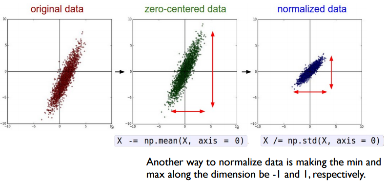

<strong>另一种规范化方法是将数据映射到 $[-1,1]$ 上</strong>

<h2>2.1 去均值与规范化</h2>
通常作为第一步且较简单的一种方式是<strong>去均值</strong>（<strong>zero-centered</strong> ，通俗地说：让每个样本都减去整体样本的均值，使整体样本的新均值为 $0$ ），并<strong>规范化（normalize）</strong>它们。这两个步骤用 Python 代码可以表示如下：
<pre class="lang:python decode:true">&gt;&gt;&gt; X -= np.mean(X, axis = 0) # 去均值（zero-center）
&gt;&gt;&gt; X /= np.std(X, axis = 0) # 规范化（normalize）</pre>
其中， $X$ 是输入数据（矩阵，规模为 $\text{NumIns} \times \text{NumDim}$ ）。另一种在预处理用于规范化（normalize）数据的方法是将每一个维度的最大最小值分别限定为 $1$ 和 $-1$ 。这种方法在你相信不同输入特征会导致不同输出（单元）值范围这一前提下，才有去这么做的意义，但这两种规范化（normalize）方法对学习算法来说都是等价的。

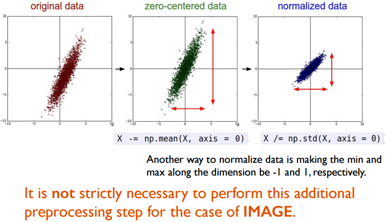

<strong>规范化到 $[0,1]$ 间的操作对图像来说不是必须的</strong>

就图像而言，像素的相对尺度大致相等（范围在 $[0,255]$ 上），所以不一定非要严格地去执行这个额外的规范化（normalize）的预处理步骤。
<h2>2.2 主成分分析白化</h2>
另一种预处理与前面说的第一个方法类似，就是<strong>主成分分析白化（ PCA Whitening）</strong>。

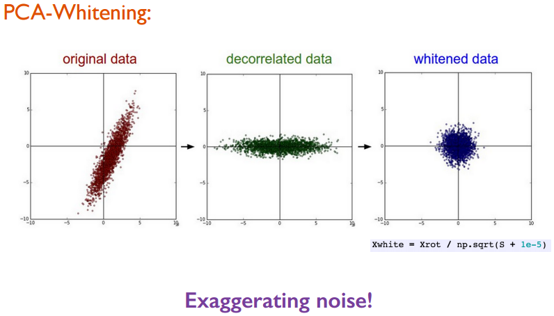

<strong>PCA-Whitening 的缺点：放大噪声</strong>

在此过程中，数据先经过去均值，然后计算出（能刻画数据内部相关结果的）协方差矩阵：
<pre class="lang:python decode:true">&gt;&gt;&gt; X -= np.mean(X, axis = 0) # 去均值
&gt;&gt;&gt; cov = np.dot(X.T, X) / X.shape[0] # 计算协方差矩阵</pre>
之后对数据去相关，方法是将（刚刚去均值后的）原始数据投影到特征基（ eigenbasis ）上：
<pre class="lang:python decode:true">&gt;&gt;&gt; U,S,V = np.linalg.svd(cov) # 对数据的协方差矩阵计算 SVD 分解
&gt;&gt;&gt; Xrot = np.dot(X, U) # 对数据去相关</pre>
最后一步是白化，它对去相关后的数据在每个维度上的特征值做尺度规范化处理：
<pre class="lang:python decode:true">&gt;&gt;&gt; Xwhite = Xrot / np.sqrt(S + 1e-5) # 除以特征值（其实是奇异值的开平方根）
</pre>
注意分母加了一个 $10^{-5}$ （1e-5）用来防止被除数为 $0$ 的情况。该变换的缺点是会扩大原始数据的噪声部分，这是因为将输入数据的各个维度都进行等尺寸的拉伸（噪声也会因为拉伸到各个维度因而被放大）。在实践中，可以通过更大的平滑减轻这种噪声（如将 $10^{-5}$ 变大）的影响。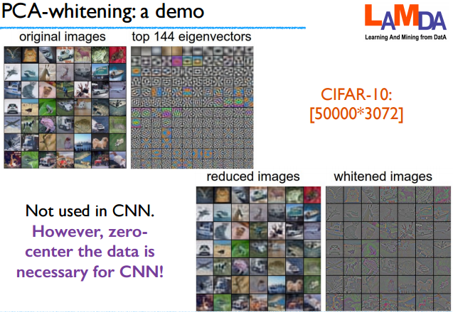

<strong>PCA Whitening 例子</strong>

为了能讲完整预处理的知识点，这里所讲的个别预处理变换步骤在实际中的卷积神经网络是不用的。但去均值对数据来说是很重要的，还有就是对图像像素做<strong>规范化（ normalization ）</strong>处理也是常见做法。
<h1>3. 参数初始化</h1>
现在数据已经准备好了，但在训练网络前还需要对一些参数进行初始化。
<h2>3.1 全零初始化</h2>
理想情形下，对于规范化后的数据来说，假设（初始化）权重参数正负大约各占一半也是合理的。此外，一种听起来似乎合理的想法是设定所有权重的初始值都为 $0$ ，这也许是一种人为猜测较好的期望权重初始值。但实际这是一个错误的想法，因为这会导致网络中每个神经元的输出结果一样，即经过完全相同的参数更新，得到的反向传播计算的梯度也相同。换言之，若初始权值相同，神经元就不具有<strong>非对称性（asymmetry）。</strong>
<h2>3.2 小随机数初始化</h2>
是一种接近 $0$ 但不是 $0$ 的权重初始化方法。做法是初始化权重为接近 $0$ 的随机小数，因为很接近 $0$ 但不想等，这也被称为<strong>“对称破缺”（ symmetry breaking ）</strong>。

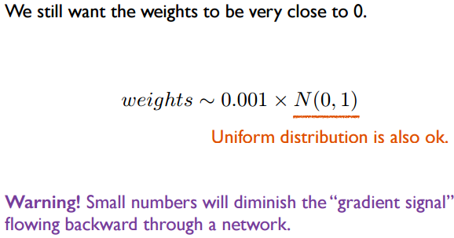

<strong>也可使用均匀分步
在网络的回传过程中，小值权重会减弱“梯度信号”</strong>

这一想法是：一开始时，每个神经元都是随机且独特的，所以它们在训练中计算出的更新是不同的，并在之后整合自己的“贡献”作为整个网络的不同部分。权重初始化的过程多少有点像 $weights ~ 0.001 \times N(0,1)$ ，其中 $N(0,1)$ 表示均值为 $0$ ，标准差为 $1$ 的高斯分布。当然也可以使用服从均匀分布的随机小数，但在二者在实际中的性能表现上只有很微弱的差别。
<h2>3.3 方差校准</h2>
但使用以上讲到方法对权重随机初始化得到的神经元都存在一个问题，网络输出单元的值的分布的方差（ variance ）会随着输入单元的增多而变大。但可以让每个随机得到的权重向量通过除以输入单元个数的平方根 $\sqrt{n}$ 来规范化（ normalize ），代码如下：
<pre class="lang:python decode:true">&gt;&gt;&gt; w = np.random.randn(n) / sqrt(n) # 使用输入单元个数 n 的平方根来校正最终输出导致的高方差
</pre>
其中函数 randn 表示生成的结果服从标准正态分布（即高斯分布），变量 n 表示输入单元的个数。这样<strong>确保了网络中神经元在最初时有着大致相同的输出分布，以及收敛速度的提升</strong>。

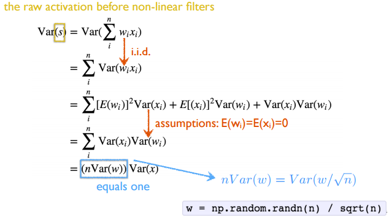

<strong>方差（Var）推导过程</strong>

详细推导见幻灯片 18 到 23 页。但在推导中请忽略 ReLU 神经元的影响。

注：$i.i.d$ 是独立同分布（independent identically distributed ， <em>IID </em>）的缩写。
<h2>3.4 推荐做法</h2>
如前文所述，先前通过校准神经元上的方差来初始化参数并未考虑使用 ReLUs 这样的激活函数。最近一篇论文（He et al. [4]）讨论了如何为 ReLUs 这样的激活函数做参数初始化，从而使网络中神经元的方差为 $2.0 / n$ ，初始化方式如下：
<pre class="lang:matlab decode:true ">&gt;&gt;&gt; w = np.random.randn(n) * sqrt(2.0/n) # 目前推荐做法</pre>
这是目前在实际中推荐的参数初始化方法，详细讨论请参考[4]。

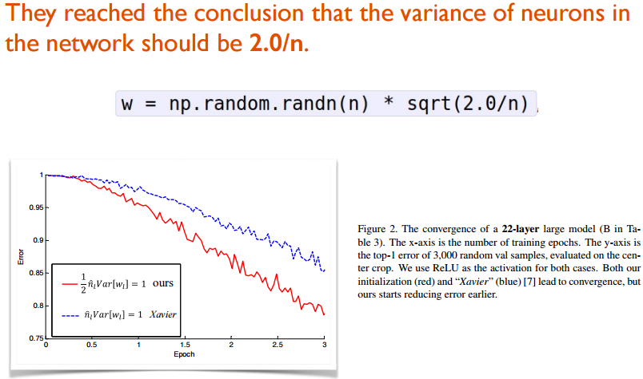

<strong>推荐做法</strong>

<h1>4. 训练</h1>
现已万事齐备，开始训练深度网络！

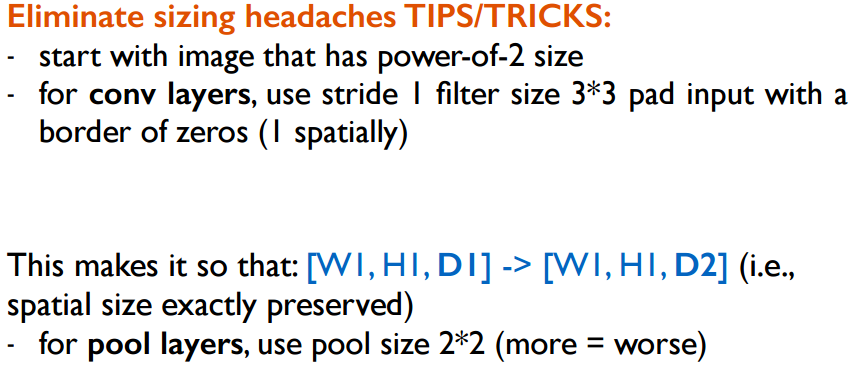

<strong>训练过程中</strong>

<h2>4.1 滤波器与池化尺寸</h2>
训练所需准备图像的像素尺寸最好 $2$ 的平方的，比方 $32$ （这是 CIFAIR-10 数据集的图像宽度）、 $64$ 、 $224$ （如众所周知的 ImageNet 数据集）、 $384$ 、$512$ 等。此外，使用小卷积核（如 $3 \times 3$ ）和步长（如 $1$ ）也很重要，并使用周围一圈补 $0$  （ zero-padding ）方法确保得到的特征图（ feature map ）不会减少，这种操作不仅会减少参数个数，也会提高整个深度神经网络的准确率。同时，上面提到的 $3 \times 3$ 卷积核与长度为 $1$ 的步长，可以保持特征图的空间大小。对于池化层（ pooling layer ），常用的池化尺寸为 $2 \times 2$ 。
<h2>4.2 学习率</h2>
正如 Ilya Sutskever [2] 在其博客中描述的，他推荐使用 mini-batch 的大小来对梯度进行划分，因为学习率（ LR ）不是总能被改变的，但可以改变 mini-batch 的大小。为了获取更合适的学习率，使用交叉验证集是一个有效的方法，一般来说 $0.1$ 是学习率的常用值。

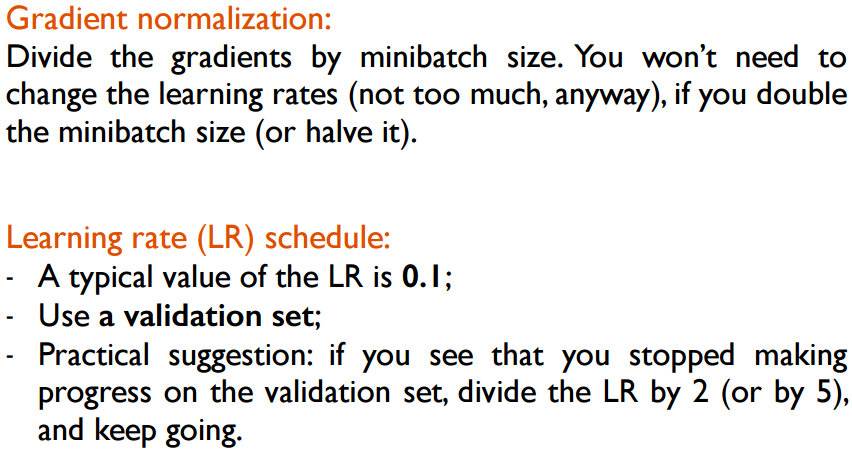

<strong>学习率调整策略</strong>

在实际中，如果在验证集上看不到性能的提升（译注：如损失函数值下降或者准确率上升），那就可以对当前的学习率除以 $2$ （或 $5$ ）看看效果并循环这一过程，或许能给你一个惊喜。
<h2>4.3 参数微调</h2>
在预先训练好的模型（ pre-trained model ）上做参数微调（ Fine-tune ）。现如今有很多已训练好且表现领先的深度神经网络被众多知名研究小组开放（如 <a href="https://github.com/BVLC/caffe/wiki/Model-Zoo" target="_blank">Caffe Model Zoo </a>还有 <a href="http://www.vlfeat.org/matconvnet/pretrained/" target="_blank">VGG Group</a> ）。多亏这些泛化能力极佳的预训练好的深度模型，我们才能拿来直接应用到自己的应用里。通过对预训练好的模型基于自己的数据进行参数微调，可进一步提高分类表现，这是一种简单且有效的微调方法。

如下表所述，对与参数微调来说，最重要的两个因素就是新数据规模的大小以及与当初用来预训练深度模型时所用数据的相似程度。不同的情况，所采用的参数微调的策略也不同：

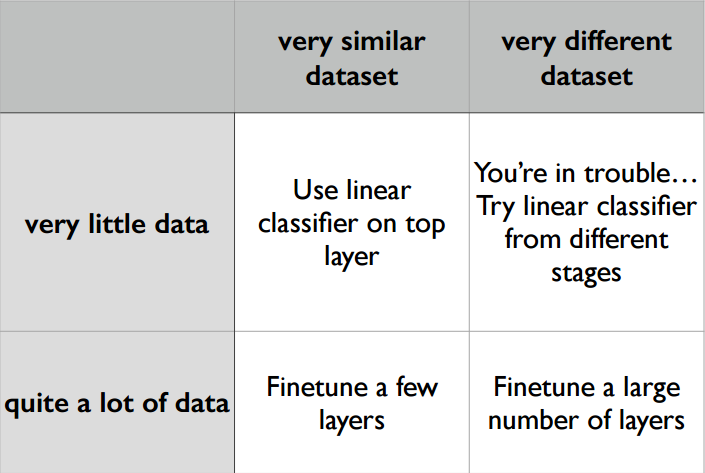

<strong>参数微调的四种情形</strong>

<ul>
	<li>一个好的情景是新数据与当初预训练模型的<strong>数据是非常相似</strong>的，这种情况下，若数据比较少就只能训练一个线性分类器作为预训练模型的顶层特征抽取部分；</li>
	<li>但当<strong>数据很多</strong>时，就可以使用一个较小的学习率，对预训练模型的多个顶层进行微调；</li>
	<li>如果数据与当初训练模型的<strong>数据相差大</strong>，但<strong>数据量多</strong>。那么网络的大多数层的参数都应该基于新的数据做微调，同时用一个较小的学习率以提升性能；</li>
	<li>如果数据与当初训练模型的<strong>数据相差大</strong>，且<strong>数据量少</strong>，那就会比较棘手。因为数据量的限制，还不如单独训练一个线性模型，因为数据就与原本训练深层模型的不同，如若从顶层开始用自己差异大的数据（预训练模型得到的参数体现的是原始数据的特征）来训练，不见得会有多么好，反倒不如训练一个支持向量机模型替换深层模型中的某些层。</li>
</ul>
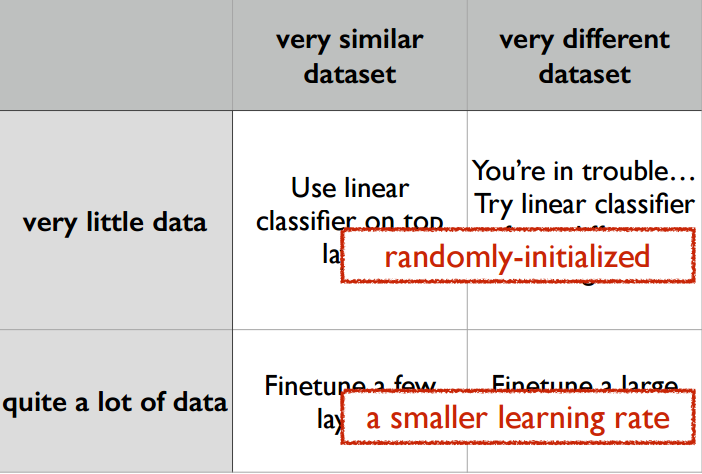

<strong>参数微调四种情形下的注意事项</strong>

参数微调在不同的情形下策略不同，比方说， Caltech-101 数据集与 ImageNet 数据集很相似，因为两者都是以目标物体为中心的图像数据集；但 Place Database 与 ImageNet 数据集不同，因为前者是以场景为中心的而后者是以目标物体为图像中心的。
<h1>5. 激活函数</h1>
深度网络其中一个重要因素是激活函数（activation function），起到非线性变换的作用。这里将详细介绍几种常见的激活函数的特性以及结合后文谈到的技巧相结合的建议。

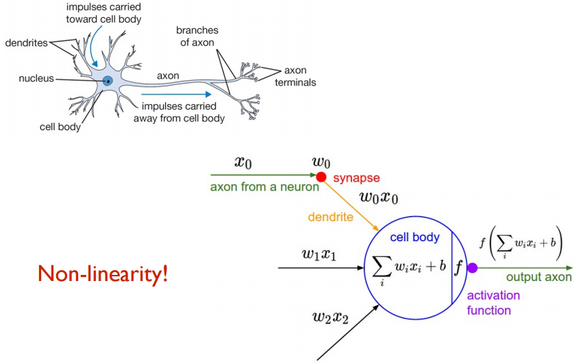

<strong>激活函数（图像来自 <a href="http://cs231n.stanford.edu/index.html" target="_blank">Stanford CS231n</a>）</strong>

<h2>5.1 Sigmoid</h2>
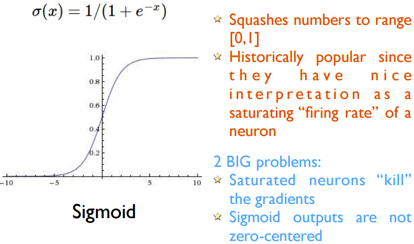

<strong>Sigmoid </strong>

Sigmoid 非线性函数其数学形式是 $\sigma(x)=1/(1+e^{-x})$  。输入是实数值，该函数会将输入值“压缩”（译注：即映射）到 $[0,1]$ 的范围上。实际中，大的负数值会变为 $0$ ，而大的整数会变为 $1$ 。作为神经元，对于这个活跃率（ fire rate ）有一个很好的解释：不活跃时（ not firing ）输出都是 $0$ 逐渐变为完全饱和状态（即活跃状态）的假定最大值 $1$ 。

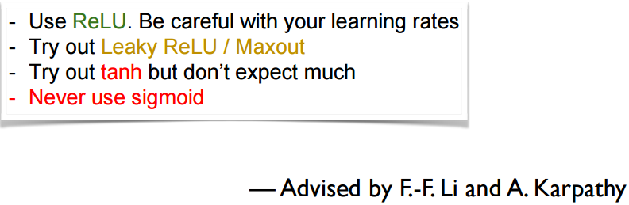

<strong>激活函数的建议</strong>

实际中， sigmoid 非线性函数现在已经不如以前那么流行，因为它有两个缺点：
<ol>
	<li> Sigmoid 饱和导致的梯度骤减。 Sigmoid 一个不太好的特性就是当饱和时，函数值要么是 $1$ 要么是 $0$ 。回想在反向传播的过程中，（局部）梯度会乘以整个网络最终输出的梯度。因此，如果梯度很小，那么就会导致反传回去的梯度被消减掉，最终导致没有梯度信号更新权重。此外需要注意的是在初始化 sigmoid 神经元的权重时，需要防止饱和性，比方说，如果初始权重太大则会导致大部分神经元处于饱和状态，以至于网络学不到东西。</li>
	<li>Sigmoid 的输出的分布不是以零为中心的。这是一个不好的特性，因为对于整个网络随后层接收到的数据，这些数据是不以零为中心的。在梯度下降过程中的动力学角度来讲，这会导致一个潜在问题：如果数据流经神经元的时数据总是正的（如在表达式 $f=w^T+b$ 中每个元素 $x&gt;0$ ），那么在反向传播时，权重的梯度也将全部变为正的，或者全部变为负的（这取决于表达式 $f$ 的梯度）。对于权重的梯度更新来说，这会导致一个不好的锯齿状梯度。然而，这些梯度一旦加入到一个批次数据的最终更新的权重上时候，这个问题就会被减轻。与过饱和的激活函数问题来相比，这个问题的后果还算不太严重。</li>
</ol>
<h2>5.2 tanh(x)</h2>
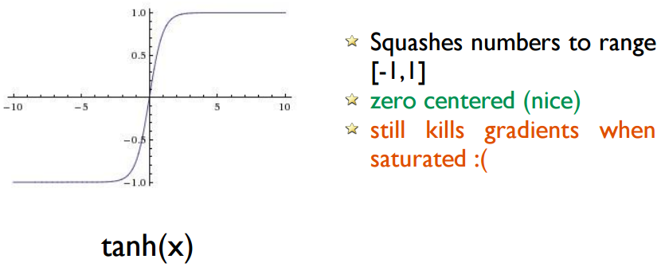

<strong>tanh</strong>

tanh 非线性函数将会把实数的输入值压缩到 $[-1, 1]$ 范围上，类似 sigmoid 的神经元，也具有一定的激活饱和性。但与其不同的在于它的输出值是以零为中心的。因此在实际当中，该函数比 sigmoid 更受欢迎。
<h2>5.3 Rectified Linear Unit</h2>
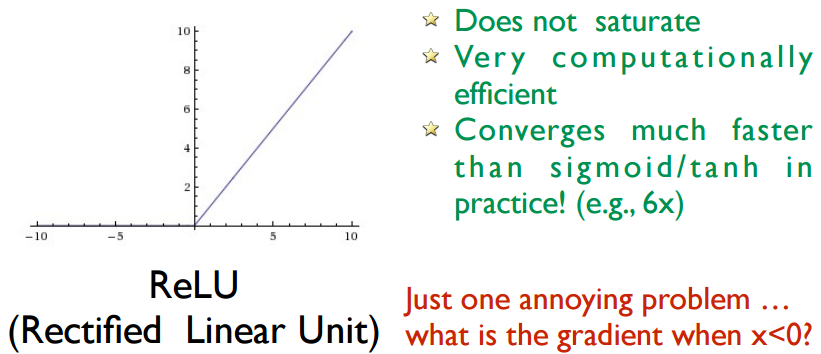

<strong>ReLU</strong>

在过去几年中，校正线性单元激活函数（ ReLU ）变得非常流行。它的函数形式是 $f(x)=max(0,x)$ ，它的形式是简单地给出一个阈值来达到激活函数的目的。

关于 ReLU 函数有几个优缺点：
<ol>
	<li>（优点）与 sigmoid/tanh 神经元相比，没有引入计算复杂高的操作（比方 sigmoid 就有指数计算等）， ReLU 的计算知识简单地判断输入与 $0$ 的大小关系。此外， ReLU 不会出现过饱和问题。</li>
	<li>（优点）与 sigmoid/tanh 神经元相比，随机梯度下降的收敛过程会得到加速（参考[1]中的六个因素）。有人认为这是由于其线性和非饱和形成的。</li>
	<li>（缺点） ReLU 函数单元在训练过程中比较脆弱，并且由于这个原因会导致死掉（译注：神经元不具有活性）。例如，当一个很大的梯度流经神经元会导致下次再对权重更新时，相同的输入数据点通过该神经元不会被激活。这就会导致每当将同样的输入数据点传入该单元时，得到的梯度值都将会是零。换句话说，这个在训练过程当中的行为会产生不可逆的后果。例如，你会发现如果学习率设置得很大，网络当中 $40\%$ 的部分是死掉的（即某些神经元在整个训练数据集上这些神经元从都不会被激活）。通过设定一个适当的学习率，这个问题产生的影响会逐渐减轻。</li>
</ol>
<h2>5.4 Leaky ReLU</h2>
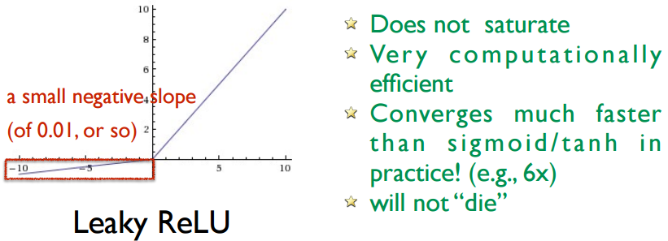

<strong>Leaky ReLU</strong>

渗漏校正线性单元（ Leaky ReLU ）是一种尝试解决 ReLU 死亡问题（译注：即由梯度过大或学习率过大导致的神经元不被激活的问题）。其做法是：当 $x &lt; 0$ 时， leaky ReLU 用一个小负数（如 $0.01$ 等值）替代原本 ReLU 小于零时的输出值 $0$ 。换句话说， leaky ReLU 当 $x&lt;0$ 时，计算的是 $f(x)=\alpha x$ ，当 $x \geq 0$ 是，则计算 $f(x) = x$ ，其中 $\alpha$ 是一个小的常数。一些人提出当使用了这种形式的激活函数获得成功后，得到的结果变得不稳定了。
<h2>5.5 Parametric ReLU</h2>
现提出这一激活函数更广泛的类，名叫 <strong>校正单元族（ rectified unit family ）。下面将会谈到 ReLU 的不同形式：</strong>

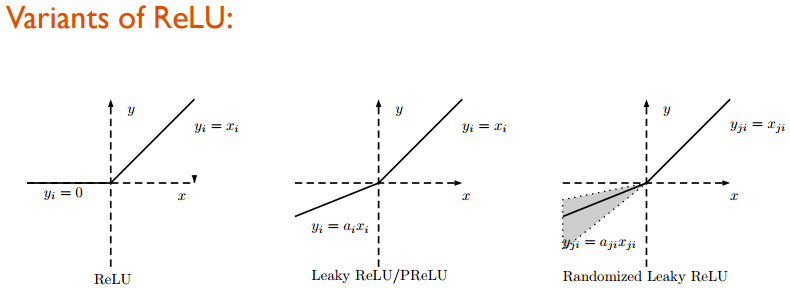

<strong>ReLU 的变形</strong>

从左至右分别是： ReLU 、 Leaky ReLU/PReLU 、 RLReLU ：
<ul>
	<li>对于 PReLU ， $a_i$ 是待学习参数；</li>
	<li>对于 Leaky ReLU ， $a_i$ 是固定参数；</li>
	<li>对于 RReLU ， $a_{ji}$ 是在给定范围内抽样出的随机变量，其它参数都是在测试时确定的。</li>
</ul>
第一种变体称为参数校正线性单元（ parametric rectified linear unit ，即 PReLU ，参考文献[4]）。在参数校正线性单元（ PReLU ）中，负数部分的斜率是从数据当中学习得到的，而不是预先定义的。文献[4]中阐明， PReLU 激活函数的使用是 ImageNet 分类任务中超越人类水平的关键因素，该激活函数在反向传播和参数更新中的计算简单且直接，并且其特点类似于传统的校正线性单元（ ReLU ）激活函数，具体可在幻灯片的第 43 页找到（如下图）。

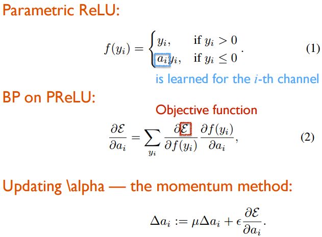

<strong>Parametric ReLU（幻灯片第 43 页）</strong>

<h2>5.6 Randomized ReLU</h2>
第二种形式叫做随机校正线性单元（ randomized rectified linear unit ，即 RReLU）。对于随机校正线性单元（ RReLU ）来说，基于训练数据集，负值部分的斜率值在给定范围内是随机选取的，而在测试时，参数值会被确定下来。正如[5]中所提到的，最近 Kaggle 国家数据科学（ National Data Science Bowl ， NDSB ）竞赛中，由于在训练时随机性的存在，据说可以减少过拟合的风险。此外，该比赛的获胜者建议，在训练过程当中，随机变量 $\apha_i$ 的取值在 $1/U(3,8)$ 范围内是合适的，测试时再被期望的值固定下来，如 $ 2/(l+u)=2/11 $。

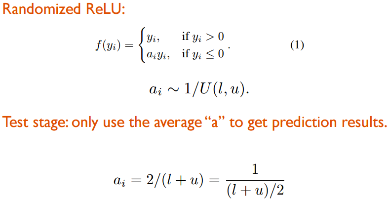

<strong>Randomized ReLU</strong>

在文献[5]中，作者使用下表展示的不同数据集（ CIFAR-10 、 CIFAR-100 、 NDSB ）评估了基于不同的激活函数下的卷积神经网络的性能。需要注意的是，对于这两种神经网络来说激活函数是在每一个卷积层之后。此外，下表中的参数 $\alpha$ 实际是 $1 / \alpha$ ，其中 $\alpha$ 是前文中所说的斜率。

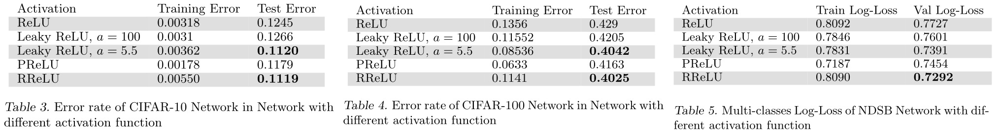

<strong>ReLU 变体的不同表现</strong>

从该表格中不难发现，而 ReLU 激活函数的表现性能在这三个数据集上并不是最好的。对于渗漏校正线性单元（ Leaky ReLU ）激活函数来说，稍微大一点儿的斜率 $\alpha$ 值可达到较好的准确率。参数校正线性单元（ PReLU ）在小数据集上容易过拟合（即，在训练数据集上的误差小，但在测试数据集上的误差较大）。尽管如此，其表现仍旧要优于校正线性单元（ ReLU ）。

此外，在国家数据科学（ NDSB ）竞赛的数据集上，随机校正线性单元（RReLU）的表现要优于其它的激活函数，这表明了随机校正线性单元（ RReLU ）可以克服过拟合，因为该数据集的训练集规模要比其他数据集小。

总之，在这三个数据集的表现上三种校正线性单元激活函数的变体都要优于原始的校正线性单元（ ReLU ）。参数校正线性单元（ PReLU ）和随机校正线性单元（ RReLU ）看起来是更好的选择。同时，文献[4]中也表达了相似的结论。
<h2>5.7 Maxout</h2>
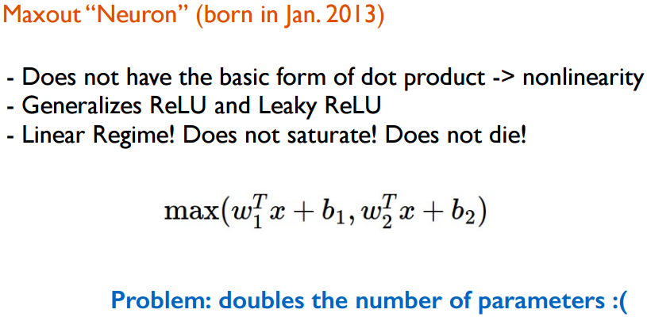

<strong>maxout</strong>

<ul>
	<li>非线性</li>
	<li>maxout 是 ReLU 或 Leaky ReLU 的更一般形式</li>
	<li>非线性但不具有饱和性，不会死掉</li>
</ul>
但问题（缺点）是：训练的参数是原本的两倍。
<h1>6. 正则化</h1>
这里介绍几种用来预防神经网络过拟合的正则化方法：

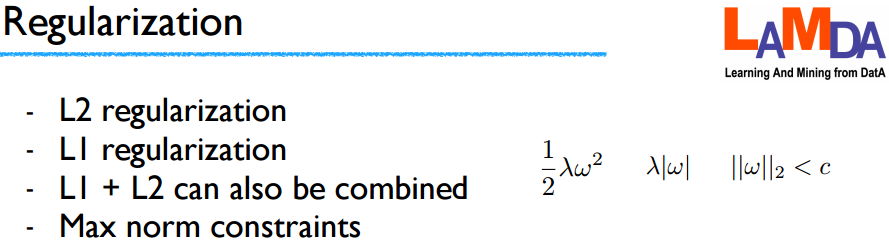

<strong>正则化</strong>

<h2>6.1 L2 正则化</h2>
L2 可能算是最常见的正则化形式，它的实现是通过直接惩罚目标函数中所有参数的平方，这个参数就是网络中的每个权重 $w$ ，这个正则化项为 $\frac{1}{2} \lambda w^2$ ，将其加入目标函数中， $lambda$ 是正则的力度。

通常 $\frac{1}{2}$ 都会在正则化项前作为系数，因为在之后算 $w$ 的微分得到的结果就是 $\lambda w$ 而不是 $2\lambda w$ 。<strong> L2 正则化的直观解释是对权重向量的加强惩罚（ heavily penalizing peaky weight vectors ）和对权重向量的发散（ diffuse weight vectors ）</strong>。
<h2>6.2 L1 正则化</h2>
L1 正则化是另一种相当常见的正则化形式，做法是将权重向量中的每个权重参数累加后（即 $\lambda |w|$ ）加入目标函数中。此外，还可以基于 L1 和 L2 的组合构成正则化项： $\lambda_1 |w| + \lambda_2 w^2$ （这也被称为<a href="http://web.stanford.edu/~hastie/Papers/B67.2%20%282005%29%20301-320%20Zou%20&amp;%20Hastie.pdf" target="_blank">弹性的网络正则</a>）。 L1 正则化有一个又去的特性，在取最值的优化过程中它可以让权重向量变得稀疏（即，让其中一些元素变得接近 $0$ ）。

换句话说，<strong>带有 L1 正则化的神经元最终会将输入的数据中的重要输入元素得到保留，其余会变成或接近 $0$ </strong>，即使对加过噪声的同一输入数据，也会保证不变性。二者相比，权重向量经 L2 正则化通常最终会变得发散，值变小。在实际中，若不关心具体的特征选择，那么使用 L2 正则化方法得到的结果会优于基于 L1 正则化的方法。
<h2>6.3 最大模限制</h2>
最大模限制（ max norm constraints ）是另一种形式的正则化，其做法是让每个神经元的权重向量有一个绝对上限（ upper bound ）的约束，使用投影梯度下降（ projected gradient descent ）来执行这个约束。实际中的对应做法是：参数更新的过程不变，<strong>强制权重向量中每个神经元 $\overrightarrow{w}$ 的约束是让其满足 $||\overrightarrow{w}||_2 &lt; c$ 。 $c$ 的值通常为 $3$ 或 $4$ </strong>。用过这种正则方法的人说该方法对性能有所提升，该形式的其中一个吸引人的属性在于即使学习率很大，网络也不会出现参数爆炸（ explode ），因为更新过程中都受到了限制。
<h2>6.4 Dropout</h2>
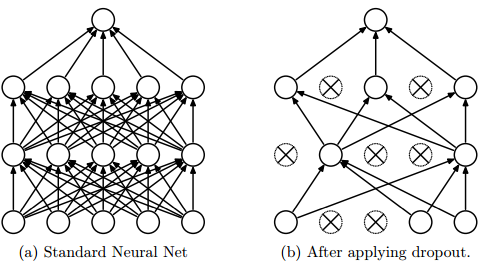

<strong>dropout 策略思想</strong>

Dropout 是一个超级有效、简单且是前阵子由 Srivastava 等人提出的（详情参考[6]），它是其它正则方法（如 L1 、 L2 、 最大模限制 ）的补充。在训练中， dropout 可理解为对整个神经网络进行抽样（出的网络），并基于输入数据仅仅更新抽样网络的参数。（因为这些抽样得到的网络是共享参数的，所以这些抽样出的网络的权重参数并非是独立的）。

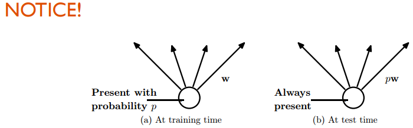

<strong>dropout 策略训练与测试时的差异
训练时， dropout 通过设定神经元的活性为某个概率值 $p$ （一个超参数），或者设定某些神经元的活性为 $0$ （即关闭状态）。此外， Google 于 2014 年为 dropout 策略申请了美国专利。</strong>

但在测试过程中，不使用 dropout 在训练时的策略（译注：即随机神经元“失活”），而是使用基于所有的子网络，即指数规模的子神经网络的集成（有关“模型集成”可参考后面小节）预测出的平均值来做输出。实际中，通常 dropout 比率 $p$ 被设为一个合理的默认值 $p=0.5$ ，但在验证数据集上是可以被调整的。

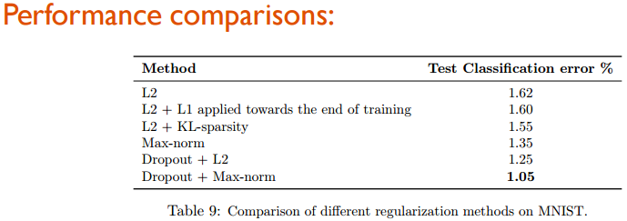

<strong>六种正则方法基于 MNIST 数据集的性能比较</strong>

<h1>7. 训练结果图像分析</h1>
到目前为止，通过以上技巧的使用在深度神经网络上会的到一个满意的设置（如数据处理，架构选择等其它细节）。在训练过程中，您可以绘制出网络训练过程中的性能表现的图像。

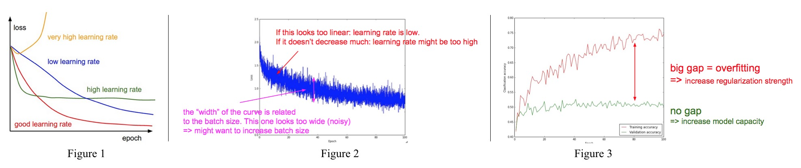

<strong>训练结果的图像分析</strong>

<h2>7.1 观察损失曲线：学习率</h2>
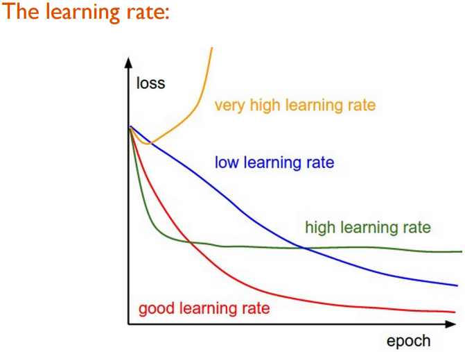

<strong>学习率对损失函数的影响</strong>

众所周知，学习率对模型的表现是敏感的。从图1中可以看出：学习率过大会导致损失曲线很奇怪（损失变大）。一个小学习率即使是经过很多轮次训练集的学习，损失函数值的下降依然很慢。相反的是，稍微大点的学习率下降反而很快，但它也会很快陷入局部最优，这样看来网络并未得到一个好的结果。那对于一个好的学习率，其损失曲线的表现应该是平滑的，最终达到最优（最小）。
<h2>7.2 放大损失曲线：学习率、batch 大小</h2>
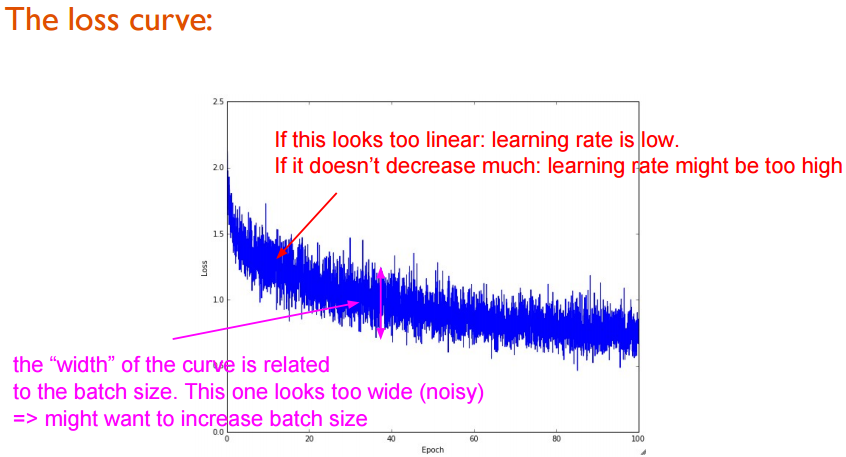

<strong>放大后的损失函数曲线</strong>

对学习率的图进行放大，可进一步观察损失函数的变化情况。每轮（ epoch ）训练是基于一个完整的训练数据集进行的，它将一个完整的训练集数据划分为多干个 mini-batch （译注：每次参数更新是基于每个 mini-batch 进行的）。如果在每轮完整的训练集（即 epoch ）绘制出损失函数值，绘制出的样子就是上图（由于是被放大后的，所以比较毛糙）。若损失曲线接近水平线，那就说明学习率比较小；若损失函数值下降地并不是很多，可能说明学习率或许有点大。

此外，曲线中（两次更新间）每小段线段的垂直高度与本次做更新时的批 （ batch ） 中有多少个样本有关，看起来越长的，表明两个批（ batch ）间样本的方差很大（译注：即两次计算损失间的批内的训练样本的方差很大），那也就说明可以通过再加大批的样本数量（即 batch size ）来减少两次样本集间的方差。
<h2>7.3 准确率曲线</h2>
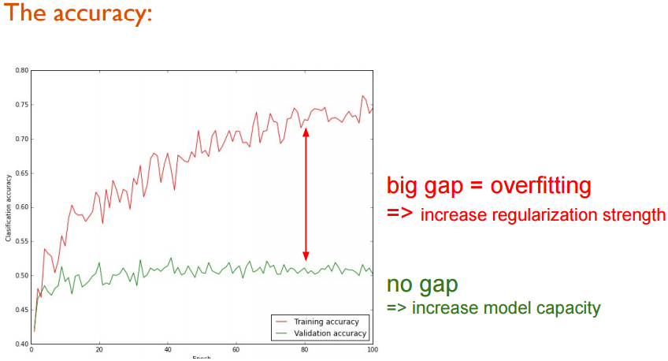

<strong>准确率曲线</strong>

最后一点是关于准确率曲线（如上图所示）。红线是训练集的准确率，绿线是交叉验证集的准确率，当交叉验证集的准确率曲线收敛时，红线与绿线间的差距将会反应深度神经网络的效能。

如果差距很大，则表明在训练数据上模型表现很好，然而在验证集网络的准确率很低。造成这种情况的原因是深度模型在训练集数据上过拟合了，因此需要使用一些正则化方法来限制深度神经网络模型的拟合能力。

但若没有差距，同时准确率在二者曲线上都很低，那就表明深度模型的学习能力（即拟合能力）还不行，这时就需要增加模型的容量（译注：比方增大模型复杂度，去掉一些正则化方法等）以得到更好的准确率。
<h2>7.4 可视化特征图（slide 补充内容）</h2>
该部分作为 slide 的补充内容，原作者并未在文中给出。这里简单描述下内容：

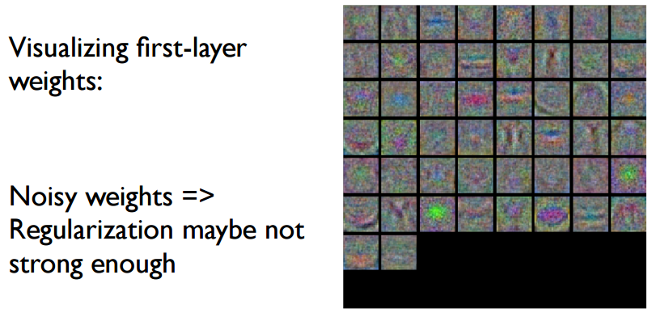

<strong>对第一层网络权重可视化</strong>

带噪声的权重（译注：猜想是通过随机初始化得到的权重），正则化的作用看不出来。

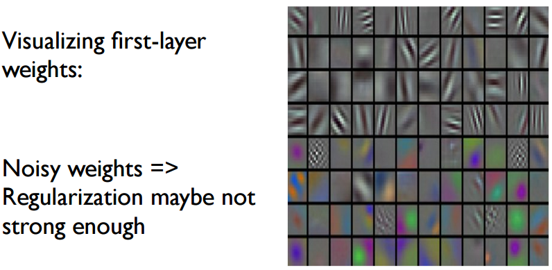

<strong>对第一层网络权重可视化</strong>

译注：猜测这幅图是后面几层网络权重的可视化结果。
<h1>8. 模型集成</h1>
在机器学习中，集成方法（ ensemble methods ）是指训练多个学习器并在之后将它们组合使用，最终得到一个强有力的分类器的方法。众所周知的事，集成（ ensemble ）方法通常比单一的学习器预测或者分类更精确，集成方法本身也在许多实际的任务中取得了大量的成功。在实际应用中，比方数据竞赛，取得第一或第二名的获胜者是用的通常都是集成方法。

在此介绍几种针对深度学习场景的集成方法的技巧：
<h2>8.1 集成不同初始化的模型</h2>
使用交叉验证集来确定最佳的超参数，再在基于最佳超参数的情况下，<strong>使用不同的随机初始化方法来初始化权重来训练多个模型</strong>。该方法的风险在于权重初始化方法的不同产生的差异。
<h2>8.2 集成 topN 表现的模型</h2>
使用交叉验证集确定了最佳的超参数后，再选取<strong>表现最佳的前 topN 个模型进行集成</strong>。这可以提升集成模型的多样性，但风险就是这几个模型都是局部最优模型。实际实践中，这种做法可以达到不错的性能，因为不需要（在交叉验证后）对模型进行额外的重新训练。实际上，可以直接在 <a href="https://github.com/BVLC/caffe/wiki/Model-Zoo" target="_blank">Caffe Model Zoo</a> 中选择表现性能在 topN 的几个深度模型进行集成。
<h2>8.3 集成相同但不同阶段的模型</h2>
当训练一个模型的代价很大时（比方时间），可以<strong>训练一个单一的网络模型但在不同的阶段</strong>记录网络权重参数，比方每个 epoch 后记录一次参数（相当于得到一个模型），<strong>用这些得到模型参数实现模型集成</strong>。显而易见的是，这种方法缺乏了网络的多样性（因为是基于一个网络的），但在实际中的表现还算不错，优点在于相比训练多个不同的网络模型做集成，该方法更易于实现。
<h2>8.4 一些实战例子</h2>
如果任务涉及到高级别的图像语义，如基于静态图像的事件识别，一个较好的集成方法是<strong>集成基于不同数据源训练的多个深度模型</strong>，提取不同但互补的深度表示。例如， <a href="http://pamitc.org/iccv15/" target="_blank">ICCV'15</a> 中的 <a href="https://www.codalab.org/competitions/4081#learn_the_details" target="_blank">文化事件识别（ Cultural Event Recognition ）</a> 挑战赛中，我们利用五个不同的深度模型基于<a href="http://www.image-net.org/" target="_blank"> ImageNet </a>、 <a href="http://places.csail.mit.edu/" target="_blank">Place Database</a> 、 <a href="http://gesture.chalearn.org/" target="_blank">竞赛组织者</a>提供的文化图像（这三个来源的）数据集的不同部分进行训练并集成。

之后，我们提取出五个互补的深层特征并把它们作为多视角的图像数据，再结合[7]中描述的早期融合（ “early fusion” ）和后期融合（ “late fusion” ），我们取得了挑战赛第二名的好成绩。与我们工作类似的[9]，提出了可以同时融合更多深度网络的堆叠神经网络框架。
<h1>9. 杂项</h1>
真实世界中的数据通常都是<strong>样本类别数量不均衡</strong>的：某些类的样本数目占大部分，其它某些类别的样本很有限。据最近科技报告[10]，若基于类别不均衡数据训练深度卷积网络，结果将会导致严重的性能问题。最简单的解决方法是<strong>使用上采样或者下采样平衡数据类别</strong>，详情可参考[10]。另一个有趣的解决方法是基于特殊的图像剪裁，因为原始图像是类别不均衡的，通过<strong>对原始图像剪裁得到新图像的方法既可以增大数据量</strong>，也可以解决类别不均衡问题。

此外，<strong>使用参数微调（ fine-tuning ）策略也可克服类别不均衡问题</strong>，例如，将原始数据划分为两部分：一部分包含大量类别的训练样本图像或剪裁，另一部分包含有限类别的样本图像。针对每部分分别训练，类别不均衡的问题就会减轻。首先在大量类别的训练图像是进行参数微淘，之后再基于第二部分（样本图像较少的类别数据）上进行微调。
<h1>10. 参考</h1>
<ol>
	<li>A. Krizhevsky, I. Sutskever, and G. E. Hinton. <a href="http://papers.nips.cc/paper/4824-imagenet-classification-with-deep-convolutional-neural-networks.pdf">ImageNet Classification with Deep Convolutional Neural Networks</a>. In <i>NIPS</i>, 2012</li>
	<li><a href="http://yyue.blogspot.com/2015/01/a-brief-overview-of-deep-learning.html/">A Brief Overview of Deep Learning</a>, which is a guest post by <a href="http://www.cs.toronto.edu/~ilya/">Ilya Sutskever</a>.</li>
	<li><a href="http://cs231n.stanford.edu/index.html/">CS231n: Convolutional Neural Networks for Visual Recognition</a> of <i>Stanford University</i>, held by <a href="http://vision.stanford.edu/index.html">Prof. Fei-Fei Li</a> and <a href="http://cs.stanford.edu/people/karpathy/">Andrej Karpathy</a>.</li>
	<li>K. He, X. Zhang, S. Ren, and J. Sun. <a href="http://arxiv.org/abs/1502.01852">Delving Deep into Rectifiers: Surpassing Human-Level Performance on ImageNet Classification</a>. In<i>ICCV</i>, 2015.</li>
	<li>B. Xu, N. Wang, T. Chen, and M. Li. <a href="http://arxiv.org/abs/1505.00853">Empirical Evaluation of Rectified Activations in Convolution Network</a>. In <i>ICML Deep Learning Workshop</i>, 2015.</li>
	<li>N. Srivastava, G. E. Hinton, A. Krizhevsky, I. Sutskever, and R. Salakhutdinov. <a href="http://jmlr.org/papers/v15/srivastava14a.html">Dropout: A Simple Way to Prevent Neural Networks from Overfitting</a>. <i>JMLR</i>, 15(Jun):1929−1958, 2014.</li>
	<li>X.-S. Wei, B.-B. Gao, and J. Wu. <a href="http://lamda.nju.edu.cn/weixs/publication/iccvw15_CER.pdf">Deep Spatial Pyramid Ensemble for Cultural Event Recognition</a>. In <i>ICCV ChaLearn Looking at People Workshop</i>, 2015.</li>
	<li>Z.-H. Zhou. <a href="https://www.crcpress.com/Ensemble-Methods-Foundations-and-Algorithms/Zhou/9781439830031">Ensemble Methods: Foundations and Algorithms</a>. <i>Boca Raton, FL: Chapman &amp; Hall</i>CRC/, 2012. (ISBN 978-1-439-830031)</li>
	<li>M. Mohammadi, and S. Das. <a href="http://cs231n.stanford.edu/reports/milad_final_report.pdf">S-NN: Stacked Neural Networks</a>. Project in <a href="http://cs231n.stanford.edu/reports.html"><i>Stanford CS231n Winter Quarter</i></a>, 2015.</li>
	<li>P. Hensman, and D. Masko. <a href="http://www.diva-portal.org/smash/get/diva2:811111/FULLTEXT01.pdf">The Impact of Imbalanced Training Data for Convolutional Neural Networks</a>. <i>Degree Project in Computer Science</i>, DD143X, 2015.</li>
</ol>
