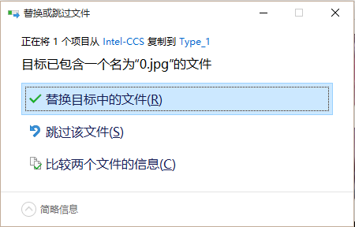

# 复制不同源的文件夹时保留同名文件

[toc]

最近做Intel的宫颈癌图像三类分类，数据涉及到training set和additional set（是对training set的补充），想要把补充数据和训练数据混合，但是有些文件是同名的，有可能是相同文件也有可能不是。但是，我想对同名的文件二者都选择保留，而不是覆盖同名文件做merge。<!--more-->
<h1>1. shell脚本解决</h1>
先是在网上找到了一段shell脚本，但是还是出现同名覆盖的问题，这个脚本如下，复制前会检查目标文件夹内和待复制文件夹内，当前遍历到的文件名是否存在存在，若存在则，复制过去在名字后加上_old后缀。
<pre class="lang:sh decode:true ">#!/bin/bash
from_path="/media/yuens/WIN10-ENTERTENMENT/Kaggle/Intel-CCS/Type_1/"
to_path="/media/yuens/WIN10-ENTERTENMENT/Kaggle/Intel-CCS/train_add/Type_1/"
file=`ls ${from_path}`

for filename in $file
do
if [ -e "${target_path}${filename}" ];then
cp ${from_path}${filename} ${to_path}${filename}"_old"
else
cp ${from_path}${filename} ${to_path}${filename}
fi
done</pre>
但是这段shell脚本不给力，实现的是两个文件夹merge但是对同名会覆盖，本来有个错，我给解决了，但是还是有点问题。
<h1>2. Ubuntu16.04的复制</h1>
然后我想系统界面直接复制黏贴时是否会做判断，Ubuntu的确会做，遇到同名文件时会让你决定是保留（跳过待复制的文件）还是替换（覆盖），还是二者都保留（但是你要对待复制的文件重新起名）。

我试了的确可以，但是需要一个个解决同名文件的冲突文件，即每个都要重命名很麻烦，尤其是数据量大的时候不敢想。而且它有个问题是：在复制的过程中遇到冲突，让你解决，而不是全部名字无冲突文件复制完成后，对有冲突的解决（Win10是这样的，很友好）。

所以放弃Ubuntu下，转入Win10的复制。
<h1>3. Win10的复制</h1>
我也是前面两个失败or效果不好才使用这种的。下面是截图，可以看到当复制两个文件夹里文件的时候，我是打开各自的文件夹，进入复制所有文件然后到目标文件夹里面，粘贴所有文件，冲突时选择比较信息，两个都勾选保留。

<strong>step1. 遇到冲突时选择“比较两个文件的信息”</strong>

<strong>step2-1. 勾选两个文件夹的对勾（如果只是想覆盖其中某些同名文件，另外某些都保留，则可以在这里更细致的选择，具体到某些个文件选择）</strong>

<strong>step2-2. 多个文件冲突可以具体到文件选择（忘打马赛克了，逃）</strong>

<strong>step3. 选择完成后看到两个文件都保留了下来</strong>

这样有点麻烦，也可以直接复制文件夹，对于同名的文件夹Type_1和Type_1，选择比较描述文件，两边都勾选，保留即可。
