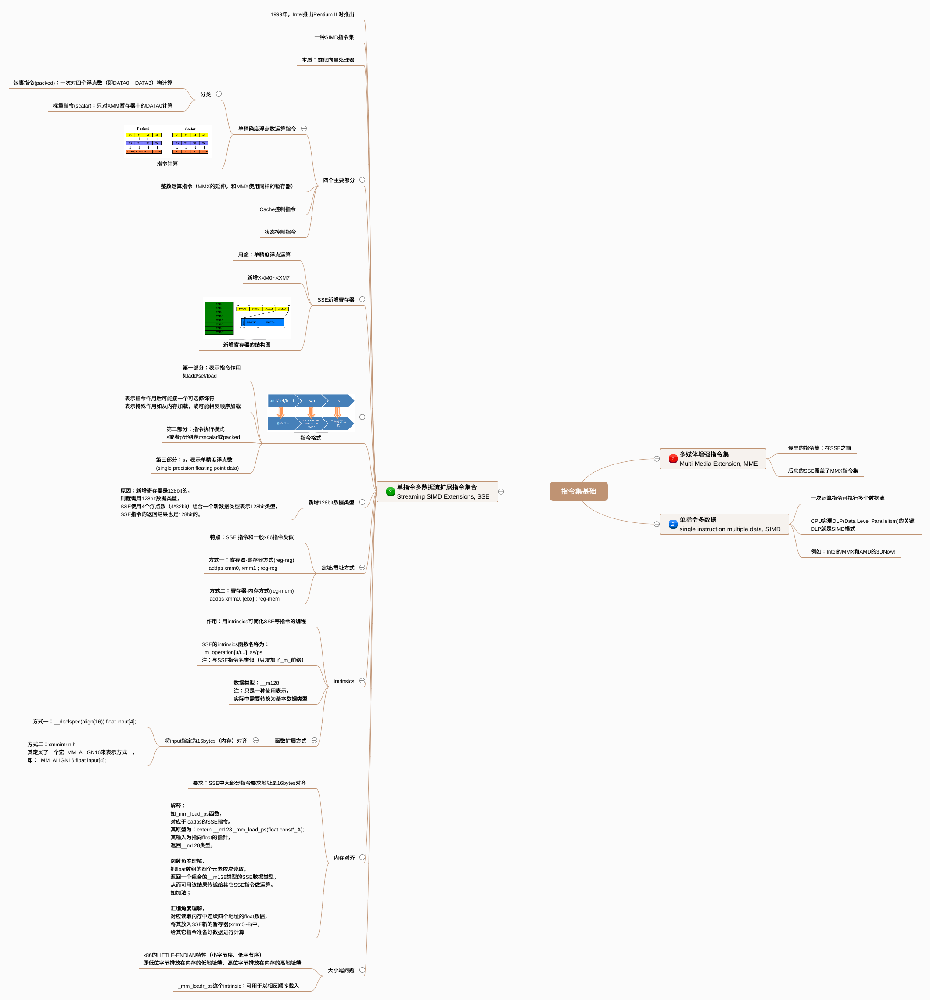
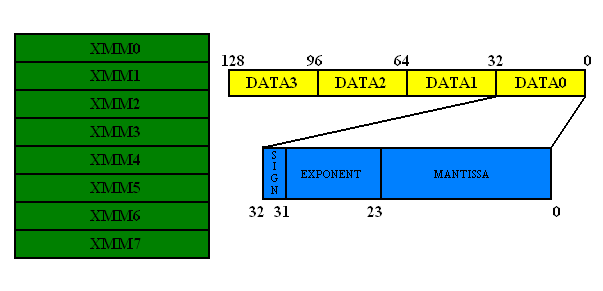
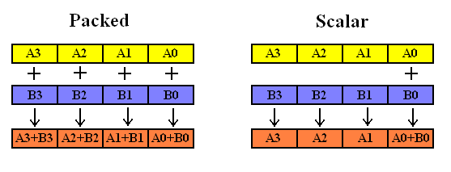
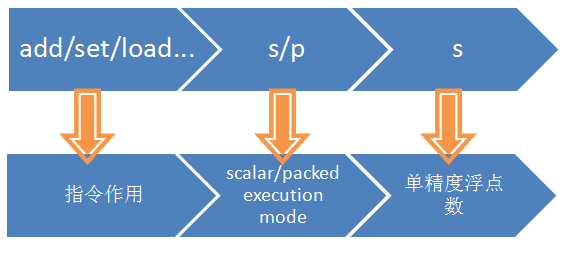

# SSE指令集基础概览

本文是从CSDN转载的，原文我找不到了，不知道这个人（http://blog.csdn.net/lee_cv/article/details/11480013）是从哪里转载。我下面对该文进行总结，百度脑图如下（点击查看大图），最好的效果请<a href="http://naotu.baidu.com/file/121840729bbdbe4ec7d00c5336505cba" target="_blank">点击这里</a>查看：

前面了解到了可以在代码中使用intrinsics函数来实现类似汇编的高级指令集（SSE等）指令，在这里，为了加深理解，再次分析一下SSE指令。<!--more-->
<h1>1. MMX指令集</h1>
首先要提到MMX指令集，MMX指令集是在SSE之前的，后来的SSE指令集覆盖了MMX指令集的内容，现在的大多数CPU也都支持SSE指令集了，SSE指令集之后还有SSE2、SSE3、SSE4等，最新的Intel处理器支持AVX指令集。
<h1>2. SIMD</h1>
single instruction multiple data，<strong>单指令流多数据流</strong>，也就是说一次运算指令可以执行多个数据流，这样在很多时候可以提高程序的运算速度。

SIMD是CPU实现<strong>DLP（Data Level Parallelism）</strong>的关键，DLP就是按照SIMD模式完成计算的。
<h1>3. SSE</h1>
SSE（为<strong>Streaming SIMD Extensions</strong>的缩写）是由 Intel公司，在1999年推出Pentium III处理器时，同时推出的新指令集。如同其名称所表示的，<strong>SSE是一种SIMD指令集</strong>。所谓的SIMD是指single instruction, multiple data，也就是一个指令同时对多个资料进行相同的动作。较早的<strong>MMX和 AMD的3DNow!也都是SIMD指令集</strong>。因此，SSE本质上是非常类似一个<strong>向量处理器</strong>的。

<strong>S</strong><strong>SE指令包括了四个主要的部份：</strong>
<ol>
<li><strong>单精确度浮点数运算指令；</strong></li>
<li><strong>整数运算指令（此为MMX之延伸，并和MMX使用同样的暂存器）；</strong></li>
<li><strong>Cache控制指令；</strong></li>
<li><strong>和状态控制指令</strong>。</li>
</ol>
<h1>4. SSE新增的寄存器（用于浮点运算指令）</h1>
SSE新增了八 ​​个新的128位元暂存器，<strong>xmm0 ~ xmm7</strong>。这些<strong>128位元的暂存器</strong>，可以用来存放<strong>四个32位元的单精确度浮点数</strong>。SSE的浮点数运算指令就是使用这些暂存器。和之前的MMX或3DNow!不同，这些暂存器并不是原来己有的暂存器（MMX和3DNow!均是使用x87浮点数暂存器），所以不需要像MMX或3DNow!一样，要使用x87指令之前，需要利用一个EMMS指令来清除暂存器的状态。因此，不像MMX或3DNow!指令，SSE的浮点数运算指令，可以很自由地和x87指令，或是MMX指令共用。但是，这样做的主要缺点是，因为多工作业系统在进行context switch时，需要储存所有暂存器的内容。而这些多出来的新暂存器，也是需要储存的。因此，既存的作业系统需要修改，在context switch时，储存这八个新暂存器的内容，才能正确支援SSE浮点运算指令。

下图是SSE新增寄存器的结构：

<h1>5. SSE浮点运算指令分类</h1>
SSE的浮点运算指令分为两大类：<strong>packed和scalar</strong>。（有些地方翻译为“包裹指令和”“标量指令” :) )
Packed指令是一次对XMM暂存器中的四个浮点数（即DATA0 ~ DATA3）均进行计算，而scalar则只对XMM暂存器中的DATA0进行计算。如下图所示：

下面是SSE指令的一般格式，由三部分组成，第一部分是表示指令的作用，比如加法add等，第二部分是s或者p分别表示scalar或packed，第三部分为s，表示单精度浮点数（single precision floating point data）。

<h1>6. SSE新的数据类型：</h1>
根据上面知道，SSE新增的寄存器是128bit的，那么SSE就需要使用128bit的数据类型，SSE使用4个浮点数（4*32bit）组合成一个新的数据类型，用于表示128bit类型，SSE指令的返回结果也是128bit的。
<h1>7. SSE定址/寻址方式：</h1>
SSE 指令和一般的x86 指令很类似，基本上包括两种定址方式：寄存器-寄存器方式(reg-reg)和寄存器-内存方式(reg-mem)：
<pre class="lang:c decode:true ">addps xmm0, xmm1 ; //reg-reg
addps xmm0, [ebx] ; //reg-mem</pre>
<h1>8. intrinsics的SSE指令</h1>
要使用SSE指令，可以使用intrinsics来简化编程，前面已经介绍过intrinsics的基础了，这里也不会展开。

SSE指令的intrinsics函数名称一般为：_m_operation[u/r...]_ss/ps，和上面的SSE指令的命名类似，只是增加了_m_前缀，另外，表示指令作用的操作后面可能会有一个可选的修饰符，表示一些特殊的作用，比如从内存加载，可能是反过来的顺序加载（不知道汇编指令有没有对应的修饰符，理论上应该没有，这个修饰符只是给编译器用于进行一些转换用的，具体待查）。

SSE指令中的intrinsics函数的数据类型为：__m128，正好对应 了上面提到的SSE新的数据类型，当然，这种数据类型只是一种抽象表示，实际是要转换为基本的数据类型的。
<h1>9. SSE指令的内存对齐要求</h1>
SSE中大部分指令要求<strong>地址</strong>是<strong>16bytes对齐</strong>的，要理解这个问题，以_mm_load_ps函数来解释，这个函数对应于loadps的SSE指令。

其原型为：extern __m128 _mm_load_ps(float const*_A);

可以看到，它的输入是一个指向float的指针，返回的就是一个__m128类型的数据，从函数的角度理解，就是把一个float数组的四个元素依次读取，返回一个组合的__m128类型的SSE数据类型，从而可以使用这个返回的结果传递给其它的SSE指令进行运算，比如加法等；从汇编的角度理解，它对应的就是读取内存中连续四个地址的float数据，将其放入SSE新的暂存器(xmm0~8)中，从而给其他的指令准备好数据进行计算。其使用示例如下：
<pre class="lang:c decode:true">float input[4] = { 1.0f, 2.0f, 3.0f, 4.0f };
__m128 a = _mm_load_ps(input);</pre>
这里加载正确的前提是：input这个浮点数阵列都是对齐在16 bytes的边上。否则加载的结果和预期的不一样。如果没有对齐，就需要使用_mm_loadu_ps函数，这个函数用于处理没有对齐在16bytes上的数据，但是其速度会比较慢。关于内存对齐的问题，这里就不详细讨论什么是内存对齐了，以及如何指定内存对齐方式。这里主要提一下，SSE的intrinsics函数中的扩展的方式：对于上面的例子，如果要将input指定为16bytes对齐，可以采用的方式是：__declspec(align(16)) float input[4];

那么，为了简化，在xmmintrin.h中定义了一个宏_MM_ALIGN16来表示上面的含义，即：
<pre class="lang:c decode:true">_MM_ALIGN16 float input[4];</pre>
<h1>10. 大小端问题：</h1>
这个只是使用SSE指令的时候要注意一下，我们知道，x86的little-endian（小端模式）特性，位址较低的byte会放在暂存器的右边。也就是说，若以上面的input为例，在载入到XMM暂存器后，暂存器中的DATA0会是1.0，而DATA1是2.0，DATA2是3.0，DATA3是4.0。如果需要以相反的顺序载入的话，可以用_mm_loadr_ps 这个intrinsic，根据需要进行选择。

下面是关于大小端模式的资料（参考百度百科：大小端模式）
<ul>
<li>大端模式（Big-endian），是指数据的高字节保存在内存的低地址中，而数据的低字节保存在内存的高地址中，这样的存储模式有点儿类似于把数据当作字符串顺序处理：地址由小向大增加，而数据从高位往低位放；这和我们的阅读习惯一致。</li>
<li>小端模式（Little-endian），是指数据的高字节保存在内存的高地址中，而数据的低字节保存在内存的低地址中，这种存储模式将地址的高低和数据位权有效地结合起来，高地址部分权值高，低地址部分权值低。</li>
</ul>
总结：了解SIMD、DLP、向量化、SSE基础等。

<h1>11. 相关参考</h1>
<ul>
<li><a href="http://edu.gamfe.com/tutor/d/11820.html" target="_blank">http://edu.gamfe.com/tutor/d/11820.html</a></li>
<li><a href="http://blog.163.com/chenqneu@126/blog/static/45738484200781392836677/" target="_blank">http://blog.163.com/chenqneu@126/blog/static/45738484200781392836677/</a></li>
<li><a href="http://dev.gameres.com/Program/Other/SSEjianjie.htm" target="_blank">http://dev.gameres.com/Program/Other/SSEjianjie.htm</a></li>
<li><a href="http://www.vckbase.com/document/viewdoc/?id=322" target="_blank">http://www.vckbase.com/document/viewdoc/?id=322</a></li>
</ul>

