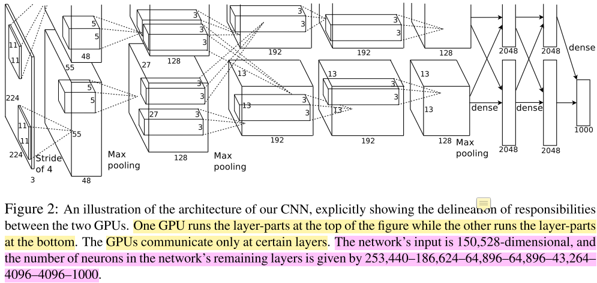
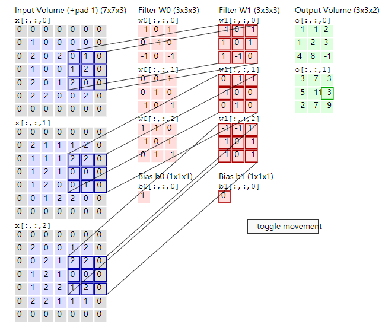
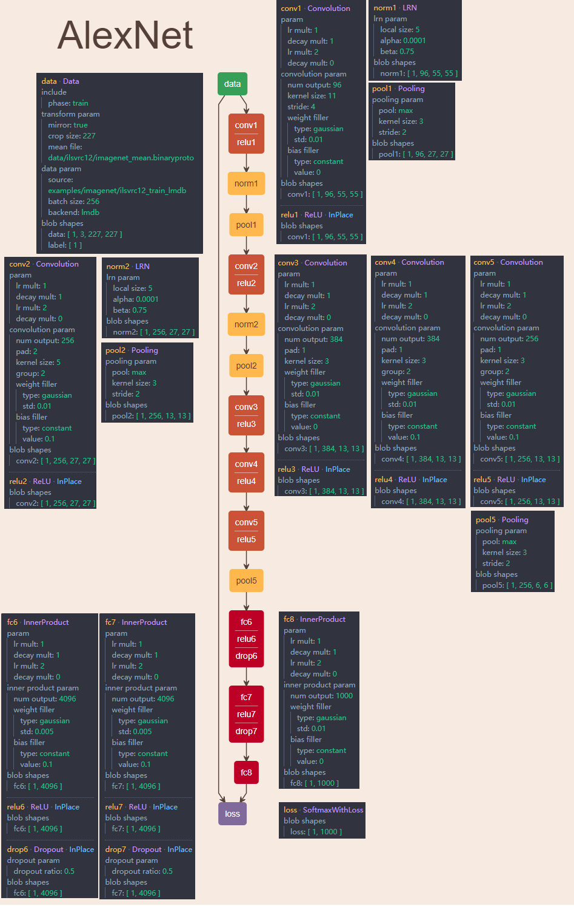
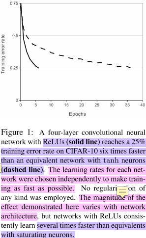
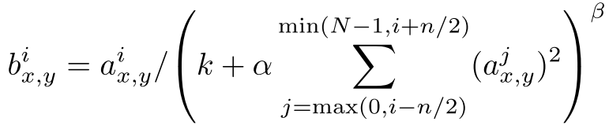
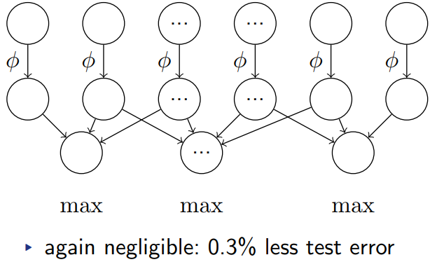
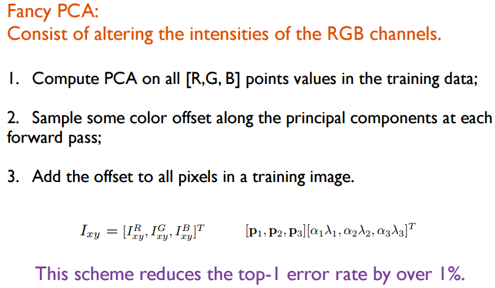
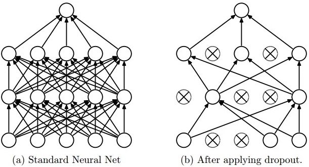
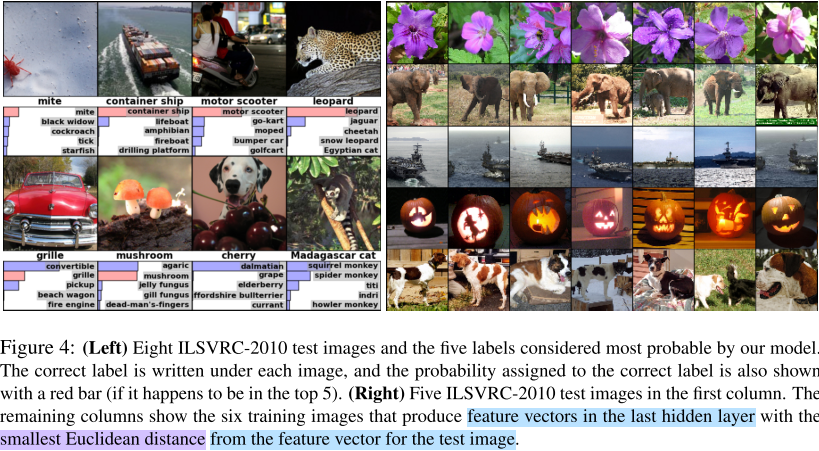
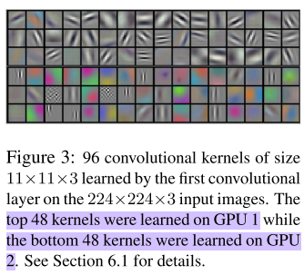

# ImageNet Classification with Deep Convolutional Neural Networks

这篇文章是Alex Krizhevsky在2012年提出的，Alex师从Hinton（也是本文的第三作者），之后也是FeiFei Li的学生。下面这幅图是模型的架构图（五个卷积后接三个全连接，最后是处理1000个元素的feature map的softmax，但softmax没画出来。后文会具体说明）：

本文做了这么件事：<strong>训练了一个深度卷积网络</strong>（6千万参数、65万神经元，结构为五层卷积，某些卷积层后接max-pooling层，后接三个全连接层，图中的方块或者竖条是feature map，连接的线是layer的名字，全连接就是dense layer。最后的特征是1000个元素的feature map，丢给没在图上体现的softmax完成分类）<strong>来完成2010年的ImageNet分类比赛的任务（LVSRC-2010），将120万张高分辨率的图片分为1000个类别</strong>。

特点在于：
<ol class="ol-list" start="">
<li><strong>收敛/训练速度加快</strong>，用了<strong>非饱和神经元（ReLU，即线性矫正单元）</strong>。ReLU是一种非线性神经元（当输入x大于0​，则输出为x​；输入​x小于0，则输出​0）较之前的​等激活函数计算速度更快，收敛也更快；</li>
<li><strong>模型并行</strong>。文中并没写是模型并行，但我看介绍认为是一种（有数据并行的）模型并行。训练过程用了两个GTX580 GPU 3GB（一个gpu无法cover住），除了第三层卷积、最后的两个全连接层（两个GPU将全连接拆成各自两部分）和Softmax（汇聚到单个GPU处理），其余部分处理可以看作两个GPU的数据并行（AlexNet架构图的上部分和下部分对应两个GPU各自的处理流程，单GPU的话，就是group=2这个可以看后文中通过netscope可视化出的网络结构）。相比单GPU没加快多少，同时某些层两个GPU共享参数，可以减少显存占用这样以便在一次参数更新放更多的图片加入训练。发现双卡比单卡top1和top5的error有下降（我认为是作者忘了改SGD学习率导致，先跑one-gpu net再跑two-gpu net）；</li>
<li><strong>正则化——数据扩增和dropout</strong>。关于数据增强，我的理解是：有变化才能找到规律。只要保证数据多样性的同时，同样的图像有些许的变化（不aug过头），这样网络的权重才能学到在变化中，输入到输出的映射本质，学习出/建立起鲁棒的网络权重/参数。没dropout模型训练很快会过拟合，加上后double了收敛时间（iteration次数）。但这一项没有做ablation study（或许做了文中没说），感觉这个dropout不convincing；</li>
<li><strong>性能state of art</strong>。top-1和top-5错误率分别为37.5%和17.5%。相比第二top-5错分率是26.2%。我觉得除以上外，性能提升的一个重要因素是做了数据扩增（data augmentation），产生更diverse的数据来拟合模型。</li>
</ol>
我个人认为Alex的工作主要在提出了AlexNet这一个网络架构和cuda-convnet这个库，其实整体工作很偏工程的。比较有特色的是跨通道的LRN（Local Response Normalization对acc提升很有限）但之后的发展历史上没见过了（不过我觉得LRN跨通道特征transform的思想带来了shuffleNet），论文中只有一个两行的带了动量的SGD的权重更新公式，没有数学证明和推倒，很像一篇实验报告，最后定性分析了结果（第一层卷积核的可视化：不同group上学到的kernel不同；网络最后一层的学到的特征好，可以用于图像搜索前的原始特征提取）。没什么理论证明啥的，dropout，relu那些东西也是拿来主义。

我想了下，也不能这么说，最大的工作就是AlexNet这个架构，除了不断尝试（超强的工程能力），有一定道理的分析和拍脑袋也是有学术思想在里面的（不能说偏工程，毕竟工程是实现的前提）。AlexNet能提出还是很有想法的。当时没有什么深度学习框架，实现这个工程挺难的。

总结：学术和工程意义非凡！开创了现代CNN的先河！本篇对该文章进行了分析，具体目录如下：[toc]

当然我有两个问题没有解决：
<ol class="ol-list">
<li>Local Response Normalization的backprop是怎么做的（后文给出了caffe的代码）；</li>
<li>data augmentation的Fancy PCA怎么算一张三通道图像的特征值和特征向量的（后文给出了cuda-convnet代码位置）？</li>
</ol>
下面我会逐一来详细分析这几个要点。不过首先来说一下任务背景。

<!--more-->
<h1>1. 任务背景</h1>
<h2>1.1 Model Capacity/Depth</h2>
介绍部分有说到对training set做了label-preserving的transformation，说白了就是一定程度的数据扩增（data augmentation），其实用更多的数据来训练模型这点大家都懂，尤其是数据多样性可以覆盖要训练的目标类别，多样性越丰富训练出的模型效果越好（YOLO文章作者曾写过一篇预测机器人物体抓取位置预测的文章，里面数据扩增的比例是1:3000​，当然结果也是好的惊人，其实我也有点纳闷是模型好，还是数据扩增的作用做到了state of art）。

此外这篇文章说到model capacity要足够大，这样才能从上百万图片中学到东西。作者提到前人的工作表示model capacity可以理解为网络的宽度和深度，相比前馈网络（Feedforward Network，也就是多层感知器，即MLP），前人的理论证明相同层数的多层感知器和卷积网络，卷积神经网络虽然参数少易于训练（更易收敛），但性能（准确率）上卷积网络要稍微差一些（其实我不太懂这里作者的逻辑，见下面）。
<blockquote>Thus, compared to standard feedforward neural networks with similarly-sized layers, CNNs have much fewer connections and parameters and so they are easier to train, while their theoretically-best performance is likely to be only slightly worse.</blockquote>
以上两段分别说明了数据和模型大小的重要性。作者的表意就是：千类物体分类的大任务，解决如此大任务需要大模型（深度-层数、宽度-卷积核数要够）来Cover，如此大模型就需要大量有些许差异的数据拟合（用变化去学习图像中不变的本质）。不过在我以往的经验上来看，越深（层数）的网络不见得越好。在MINST数据集和其它的一些Kaggle数据集上跑过不同深度的卷积网络和残差网络（18、34、50、101、152、200层），发现只有深度不同的情况下，最好的性能不是深度最深的， 而是深度一般的（宽度这一因素我也做过类似的实验，结果也差不多）。当然我考虑的是网络这个东西本身就是牵一发而动全身，因素太多，可能把深度作为一个因变量的同时，其他一些未知的超参数也需要重新设置为跟深度match的值，测试才有效果？这我不得而知，反正就是深度不一定，当然也有可能是我做的实验不够细致也不够多。
<blockquote>Our final network contains five convolutional and three fully-connected layers, and this depth seems to be important: we found that removing any convolutional layer (each of which contains no more than 1% of the model’s parameters) resulted in inferior performance.</blockquote>
不过作者做了这么一个实验，把已经确定的网络结构中的某些卷积层去掉，发现性能下降，然后得出的结论是：深度很重要。感觉这个实验在对深度的处理来说并不convincing，只能说明当前的网络结构（尤其是卷积层）很合理，卷积层在最大深度为5的的架构下比较好。关于深度的重要性，文章的conclusion部分也有论述：
<blockquote>our network’s performance degrades if a single convolutional layer is removed. For example, removing any of the middle layers results in a loss of about 2% for the top-1 performance of the network. So the depth really is important for achieving our results.

our results have improved as we have made our network larger and trained it longer.</blockquote>
另外刚说到模型capacity和数据量的关系，说到底，这些个监督学习是需要label的，模型的这些参数（或者说监督学习）都是在拟合数据的概率分布，既有图像中标准化后RGB的概率分布，还有类别信息的概率分布，还有每个类别中训练数据的占比的概率分布等等概率分布。

总是说“概率分布”，“拟合”，那网络到底学了什么。这里给出一页slide是CS231n这门课上关于线性回归的介绍，其中下面的10张可视化出来的小图就是这个线性分类器学到的权重矩阵$W​$对每个类别的权重向量可视化的结果。这10张小图从右往左数第三个是马，但模模糊糊好像是一个双头马，而且左边的头更明显一些。这是因为训练数据中马的头大多数是朝向左边的，其实这个过程就是在拟合数据得到一个模板，让新来的图像$x​$和这个权重矩阵$W​$（或者说是一个类别模板）计算$f(x, W) = Wx + b​$，输入图像与各个类的权重向量（$W​$整个权重矩阵是所有类的权重向量拼起来的）的模板越匹配，则算出来那一类的概率值就越大。虽然这个例子比较感性，但我想足已体现<strong>监督学习都是在拟合概率分布</strong>这个事实。

其实，监督模型拟合概率分布中的训练数据每类别的样本占比，这个还挺重要的。比方实际猫狗分类，需要考虑分类器的应用场景，若狗的训练数据过多而猫很少（想象一个极端情况：总计10000张猫狗图像，狗有10张剩下全是猫的图像），用这样类别极度不平衡的数据训练处的分类器大概率会把物体识别为猫，因为分类器对狗学习得不够多，不了解，反而对猫学习得过多很可能造成了严重的过拟合。如果实际的使用场景中狗作为异常点，比方一个猫猫乐园要统计猫的数量来确定每天需要的食物量确保不要把外来的狗计算在内（狗就被当做异常），即使数据倾斜得厉害（猫多狗少），这个分类器在实际中大概率也还是可以用的。还有一个例子是Kaggle小伙伴在一个二分类比赛中提交test类别完全一样的submission，结合evaluation的公式来public board上的类别分布，从而估计private board上的类别分布，从而在训练的时候按照这一的比例去训练模型，最后拿到了不错名次。
<h2>1.2 ImageNet</h2>
ImageNet包含22000个类别的1500万张图像（主要标注任务由项目负责人FeiFei Li组织完成，大部分标注任务使用了亚马逊的众包项目完成）。因为ImageNet这个项目和FeiFei Li等人的不懈努力，有一个名叫ILSVRC（ImageNet Large Scale Visual Recognition Challenge）的年度比赛，作为Pascal Visual Object Challenge的一部分。但ILSVRC只用了ImageNet数据集中的一个子集数据：包含1000类，每类大概1000张图像，训练集有120万张图像、验证集5万张图像以及15万张用来测试的图像。分类任务的模型性能习惯用top-1和top-5两个错误率进行不同模型的比较。

因为本身ImageNet的图像分辨率是不同的，而我们的分类系统一般而言输入都是固定大小的。作者的做法是将图像下采样到一个固定的$256 \times 256$分辨率。对于矩形图像，将其短边缩放到256像素，然后从中间部分crop out$256 \times 256$大小的图像patch。作者做的预处理操作只有一个——将图像中每个像素值减去整个训练集所有图像同一位置处的像素均值。相当于作者喂给网络的是一个centered raw RGB像素值。
<h1>2. Architecture</h1>
再一次回到正题，网络结构一开始的时候已经放出了图，两个GPU分别跑前五个卷积层，从第一个到第三个全连接层共享参数，每个GPU分摊二分之一的参数，最后生成的1000个元素的feature map交给下面的GPU，再进行softmax计算。

这个图注里作者写的是neurons数目，我看既不是feature map也不是网络参数（CS231n在讲Conv的博文中有一章节讲到从brain view来看neuron，没看懂）。经过和小伙伴们的讨论，我们确定第一个卷积层后的feature map，也就是253400这个数作者算错了，而应该是$55 \times 55 \times 48 \times 2 = 290400$，后面计算的feature map维度都正确。这里简单说一下feature map和网络权重的计算方法。

上图每个立方体或者长条都是feature map（维度为224x224x3的输入图像其实也可以看成是一种feature map，需要注意的是某些conv层后有pool操作，Alex没有画出来，但是后面我贴出的netscope给出了pool具体的参数）。
<ul>
<li>输入层：作者说网络输入是150528维度，也就是输入图像的长、宽和通道数的乘积（$224 \times 224 \times 3 = 150528$）。接下来经过第一层卷积操作，第一层卷积操作的具体参数量为11712；</li>
<li>卷积层1：卷积核宽和高为11，即$11 \times 11$，网络架构图上有上下两路，两路feature map通道数的总和96，等同于output channel的数量，这个结论我是根据CS231n中的下面这张图得出的（可以看到有两个卷积核$w_0$和$w_1$，而且每个卷积核的维度都是$3\times3\times3$的带深度的三维结构，需要注意的是：<strong>每个卷积核处理上一层输入的一张图三个通道，那么卷积核也是三维的</strong>，同时每个卷积核还有1个偏执单元，那么2卷积核有2个bias，总参数量为：$3 \times 3 \times 3 \times 2 + 2 = $），那么总共的卷积参数大小为：$(11 \times 11 \times 3 \times 48 + 48 ) \times 2 = 34944$。主要在于这里是上下两路，单路是$11 \times 11 \times 3 \times 48 + 48 = 17472$；</li>
</ul>

<ul>
<li>卷积层1得到的feature map：第一个卷积层后得到feature map，由两个48通道的feature map合起来看，相当于算这个立方体的体积。总维度为$55 \times 55 \times 48 \times 2 = 290400$（作者图注写的是253400是错的）。feature map的计算是根据上一层（输入）的长宽减去filter的长宽，加上2倍的padding的和，除以stride 4，最后加1，即$(224 - 11 + 2 \times 0) \div 4 + 1 = 54.25$，会发现这里不是55且带小数，CS231n课程中有下面一段说Alex当时可能是在227的图上做的（但是下面这段话说Alex做了padding，我觉得如果224的图要padding得到55的话，要这么算：$(224 - 11 + 2 \times 1.5) \div 4 + 1 = 55$，也就是说$padding=1.5$），即$(227 - 11 + 2 \times 0) \div 4 + 1 = 55$；
<blockquote><em>As a fun aside, if you read the actual paper it claims that the input images were 224x224, which is surely incorrect because (224 - 11)/4 + 1 is quite clearly not an integer. This has confused many people in the history of ConvNets and little is known about what happened. My own best guess is that Alex used zero-padding of 3 extra pixels that he does not mention in the paper.
</em><em>                                                                                                                    from CS231n blog</em></blockquote>
</li>
<li>norm1层：norm就是local response normalization，基于局部小区域的像素值强度归一化（后面介绍），对feature map大小没有影响；</li>
<li>pool1层（pool：max；kernel size：3；stride：2）：上一层卷积feature map维度（把两个支路一起看）为：$W=55, H=55, D=96$，分比表示宽度、高度、深度（channel数）。经过pool后的结果这么算：$W_1 = (W-F)/S + 1 ; H_1 = (H - F)/S + 1; D_2 = D_1$，其中F和S分别是两个pool的超参数池化空间扩展（spatial extent，相当于池化的kernel）和池化步幅（Stride）。那么得到的新的feature volume的长、宽、深（通道数）为$W_1 = 27; H_1 = 27; D_1 = 96$，整体规模为$[(55-3)/2 +1] \times [(55 - 3)/2 + 1] \times 96 = 69984$；</li>
<li>卷积层2：权重规模为（拆成两路算）：$(5 \times 5 \times 48 \times 128 + 128 ) \times 2 = 307456$。其实有个很基础的公式（也带计算bias）：$ \#input\ channel \times \# {kernel\ size}^2 \times \# output\ channel + \#output\ channel$，这里是双路GPU所有每一路算各自的，最后乘以2；</li>
<li>卷积层2得到的feature map：$27 \times 27 \times 128 \times 2 = 186624$；</li>
<li>norm2：略，186624；</li>
<li>pool2：$[(27 - 3) / 2 + 1] \times [(27 - 3) / 2 + 1] \times 128 \times 2 = 43264$；</li>
<li>卷积层3：权重规模为：$(3 \times 3 \times 128 \times 192 \times 2 + 192 \times 2) \times 2= 885504$，但是我根据netscope的网络结构（没有group，注意没有分支）图算出来的权重规模为：$3 \times 3 \times 256 \times 384 + 384 = 885120$。后来发现这个885504（前一个）算的不对，因为文中说到：the kernels of layer 3 take input from all kernel maps in layer 2，所以这里就把两条支路当做一条路，前一层上下两路的feature map当做一起的，后面得到的上下两路feature map一当做一起的。前者多出来一个384，是因为多了一个GPU产生的bias数目。或许因此，two-gpu net比one-gpu net的性能好（我的猜测后文是作者又尝试了非GTX580的大显存卡吧，当然不排除作者减小input shape和模型中的kernel size来训练one-gpu net。这里作者也没讲清）；</li>
<li>卷积层3得到的feature map：$13 \times 13 \times 192 \times 2 = 648,96$；</li>
<li>卷积层4：权重规模为：$(3 \times 3 \times 192 \times 192 + 192) \times 2 = 663,936$，与单GPU（后面netscope）的数值一致；</li>
<li>卷积层4得到的feature map：$13 \times 13 \times 192 \times 2 = 64896$；</li>
<li>卷积层5：权重规模为：$(3 \times 3 \times 192 \times 128 + 128) \times 2 = 442624$，与单GPU（后面netscope）的数值一致；</li>
<li>卷积层5得到的feature map：$13 \times 13 \times 128 \times 2 = 43264$；</li>
<li>pool5：见下；</li>
<li>全连接层1：权重规模：可以单独算，$(13 \times 13 \times 128 \times (2048 + 2048) + 13 \times 13 \times 128 ) \times 2 = 177,252,608$，或者两路GPU的结果合并算，$13 \times 13 \times 128 \times 2 \times 2048 \times 2 + 13 \times 13 \times 128 \times 2= 177,252,608$。这么算是没错的但是没有考虑pooling5（pool：max；kernel size：3；stride：2），我们先计算经过pooling5后的维度：$[(13 - 3) / 2 + 1] \times [(13 - 3)/2 + 1] \times 128 = 4608$，当然这是一个支路pool5后的结果，两个就是9216。此时再计算全连接：$9216 \times 4096 + 4096 = 37,752,832$。相比没有pool5的177,252,608，数量减少了一个多亿的参数量（78%）；</li>
<li>全连接层1得到的feature map：4096；</li>
<li>全连接层2：权重规模：$4096 \times 4096 + 4096 = 16,781,312$；</li>
<li>全连接层2得到的feature map：4096；</li>
<li>全连接层3：权重规模：$4096 \times 1000 + 1000 = 4,097,000$；</li>
<li>全连接层3得到的feature map：$1000$；</li>
<li>softmax：1k-way。</li>
</ul>
这里再把netscope和Alex画的图都扔出来，同时计算总的参数量：

<table class="md-table" contenteditable="false">
<thead>
<tr class="md-end-block">
<th>Layer Name</th>
<th>model size of one-gpu net</th>
<th>model size of two-gpu net</th>
<th>feature map</th>
</tr>
</thead>
<tbody>
<tr class="md-end-block">
<td>input</td>
<td>-</td>
<td>-</td>
<td>150,528</td>
</tr>
<tr class="md-end-block">
<td>conv1</td>
<td>34,944、8（hyper-params）</td>
<td>34944、16</td>
<td>290,400</td>
</tr>
<tr class="md-end-block">
<td>norm1</td>
<td>3（local size、alpha、beta）</td>
<td>6</td>
<td>290,400</td>
</tr>
<tr class="md-end-block">
<td>pool1</td>
<td>2（kernel size、stride）</td>
<td>4</td>
<td>69,984</td>
</tr>
<tr class="md-end-block">
<td>conv2</td>
<td>307,456、8</td>
<td>307,456、16</td>
<td>186,624</td>
</tr>
<tr class="md-end-block">
<td>norm2</td>
<td>3</td>
<td>6</td>
<td>186,624</td>
</tr>
<tr class="md-end-block">
<td>pool2</td>
<td>2（kernel size、stride）</td>
<td>4</td>
<td>43,264</td>
</tr>
<tr class="md-end-block">
<td>conv3</td>
<td>885,120、8</td>
<td>885,504、16</td>
<td>648,96</td>
</tr>
<tr class="md-end-block">
<td>conv4</td>
<td>663,936、8</td>
<td>663,936、16</td>
<td>648,96</td>
</tr>
<tr class="md-end-block">
<td>conv5</td>
<td>442,624、8</td>
<td>442,624、16</td>
<td>43,264</td>
</tr>
<tr class="md-end-block">
<td>pool5</td>
<td>2（kernel size、stride）</td>
<td>4</td>
<td>4,608</td>
</tr>
<tr class="md-end-block">
<td>fc6</td>
<td>37,752,832、6（有dropout）</td>
<td>37,752,832（强调：每张卡摊一半）、12</td>
<td>4,096</td>
</tr>
<tr class="md-end-block">
<td>fc7</td>
<td>16,781,312、6（有dropout）</td>
<td>16,781,312（同上）、12</td>
<td>4,096</td>
</tr>
<tr class="md-end-block">
<td>fc8</td>
<td>4,097,000、5</td>
<td>4,097,000（强调：reduce到一张卡）、5</td>
<td>1,000</td>
</tr>
<tr class="md-end-block">
<td>SUM</td>
<td>400,740,785</td>
<td>基本同左</td>
<td>1,404,680</td>
</tr>
</tbody>
</table>
最后算出来，one-gpu net和two-gpu net的model参数规模基本一致，量级都在4000万。feature map的量级在140万（feature map就是作者文中所说的neurons个数）。不过可以发现，和作者开头所写的模型参数6000万，神经元数量（feature map）60万是不吻合的。不过还是以我算的为准吧（作者又算错了）。

下面根据论文主要讲架构的三个点：非线性激活函数ReLU、重叠池化（Overlapping Pooling）以及这篇文章比较有特色的多卡训练和局部响应规范化（Local Response Normalization）。
<h2 class="md-end-block md-heading">2.1 ReLU</h2>
用这种分段函数比先前的S型函数（tanh、sigmoid）收敛快，作者拿了个四层的CNN分别用tanh和ReLU训练，发现在train error rate曲线图上，到达相同的train error rate，tanh比ReLU慢6倍（见下图，当然这个tanh的曲线好像是作者手画的还抖了几下子）。

<h2>2.2 多卡训练</h2>
两张小破卡GTX 580 3GB（查了下CUDA compute capacity为2.0，现在性价比最高的1080是6.1）是要解决一张卡，显存塞不下模型的问题，但其实我也有疑问，后文又说到two-gpu net比one-gpu net的acc要高，这个one-gpu net如果说是用580的卡，岂不是矛盾，一种可能是作者有显存更大的卡，在保证其他都一样的情况下，又训练了一遍发现两张卡的结果好；要么就是缩小了模型或图像分辨率等等，把模型和中间的结果得以塞进一张卡。后来我又想了下，有可能是作者先跑了one-gpu net的模型，之后跑two-gpu net的模型时，然后忘了改学习率，或者说bsize比较小。当然都有可能啦。

那么具体来说一下两张卡相比单张卡在模型训练过程中的差异。在上下两路中第2层、第4层、第五层的卷积会有参数共用，若是单GPU训练，这里其实就是group=2。简单来说，如果上一层的feature map的depth为256，在group=2的情况下，256会分为两个128的feature map（即feature map A和feature map B），同时这一层的卷积kernel也会分为等数量的两组比方C和D，那么做conv的过程就是：用C这一组卷积核只在A上做，用D这一组卷积核只在B上做。那么最后就是$A \times C + B \times D$。而这里巧妙之处在于为了节省显存，作者用2个GPU实现了group=2这个概念，在当时可能还没有group这个卷积分组的概念。
<blockquote><em>This means that, for example, the kernels of layer 3 take input from all kernel maps in layer 2. However, kernels in layer 4 take input only from those kernel maps in layer 3 which reside on the same GPU.</em></blockquote>
图中第三个卷积层，第一个、第二个全连接层有参数共享，最后一个全连接的网络参数都在第二张卡上（相当于第一张空了）做reduce。除此之外，网络上下两部分（即两个GPU对应的两个分支）都是相同的。但是这里有个问题在于，我算第三个卷积层的时候，two-gpu net比one-gpu net多了384个参数（来自多出一个GPU所带来的conv3的filter数量个bias），因为两个gpu存在两组filter，但其实还是对作者上面这句话不太理解：似乎是说两张卡只有一张卡存模型参数，如果是这样，那么参数量就多计算了384个。其实这里忽略吧，毕竟现在即使是多张卡，也都是one-gpu net的数据并行，而不是模型并行。

这种连接pattern作者是通过validation来选的，认为这样比较好控制计算量和模型体积。说几句题外话，现在似乎都不关心GPU的连接拓扑结构了，即插即用。Pascal等新架构有了NVLink（一个能够在GPU-GPU以及GPU-CPU之间实现高速大带宽直连通讯的快速互联机制），理论带宽性能可以达到80GB/s，当然是卡之间的，是传统PCIE3.0的5~12倍率。如果机器是Power架构，Power CPU和GPU之间也可以通过NVLink连接，同时Power架构另一个优势是超高的内存带宽（CPU-内存），不过理论上双路Power CPU带宽为230GB/s，实测150GB/s，双路至强是99GB/s左右（Power架构就以上两个优势吧，总体而言和X86架构在深度学习的训练上比没什么）。
<h2>2.3 Local Response Normalization</h2>
作用是有助于泛化，有这个操作模型在Cifar10（四层CNN）和ImageNet数据集（AlexNet）上准确率有提高。这是一种根据附近$n/2$个通道在同一个位置的像素来做局部像素值规范化的方法，计算第j个通道在x,y位置上局部响应规范化后的值$b^i_{x,y}$的计算公式如下：

其中，$a^j_{x,y}$是第j个通道上x,y位置上的ReLU激活值。$n, k, \alpha, \beta$都是超参数，根据一组validation set得到$n = 5, k=2, \alpha=10^{-4}, \beta = 0.75$，N是这个feature map总的通道个数。

对值不大或过大的response在channel层级上有normalization的作用，被磨平（跨通道且带有局部性质的非极大值抑制）了。缺点也比较明显，因为是跨通道的，本身通道层级上的信息交流（不同卷积核之间的信息交流）相比如卷积这样单通道的信息交流有说服力（不过这里有一种，ShuffleNet中channel级别的信息crosstalk的感觉）；此外local带有随意性，和batch size内的顺序有关（如果分配再科学一些就更好了）。这一方法在后来VGG那篇文章里说到LRN并没什么用，在之后的发展历史上也基本没有出现过。

忽然想到一个问题那LRN的backprop怎么算？问了好几个人答案不尽相同，还是翻了Caffe的代码：
<pre class="lang:c++ decode:true ">template &lt;typename Dtype&gt;
void LRNLayer&lt;Dtype&gt;::Backward_cpu(const vector&lt;Blob&lt;Dtype&gt;*&gt;&amp; top,
        const vector&lt;bool&gt;&amp; propagate_down, const vector&lt;Blob&lt;Dtype&gt;*&gt;&amp; bottom) {
    switch (this-&gt;layer_param_.lrn_param().norm_region()) {
        case LRNParameter_NormRegion_ACROSS_CHANNELS:
            CrossChannelBackward_cpu(top, propagate_down, bottom);
            break;
        case LRNParameter_NormRegion_WITHIN_CHANNEL:
            WithinChannelBackward(top, propagate_down, bottom);
            break;
        default:
            LOG(FATAL) &lt;&lt; "Unknown normalization region.";
    }
}

template &lt;typename Dtype&gt;
void LRNLayer&lt;Dtype&gt;::CrossChannelBackward_cpu(
        const vector&lt;Blob&lt;Dtype&gt;*&gt;&amp; top, const vector&lt;bool&gt;&amp; propagate_down,
        const vector&lt;Blob&lt;Dtype&gt;*&gt;&amp; bottom) {
    const Dtype* top_diff = top[0]-&gt;cpu_diff();
    const Dtype* top_data = top[0]-&gt;cpu_data();
    const Dtype* bottom_data = bottom[0]-&gt;cpu_data();
    const Dtype* scale_data = scale_.cpu_data();
    Dtype* bottom_diff = bottom[0]-&gt;mutable_cpu_diff();
    Blob&lt;Dtype&gt; padded_ratio(1, channels_ + size_ - 1, height_, width_);
    Blob&lt;Dtype&gt; accum_ratio(1, 1, height_, width_);
    Dtype* padded_ratio_data = padded_ratio.mutable_cpu_data();
    Dtype* accum_ratio_data = accum_ratio.mutable_cpu_data();
    // We hack a little bit by using the diff() to store an additional result
    Dtype* accum_ratio_times_bottom = accum_ratio.mutable_cpu_diff();
    caffe_set(padded_ratio.count(), Dtype(0), padded_ratio_data);
    Dtype cache_ratio_value = 2. * alpha_ * beta_ / size_;

    caffe_powx&lt;Dtype&gt;(scale_.count(), scale_data, -beta_, bottom_diff);
    caffe_mul&lt;Dtype&gt;(scale_.count(), top_diff, bottom_diff, bottom_diff);

    // go through individual data
    int inverse_pre_pad = size_ - (size_ + 1) / 2;
    for (int n = 0; n &lt; num_; ++n) {
        int block_offset = scale_.offset(n);
        // first, compute diff_i * y_i / s_i
        caffe_mul&lt;Dtype&gt;(channels_ * height_ * width_,
                top_diff + block_offset, top_data + block_offset,
                padded_ratio_data + padded_ratio.offset(0, inverse_pre_pad));
        caffe_div&lt;Dtype&gt;(channels_ * height_ * width_,
                padded_ratio_data + padded_ratio.offset(0, inverse_pre_pad),
                scale_data + block_offset,
                padded_ratio_data + padded_ratio.offset(0, inverse_pre_pad));
        // Now, compute the accumulated ratios and the bottom diff
        caffe_set(accum_ratio.count(), Dtype(0), accum_ratio_data);
        for (int c = 0; c &lt; size_ - 1; ++c) {
            caffe_axpy&lt;Dtype&gt;(height_ * width_, 1.,
                    padded_ratio_data + padded_ratio.offset(0, c), accum_ratio_data);
        }
        for (int c = 0; c &lt; channels_; ++c) {
            caffe_axpy&lt;Dtype&gt;(height_ * width_, 1.,
                    padded_ratio_data + padded_ratio.offset(0, c + size_ - 1),
                    accum_ratio_data);
            // compute bottom diff
            caffe_mul&lt;Dtype&gt;(height_ * width_,
                    bottom_data + top[0]-&gt;offset(n, c),
                    accum_ratio_data, accum_ratio_times_bottom);
            caffe_axpy&lt;Dtype&gt;(height_ * width_, -cache_ratio_value,
                    accum_ratio_times_bottom, bottom_diff + top[0]-&gt;offset(n, c));
            caffe_axpy&lt;Dtype&gt;(height_ * width_, -1.,
                    padded_ratio_data + padded_ratio.offset(0, c), accum_ratio_data);
        }
    }
}

template &lt;typename Dtype&gt;
void LRNLayer&lt;Dtype&gt;::WithinChannelBackward(
        const vector&lt;Blob&lt;Dtype&gt;*&gt;&amp; top, const vector&lt;bool&gt;&amp; propagate_down,
        const vector&lt;Blob&lt;Dtype&gt;*&gt;&amp; bottom) {
    if (propagate_down[0]) {
        vector&lt;bool&gt; product_propagate_down(2, true);
        product_layer_-&gt;Backward(top, product_propagate_down, product_bottom_vec_);
        power_layer_-&gt;Backward(power_top_vec_, propagate_down, pool_top_vec_);
        pool_layer_-&gt;Backward(pool_top_vec_, propagate_down, square_top_vec_);
        square_layer_-&gt;Backward(square_top_vec_, propagate_down,
                square_bottom_vec_);
        split_layer_-&gt;Backward(split_top_vec_, propagate_down, bottom);
    }
}</pre>
LRN层backprop的计算根据LRN的norm_region的不同分两种情况：一种是ACROSS_CHANNELS（会调用CrossChannelBackward_cpu(top ,propagate_down, bottom)），另一种是WITHIN_CHANNEL（会调用WithinChannelBackward(top, propagate_down, bottom)）。压力实在很大，看不下去了，放弃！

作者的cuda-convnet代码写的也很冗长，这里只贴出这backprop部分的上层代码：
<pre class="lang:c++ decode:true ">void ResponseNormLayer::bpropActs(NVMatrix&amp; v, int inpIdx, float scaleTargets, PASS_TYPE passType) {
    convResponseNormUndo(v, _denoms, _prev[0]-&gt;getActs(), getActs(), _prev[0]-&gt;getActsGrad(), _channels, _size, _scale, _pow, scaleTargets, 1);
}</pre>
<h2>2.4 Overlapping Pooling</h2>
传统没有重叠，有重叠发现更难过拟合，泛化能力提高（准确率有微弱提高）。具体流程是这么做的：

因为上图是兴趣区域的pooling，与我们的一边的pooling有一些差别，不过二者大体一致。此外，我在文章发现这句话：
<blockquote>We generally observe during training that models with overlapping pooling find it slightly more difficult to overfit.</blockquote>
“有了重叠池化网络不易过拟合”。多少有点反直觉，池化带来信息量减少，重叠形式带来非极大值抑制的作用。直觉上觉得这样会更快收敛，但准确性上不好说（如果作者可以进一步分析一下就更好了）。但实际这里性能的提升相比不带重叠的确实很微弱：top1和top5分别提升0.4%和0.3%。

这里放出池化算法的具体步骤（摘录自CS231n）：
<blockquote>
<ul class="ul-list" data-mark="-">
<li>Accepts a volume of size ​$W_1 \times H_1 \times D_1$</li>
<li>Requires two hyper-parameters:
<ul class="ul-list" data-mark="-">
<li>their spatial extent ​$F​$,</li>
<li>the stride ​$S$,</li>
</ul>
</li>
<li>Produces a volume of size ​$W_2 \times H_2 \times D_2$  where:
<ul class="ul-list" data-mark="-">
<li>$W_2=(W_1−F)/S+1$</li>
<li>$H_2=(H_1−F)/S+1$</li>
<li>$D2=D1$</li>
</ul>
</li>
<li>Introduces zero parameters since it computes a fixed function of the input</li>
<li class="md-focus-container">Note that it is not common to use zero-padding for Pooling layers</li>
</ul>
</blockquote>
<h1>3. Reducing Overfitting</h1>
<blockquote>Although the 1000 classes of ILSVRC make each training example impose 10 bits of constraint on the mapping from image to label, this turns out to be insufficient to learn so many parameters without considerable overfitting.</blockquote>
把图像映射到10bits（$2^{10} = 1024 \approx 1000$）的类别信息中，如果不过拟合，那么大模型很难从1000类图像中学到如此量级的参数。那么如此说来，就很有必要再过拟合以及参数学习两者之间trade off。文中有两个方法来避免过拟合：
<ol>
<li>Data augmentation</li>
<li>Dropout</li>
</ol>
<h2>3.1 Data Augmentation</h2>
作者用到的数据扩增有水平翻转和像素值加噪声两种方式。水平翻转是对原始图像统一resize到$256 \times 256 $大小，再crop出所有$224 \times 224$的图，进行水平翻转扩大2倍，那么训练图像就增加了$(256 - 224 + 1) \times (256 - 224 + 1) \times 2 = 2178$倍，作者算的2048（$32\times 32\times 2 = 2048$）是错的。

第二种方式是改变图像上RGB通道的像素强度值（加噪声，带来的优势是top1错误率降低1%），大概流程是：计算原始图像的协方差矩阵，根据协方差矩阵计算特征值和特征向量，在特征值前加入噪声系数（服从均值为0，标准差为0.1的高斯分布，然后复原回原始图像，得到加了噪声的图像）。有三个步骤：

上面这幅图来自魏秀参的神经网络训练tricks的data augmentation部分。但是我觉得不需要计算PCA，只需要把图像的特征值和特征向量拿到就好了吧。然后在特征值前加入均值为0标准差为0.1的高斯噪声随机变量，再将数据还原回去即可。这里不是很明白，还是需要看看代码`cuda-convnet/src/cudaconv2/img_acts.cu`，困死了，卒！不看了！摔！
<h2>3.2 Dropout</h2>

dropout解决模型过拟合的问题，但带来的一个问题是double了iteration次数才收敛。实现是通过设定一个dropout的概率`dropOutFraction`，训练过程中的forward和backward会随机使这一层的神经元以p的概率失活，在AlexNet中dropout在前两个全连接层。deeplearn toolbox的实现如下：
<pre class="lang:matlab decode:true ">% dropout
% forward stage in NN\nnff.m
    if(nn.dropoutFraction &gt; 0)
if(nn.testing)
    nn.a{i} = nn.a{i}.*(1 - nn.dropoutFraction);
    else
    nn.dropOutMask{i} = (rand(size(nn.a{i}))&gt;nn.dropoutFraction);
    nn.a{i} = nn.a{i}.*nn.dropOutMask{i};
end
end
% backward stage in NN\nnbp.m
if(nn.dropoutFraction&gt;0)
d{i} = d{i} .* [ones(size(d{i},1),1) nn.dropOutMask{i}];
end</pre>
<ul>
<li>forward：可以看到神经元失活是先随机初始化一个与当前层规模一样的mask，然后根据mask中每个元素的随机值（介于0到1之间），将小于`dropoutFraction`的元素设置为0，其余为1，得到`dropOutMask`。再将该层的所有激活值与`dropOutMask`进行点乘，得到结果。照deeplearn toolbox的代码显示，每次forward随机的mask都是不同的；</li>
<li>backward：backprop回来的所在层的derivatives乘以对应层的`dropOutMask`。</li>
</ul>
<blockquote>其实我一开始还有点费解为什么dropout的backprop要乘以mask：forward的时候已经按照dropOutFraction这个值dropout了，backprop就不需要再dropout了吧，结果代码中却对derivatives再乘以`dropOutMask`，岂不是相当于做了两次同样fraction的dropout？</blockquote>
后来想了想，就应该在backward的阶段乘以`dropOutMask`，因为forward的时候是mask的不完整模型进行的，那么backprop必然也是针对这个不完整的模型进行update；
<ul>
<li>test：所有神经元参与计算，但是每个元素值乘以(1-`dropOutFraction`，作为没有被dropout的比率被留下的值。</li>
        </ul>
        <blockquote>原理上，我同样不太明白：为什么所有单元都参与运算的同时还需要乘以`droputFraction`？我觉得所有单元参与本身训练的时候就是不完整的，test的时候再来一次，岂不被阉割两次？</blockquote>
        后来也想通了，dropout每次forward的mask都是不同的，相当于从一个大模型中sample出一个小模型，那么forward和test阶段要保证一致，forward是让`dropOutFraction`的神经元失活，那么test阶段全用（集成的大模型，不要看做认为是被阉割过的），就通过结果再乘以(1-`dropOputFraction`)来和forward阶段保持一致。
        <h1>4. Details of learning</h1>
        这部分汇总一下作者提到的训练经验：
        <ul>
        <li>权重初始化：每层权重根据均值为0标准差为0.01的高斯分布初始化，第二、第四、第五层卷积和全连接层的bias初始化为常数1，剩下所有层的bias初始化为0。这种初始化有助于早期阶段正样本的学习的加速；</li>
        <li>优化算法：小批量梯度下降；
        $$
        \begin{align*}
        v_{i+1} &amp; := 0.9 \cdot v_i - 0.0005 \cdot \epsilon \cdot w_i - \epsilon \cdot \left \langle \frac{\partial L}{\partial w}|_{w_i} \right \rangle_{D_i} \\
        w_{i+1} &amp; := w_i + v_{i+1}
        \end{align*}
        $$
        其中，$i$表示迭代的索引次数（从0开始），$v$表示动量变量，$\epsilon$是学习率，$\left \langle \frac{\partial L}{\partial w}|_{w_i} \right \rangle_{D_i}$是目标函数关于$w$的偏导数值，基于第$i$个batch $D_i$的平均。</li>
        <li>batch size：128。<strong>其实这个bsize感觉很大，两个GTX580 3GB能Cover住，尤其是每张图是224大小的，我表示震惊，这里没具体分析</strong>；</li>
        <li>learning rate：0.01，所有层使用一样的初始学习率。训练过程中如果val-error不降低，那么就会对learning rate除以10。训练总共跑了90个epochs，3次因为val-error不降低调整学习率；</li>
        <li>momentum：0.9；</li>
        <li>weight decay：0.0005。重要，不仅起正则（提高val-acc）作用，也提高train-acc；</li>
        <li>epochs：90。跑了90遍（两张GTX 580 3GB，跑了5、6天，估算下来230img/sec/2gpus，感觉很挺快的）120万张图像的数据集，前面说到仅仅crop+flip的data augmentation就做了2178倍的数据扩增，这里需要说明的是，data augmentation不是说跑一张图像会跑2178次，而是说每个epoch每张图像都会有2178种随机变化的可能性，使得每次数据有一定的变化。</li>
</ul>
<h1>5. Feature Extractor</h1>
其实训练好的网络本身就可以当做特征提取器，比方下面图右侧，就是跑了网络得出softmax前的feature map，然后对其他所有图与给定的图计算欧氏距离，得到最近的6张图（这一方法在人证比对之类的场景用的比较多）。每一行第一个是给出的图，这一行剩下的6个是其他feature map与第一张图最近的6张。

这点足以看出，pre-trained模型的特征提取能力。还有一个好玩的地方是文中说的data-connect层，说白了就是第一个卷积层，作者将第一个卷积层可视化，总共96个通道，可以明显看到上下两个GPU训练得到的卷积核侧重点不同，上面偏重对网络线条、方向的学习，下面偏重对颜色和方向的学习。其实在模型架构那里，我也拿出了CS231n课程上线性回归那一节的截图，也是对线性回归的权重可视化是目标类别的模模糊糊的轮廓。

我想如果将每层可视化的卷积权重进行逐层的叠加等处理，是否也会得到类似目标类别模糊轮廓的模板呢？
<h1>6. 参考</h1>
<ul>
<li>[1] ImageNet Classification with Deep Convolutional Neural Networks</li>
<li>[2] CS231n Convolutional Neural Networks for Visual Recognition
http://cs231n.github.io/convolutional-networks/#pool
http://cs231n.stanford.edu/slides/2017/cs231n_2017_lecture3.pdf</li>
<li>[3] IBM Deep Learning “专用” S822LC 服务器深(fu)度(yan)测评 – HPCCHINA
http://hpcchina.net/ibm-deep-learning-server-s822lc-review/</li>
<li>[4] GTC喧嚣后的思考 NVLink技术及影响解析（全文）_NVIDIA GeForce GTX 780Ti_显卡评测-中关村在线
http://vga.zol.com.cn/445/4459884_all.html</li>
<li>[5] Must Know Tips/Tricks in Deep Neural Networks (by &lt;a href="http://lamda.nju.edu.cn/weixs/"&gt;Xiu-Shen Wei&lt;/a&gt;)
http://lamda.nju.edu.cn/weixs/project/CNNTricks/CNNTricks.html</li>
<li>[6] deepsense-ai/roi-pooling
https://github.com/deepsense-ai/roi-pooling</li>
</ul>
<audio style="display: none;" controls="controls"></audio>
