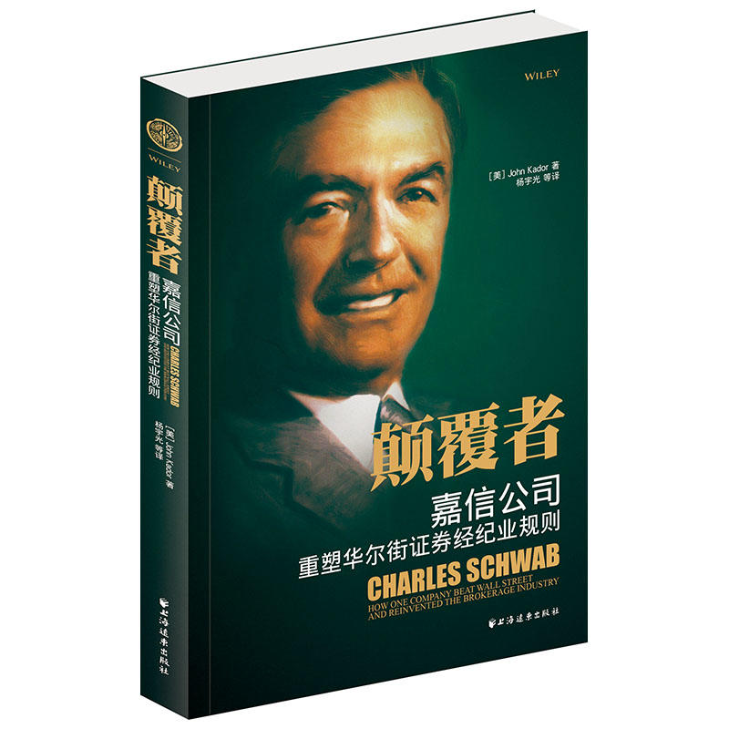

[](https://yuenshome.github.io)

# 读《颠覆者：嘉信公司-重塑华尔街证券经纪业规则》几点收获

记得有一次是在感觉自己身体不好的时候去体检的过程当中（当然后来体检结果是好），无聊的时候看手机微信，然后刷出一篇文章，讲的是腾讯的一位前总经理之类的级别的员工，在离职之后创办了一家互联网金融类的公司，这家公司的主要做的是关于股票和互联网方面的事情。

在他给大家讲自己的创业过程时，他提到了一本书，就是这本名叫“嘉信公司-重塑华尔街证券经纪业规则”的这本书，当然，它有一个非常霸气威武的书名，名字叫《颠覆者》。



在看这本书的过程中，从开头开始看起，我不得不承认相关的证券，或者说是股票的基本概念我并不清楚，刚开始看起我是一头雾水，但是随着往后推进，越清楚一些，可能这些不清楚的地方，一是因为自己没这方面的背景，二可能是因为在翻译当中，它的描述不准确，当然还有第三点，本身美国在证券业上与我国有一些出入和差别。当然作者在自己描述当中可能受众对象是一些有基本的知识储备或者概念的读者，我并不在此列。

但是即使如此，虽仅读了一遍，我也受到如下启发：[toc]<!--more-->
<h1>1. 通货膨胀与投资</h1>
其实最近也得看相关理财的产品，在这个过程当中，家里人也说，希望我在理财方面有一些自己的经验，或者进一步来讲，因为银行利率很低，不能一直把钱以活期的方式存到银行。

然后我看到这本书里讲到，在20世纪70年代末的时候。因为通货膨胀导致消费物价格指数上升。在本书当中，作者认为物价指数上升根当前的领导人有直接关系。因为通货膨胀带来的冲击，导致很多公司受到一些影响。

但是尽管如此，美国从一个储蓄型的国家变为投资型国家，也就是说人民从原本以一种储蓄型的方式，现在变为把钱去投资，是对通货膨胀是一种抵御的方式。

因为投资型的这样的方式来管理自己的钱，相比通货膨胀时，直接把钱存入银行，是一种将不合理的方式，而且肯定会受到和膨胀严重的影响，造成损失。

和同学在讨论通货膨胀带来的影响时，学姐说适当的通货膨胀可以促进经济发展。很有意思。找到一个百度知道的回答：

```
我用最通俗的话讲吧  
	
1、不是居民购买力下降，是纸币购买力下降。这么讲吧，如果价格上涨一倍，收入也上涨一倍，居民的生活水平依然不变。对于经济体而言，只要市场中流通的实际货币量没有太大变化就不会有严重问题  
	
2、扩大内需是强调刺激居民消费，例如降息，钱放在银行不如拿出来花了...因为获取的利息极低。还有投资也是总需求的一部分，（因为投资本身就是对生产要素的购买），国家建设铁路，银行低息放贷都是为了刺激投资...也就是刺激总需求。温和的通货膨胀并不影响总需求的增加，只是物价上涨过度（及极端的通货膨胀）就可能会使价格机制失灵...  

3、出台的政策既有刺激消费又有刺激投资的内容。  

4、影响的还是价格，通货膨胀会导致价格上涨，温和（低速）自然就是缓慢上涨...价格起着信号的作用——即，高价的时候厂商会增加供给，如果价格长期完全不变，厂商的积极性自然就没了...所以适量的价格上涨有利于推动经济增长。
```

<h1>2. 分公司与信任</h1>
原本从一开始就是一种电话的方式进行交易的公司。但是自从某些因素，嘉兴公司设立了第一家分公司开始他明显的发现，客户开始变多。

也是这种神秘的现象，孕育出一个推动嘉信公司今后十年发展的真知灼见，那就是，人们希望近距离感知他们的财富。

许多潜在客户通过上门来设立账户，也就是说来到分公司，可能第一次是这样子，那以后就开始进行电话交易了，日常平时几乎不到分公司来，但是偶尔路过公司，看到员工们都很勤奋，工作就足够了。

但是分公司作为一种营销工具，他并没有失败，没有消耗公司的财力和人力，反倒推动了公司的发展，还是那句话，人们希望近距离感知他们的财富。

归根到底是因为距离感给客户带来的信任。
<h1>3. 信仰与变革</h1>
公司有自己的信仰，这是一件好事，尤其是对于一些发展时间不长的公司来说。工作多年，这些老的价值观，价值理念已经根深蒂固，扎根在老员工心里。

在面对客户的时候，他会把这些价值观或者说新年作为一种约束自己的行为准则。

在这点上来讲，嘉信公司他们不向客户推销的这一准则，或者说禁止向客户推销，在这一行为准则但是随着时间的发展，原本十几年的老客户等等不少客户来讲，现在如今也变得富有，他们需要被推销或者进一步来讲，他们需要相关的咨询服务，来进一步的增加他们的财富。但是嘉兴公司将禁止咨询作为行动准则，行为准则这一约束，一直困扰着分公司的老员工。

因此公司不得不做出改变，他们给老员工发放离职金，并且表示感谢，在这方面，公司是非常慷慨的，但是不会因为他们的请求而退让而让公司后退。

不过坚信老的价值理念的许多分公司雇员都感到嘉信公司公司背叛了他们。

做出这个决定是困难的，因为查克看到他的许多客户，转向了美林和贝尔斯登这些有咨询业务的公司，他便重新考虑不提供咨询的服务标准。认为还是需要一共这样的咨询服务，但是需要一种其他的方式来进行。

为什么这么说呢？因为传统的经理，他们的工资与推销哪些股票，以及有多少是有提成的。

然而公司创始人却厌恶这一点，他给每位经理的薪水是固定的，因此不会受到这样的影响，而且本身也不提供咨询服务。
<h1>4. 变革与痛苦</h1>
由于公司的服务变的电子化，而且整合得更好。很多操作都可以在互联网上进行，不仅如此，把原本不同的拆分的账户进行整合合并，只要在一个账户下就可以完成原本复杂的操作。

但是这样带来的一个问题就是利润率的下降。每个员工雇员带来新客户时提成就少。这是每位员工不希望看到的事情。但这也是电子化带来的好处。

为了能让更多的客户使用公司网上的服务，去完成自己的业务。公司奖励激励员工去引导客户使用公司网上的服务。有句话说的好，一旦你与激励制度联系在一起，令人惊奇的事情就会发生。

这里我贴出书中的一个故事。当有人像经济学家，杰里米·本瑟姆请教一个具有生死攸关意义的管理问题时。他立即领悟了上述真理。

19世纪几十年里，英国把罪犯流放到澳大利亚，问题在于运送过去的囚犯生存率很低，只有一半能活着抵达澳大利亚，本瑟姆建议对政府与私人船主订立的合同稍作修改，来解决这个问题，不是让船主按在英国上船的囚犯数目领取报酬，而是通过澳大利亚下船囚犯的数目，付给报酬。新条款启用后的第一次航运中，囚犯生存率提高到98%。

其实网上和去分公司办理的手续费是不同的，在分公司办理手续费会高上一倍。但是公司奖励雇员领导，客户在网上办理时，虽然利润下降了，但是客户更多了，在一开始的一个季度，股票下降了，从63美元降到57美元，但是这是可以预期的。但是不到一年时间，总账户数从300万增加到620万，也就是说，仅仅半年时间就新增了5亿美元资产，股价一直上涨。
<h1>5. 自我与变革</h1>
公司波特鲁克这样描述他的学习过程：如果打算更有效率，我就必须变革，这是我不得不去做的第一件事。

他原本对员工颐指气使，绝不留情的旧管理风格在新经济中不能奏效，要取得成功，需要比以往更加依赖员工。
<ul>
	<li>他不强迫某人去担任义务，而是通过别的方法达到自己的要求；</li>
	<li>相互依存实际上比单干提供了更大的保障；</li>
	<li>团队合作比分裂和征服够用；</li>
	<li>愿意接受别人指引的领导者，比高高在上发号施令的领导者，更能使员工效忠。</li>
</ul>
波特鲁克的学习在继续，他要成为像查克那样有悟性的领导者。他观察到，后者的领导风格，主要是提问题，而不是回答。下面这段话在文中我觉得很有意思，记录下来：
<ul>
	<li>普通领导者会给出答案，而灵巧的领导者能够提出很多问题，他知道让下属找到答案，有时候比答案本身更重要。</li>
	<li>普通领导者通过合同约束雇员的时间和工作，有悟性的领导者则懂得，员工是为了钱而工作的，但是他们也愿为崇高的理想奉献一生。</li>
	<li>普通领导者，寻找团队队员，有悟性的领导者则寻找盟友。</li>
	<li>普通领导者允许雇员不断发展，有悟性的领导者则关心促进雇员逐步晋升。</li>
	<li>普通领导者用自己始终做的比较好，来向雇员提出挑战，而最难学到的是，有悟性的领导者，用自己的错误，偶尔的争论失败，或者承认自己的错误，这些极大胆的方法来激励雇员。</li>
</ul>

<hr />

以上，就是我的感悟不少地方摘抄了原文或者改写。变革、自我革命始终围绕着嘉信公司，与公司内部的革命、与公司外部的革命、与自我的革命。正如最后这部分，领导者也要革命，虽然痛苦但确是值得的，若你不革自己的命，迟早会被别人革命。
