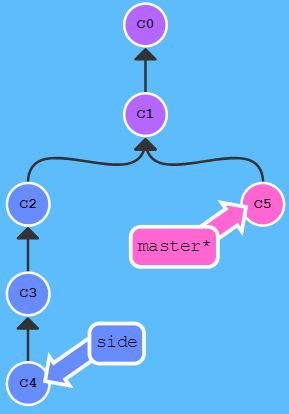
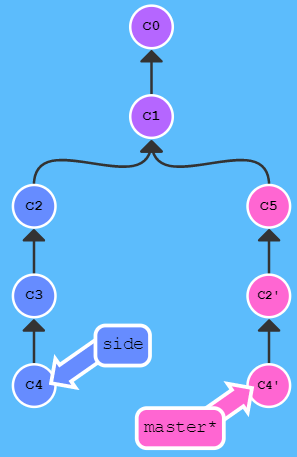
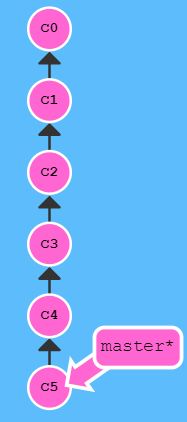
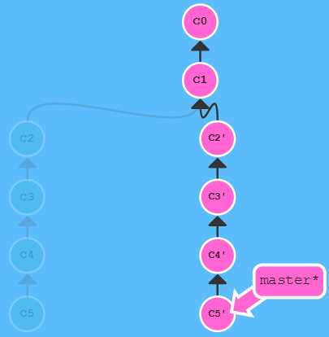
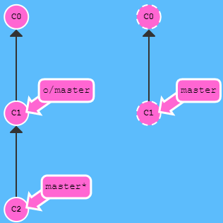
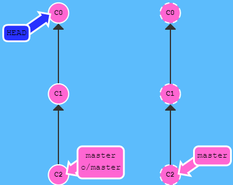
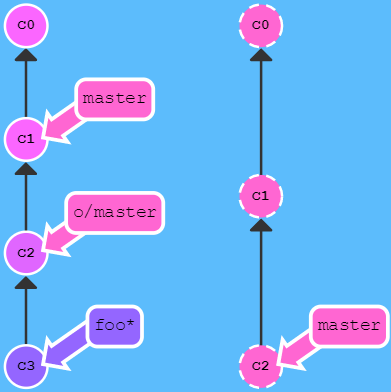
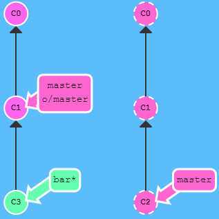
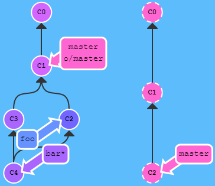

# learn-git-branching知识要点记录

git作为一个经典的代码管理工具，即使在实际当中可能很少会遇到复杂情况，但对于这个几乎我们天天打交道的工具，我们也需要去学习个大概，知道目前处于什么样的问题场景，从而清楚搜哪些东西。让这个随用随查，不会沦落到技能的反面。

为了不显得在学习的过程中过于乏味与无聊，我找到learngitbranching这个好玩儿的闯关游戏，以练习的形式学习git相关的知识。下面是记录在闯关过程中的知识要点记录，大体分为以下小节：[toc]

<!--more-->
<h1>1. Git branch</h1>
git branch常见有三种用法。
<h2>用法1：创建并切换到创建的分支</h2>
创建并切换到名为bugFix的分支：
<pre class="lang:sh decode:true">git branch bugFix
git checkout bugFix
# 上面两句还可以用下面一句代替
git checkout -b bugFix</pre>
<h2>用法2：强制修改分支位置</h2>
如将 master 分支强制指向 HEAD 的第 3 级父提交：
<pre class="lang:sh decode:true">git branch master HEAD~3</pre>
<h2>用法3：设置远程追踪的本地分支</h2>
如让本地分支 `foo` 跟踪远程 `origin/master` 分支：
<pre class="lang:sh decode:true">git branch -u o/master foo
# 若当前在 foo 分支上，可以省略 foo ，如下
git branch -u o/master</pre>
<h1>2. 合并代码</h1>
<h2>2.1 方式一：merge</h2>
在base分支上（一般是master）去合并其他功能分支，比方master要合并bugFix分支。则前提当前要在master分支上，然后执行：
<pre class="lang:sh decode:true">git checkout master
git merge bugFix</pre>
合并结束后，bugFix分支没有用了就可以被删除。当然也可以再在bugFix分支上去合并master分支，此时实际上是bugFix指向的HEAD快速移动（fast forward）到了master分支。
<h2>2.2 方式二：rebase</h2>
git rebase是另一种合并代码的命令。Rebase 的优势就是可以创造更线性的提交历史。同样用master分支合并bugFix分支，但是此时先要在bugFix分支上，按git rebase的字面意思理解：“以某个分支重新作为base”，那么rebase后的分支名应是父分支。
<pre class="lang:sh decode:true ">git checkout bugFix
git rebase master</pre>
rebase还可以合并特性分支到主分支：
<pre class="lang:sh decode:true">git rebase BRANCH_BASE BRANCH_CHILD
# 如: git rebase master feature_conv1x1</pre>
<ul>
	<li>优点：Rebase 使你的提交树变得很干净， 所有的提交都在一条线上。</li>
	<li>缺点：Rebase 修改了提交树的历史。</li>
</ul>
<h2>2.3 方式三：cherry-pick</h2>
等同于`rebase -i`。但是二者的区别是是否知道提交名，若不知道提交名则通过相对引用使用`rebase -i`命令去合并。

使用前提是当前位于父分支的位置处，cherry-pick的参数是要合并的提交名：
<pre class="lang:sh decode:true">git cherry-pick C2 C4
# 或
git cherry-pick C4</pre>
<h1>3. 移动位置</h1>
<h2>3.1 HEAD与指向</h2>
我们首先看一下 “HEAD”。 HEAD 是一个对<strong>当前检出记录的符号引用</strong> —— 也就是<strong>指向</strong>你正在其基础上<strong>进行工作的提交记录</strong>。

HEAD 总是指向<strong>当前分支</strong>上<strong>最近一次</strong>提交记录。大多数修改提交树的 Git 命令都是从改变 HEAD 的指向开始的。

HEAD 通常情况下是指向分支名的（如 bugFix）。在你提交时，改变了 bugFix 的状态，这一变化通过 HEAD 变得可见。
<blockquote>如果想看 HEAD 指向，可以通过 `cat .git/HEAD` 查看， 如果 HEAD 指向的是一个引用，还可以用 `git symbolic-ref HEAD` 查看它的指向。</blockquote>
默认情况下，HEAD指向分支名，分支名指向最近一次提交，如若最常见的情景是：
<pre class="lang:sh decode:true">HEAD -&gt; master -&gt; C1</pre>
即当前 HEAD 指向 master 分支，而当前 master 分支的最近一次提交指向 C1 。

若 checkout 到某个提交 C1 ，那么当前 HEAD 就指向某个提交 C1 ，即：
<pre class="lang:sh decode:true">HEAD -&gt; C1</pre>
<h2>3.2 引用操作符</h2>
<h3>3.2.1 功能一：移动位置</h3>
<ol>
	<li>使用 `^` 向上移动 1 个提交记录。`master^` 相当于“`master` 的父节点”。`master^^` 是 `master` 的第二个父节点。</li>
	<li>使用 `~` 向上移动多个提交记录。如 `~3`</li>
</ol>
引用操作符也可以连着写，比方操作`git checkout HEAD~2; git checkout HEAD^; git checkout HEAD~4`可以等效写为：`git checkout HEAD~2^~4`。
<blockquote>操作符 `^` 与 `~` 符一样，后面也可以跟一个数字。

但是该操作符后面的数字与 `~` 后面的不同，并不是用来指定向上返回几代，而是指定合并提交记录的某个父提交。还记得前面提到过的一个合并提交有两个父提交吧，所以遇到这样的节点时该选择哪条路径就不是很清晰了。

Git 默认选择合并提交的“第一个”父提交，在操作符 `^` 后跟一个数字可以改变这一默认行为。</blockquote>
<h3>3.2.2 功能二：^切换主父节点和^2切换副父节点</h3>
<pre class="lang:sh decode:true">git checkout master^</pre>
对于merge合并的提交记录。如果不加数字修改符直接检出 `master^`，会回到第一个父提交记录。

切换副父节点的提交：
<pre class="lang:sh decode:true">git checkout master^2</pre>
强制修改分支位置
<pre class="lang:sh decode:true">git branch master HEAD~3</pre>
命令会将 master 分支强制指向 HEAD 的第 3 级父提交。
<h1>4. 撤销变更</h1>
<ul>
	<li>git reset：<strong>本地分支</strong>中<strong>使用</strong>（对远程分支是无效的），如`git reset HEAD~1`。reset后， reset 消失掉的变更还在，但是处于未加入暂存区状态。</li>
	<li>git revert：不仅撤销更改，而且可以提交给远程。`git revert HEAD`会撤销到当前HEAD的父节点，revert顾名思义：“翻转”，虽然后面接的是HEAD，但是“翻转HEAD”即当前节点的父节点。</li>
</ul>
<h1>5. 移动提交记录</h1>
开发人员想把这个提交放到这里，那个提交放到刚才那个提交的后面。

这里有一个仓库，我们想将 `side` 分支上的工作复制到 `master` 分支，你立刻想到了之前学过的 `rebase` 了吧？除了rebase，还有两种实现方式：
<ul>
	<li>git cherry-pick &lt;提交号&gt;...</li>
	<li>git rebase -i</li>
</ul>
<h2>5.1 方法一：知道提交名的cherry-pick</h2>
先用cherry-pick：
<pre class="lang:sh decode:true">git cherry-pick C2 C4</pre>

<h2>5.2 方法二：不知提交名的交互式 rebase</h2>
当知道提交记录的哈希值时， 用 cherry-pick 再好不过了。但是如果<strong>不清楚你想要的提交记录的哈希值</strong>呢? 可以<strong>利用交互式的 rebase</strong>。尤其是想从一系列的提交记录中找到想要的记录。

交互式 rebase 指的是使用带参数 `--interactive` 的 rebase 命令， 简写为 `-i。`

当 rebase UI界面打开时， 你能做3件事:
<ol>
	<li>调整提交记录的顺序（通过鼠标拖放来完成）</li>
	<li>删除你不想要的提交（通过切换 `pick` 的状态来完成，关闭就意味着你不想要这个提交记录）</li>
	<li>合并提交。 它允许你把多个提交记录合并成一个。</li>
</ol>

当执行下面命令时会出现一个交互对话框。对提交记录做个排序（当然你也可以删除某些提交）：
<pre class="lang:sh decode:true">git rebase -i HEAD~4</pre>
Git 严格按照你在对话框中指定的方式进行了复制。执行后得到如下结果：

<h1>6. 标记和查找</h1>
<h2>6.1 用Tag标记提交</h2>
分支很容易被改变，<strong>大部分分支还只是临时的，并且还一直在变</strong>。<strong>Git 的 tag</strong> 永久地将某个特定的提交命名为里程碑，也可以像分支一样引用了。<strong>不会随着新的提交而移动不能检出到某个标签上面进行修改提交</strong>，它就像是提交树上的一个<strong>锚点，标识了某个特定的位置</strong>。

下面建立一个标签，指向提交记录 `C1`，表示1.0 版本。
<pre class="lang:sh decode:true">git tag v1 C1</pre>
若不指定提交记录，Git 会用当前 HEAD 所指向的位置。

补充：默认情况下，git push并不会把tag标签传送到远端服务器上，只有通过显式命令才能分享标签到远端仓库。
<ol>
	<li>push单个tag，命令格式为：git push origin [tagname]
例如：git push origin v1.0 #将本地v1.0的tag推送到远端服务器</li>
	<li>push所有tag，命令格式为：git push [origin] --tags
例如：git push --tags 或 git push origin --tags</li>
</ol>
<h2>6.2 用Describe查找最近的标记记录</h2>
由于标签 tag 在代码库中起着“锚点”的作用，Git 专门设计了用来<strong>描述</strong>离你最近锚点（也就是标签）的命令：
<pre class="lang:sh decode:true">git describe &lt;ref&gt;</pre>
&lt;ref&gt; 可以是任何能被 Git 识别成提交记录的引用，如果你没有指定的话，Git 会以你目前所检出的位置（`HEAD`）。
<blockquote>找某个提交记录可用 `git bisect`（一个查找产生 Bug 的提交记录的指令）。</blockquote>
它输出的结果是这样的：

&lt;tag&gt;_&lt;numCommits&gt;_g&lt;hash&gt;
<ul>
	<li>`tag` 表示的是离 `ref` 最近的标签</li>
	<li>`numCommits` 是表示这个 `ref` 与 `tag` 相差有多少个提交记录</li>
	<li>`hash` 表示的是你所给定的 `ref` 所表示的提交记录哈希值的前几位</li>
</ul>
<h1>7. 远程操作</h1>
<h2>7.1 Git Clone</h2>
`git clone` 命令在真实的环境下的作用是在**本地**创建一个远程仓库的拷贝（比如从 github.com）。

远程分支的一个特别属性：<strong>在检出时自动进入分离 HEAD 状态</strong>。Git 这么做是出于不能直接在这些分支上进行操作的原因， 你必须在别的地方完成你的工作， （更新了远程分支之后）再用远程分享你的工作成果。

远程分支的前面的 `origin/` 是远程仓库的意思。当你用 `git clone` 某个仓库时，Git 已经帮你把远程仓库的名称设置为 `origin` 了。

远程分支也有命名规范，如远程仓库名为 `origin` 分支名为 `master` 的远程分支为：
<pre class="lang:sh decode:true">&lt;remote name&gt;/&lt;branch name&gt;</pre>
<h2>7.2 Git Fetch</h2>
Git 远程仓库相当的操作实际可以归纳为两点：<strong>向远程仓库传输数据以及从远程仓库获取数据</strong>。`git fetch` 完成了仅有的但是很重要的两步：
<ul>
	<li>从远程仓库下载本地仓库中缺失的提交记录</li>
	<li>更新<strong>本地的远程分支指针</strong>(如 `origin/master`)</li>
</ul>
`git fetch` 实际上<strong>将本地仓库中的远程分支更新成了远程仓库相应分支最新的状态</strong>。

如果你还记得上一节课程中我们说过的，远程分支反映了远程仓库在你**最后一次与它通信时**的状态，`git fetch` 就是你与远程仓库通信的方式了。`git fetch` 通常通过互联网（使用 `http://` 或 `git://` 协议) 与远程仓库通信。

`git fetch` 不会改变本地仓库的状态（把远程仓库更新下载到了本地的origin仓库，比方对应的本地的远程主分支即origin/master）。它不会更新你的 `master` 分支，也不会修改你磁盘上的文件。
<blockquote>Note: 理解这一点很重要，因为许多开发人员误以为执行了 `git fetch` 以后，他们本地仓库就与远程仓库同步了。它可能已经将进行这一操作所需的所有数据都下载了下来，但是**并没有**修改你本地的文件。</blockquote>
所以可以将 `git fetch` 理解为单纯的下载操作。
<h2>7.3 Git Pull</h2>
当远程分支中有新的提交时，可以像合并本地分支那样来执行以下命令合并远程分支：
<ul>
	<li>`git cherry-pick o/master`</li>
	<li>`git rebase origin/master`</li>
	<li>`git merge origin/master`</li>
	<li>等等</li>
</ul>
实际上，先抓取更新再合并到本地分支这个流程很常用，因此 Git 提供了 `git pull`命令来完成这两个操作。等同于 `fetch`、`merge` 依次执行的效果：
<pre class="lang:sh decode:true">git fetch; git merge origin/master</pre>
我们用 `fetch` 下载了远端最新（而本地没有）的提交， 然后通过 `git merge origin/master` 合并了这一提交记录。这两句等同于`git pull`。
<h2>7.4 Git Push</h2>
`git push`上传自己分享内容与`git pull`下载他人的分享刚好相反。`git push` 负责将**你的**变更上传到指定的远程仓库，并在远程仓库上合并你的新提交记录。
<blockquote>注意：git push 不带任何参数时的行为与 Git 的一个名为 push.default 的配置有关。它的默认值取决于你正使用的 Git 的版本，但是在教程中我们使用的是 upstream。 这没什么太大的影响，但是在你的项目中进行推送之前，最好检查一下这个配置。</blockquote>
<h3>常见使用场景</h3>
<blockquote>假设你周一克隆了一个仓库，然后开始研发某个新功能。到周五时，你新功能开发测试完毕可以发布了。但是 —— 天啊！你的同事这周写了一堆代码，还改了许多你的功能中使用的 API，这些变动会导致你新开发的功能变得不可用。但是他们已经将那些提交推送到远程仓库了，因此你的工作就变成了基于项目<strong>旧版</strong>的代码，与远程仓库最新的代码不匹配了。</blockquote>
这种情况下， `git push` 就不知道该如何操作了。如果你执行 `git push`，Git 应该让远程仓库回到星期一那天的状态吗？还是直接在新代码的基础上添加你的代码，异或由于你的提交已经过时而直接忽略你的提交？

因为这情况（历史偏离）有许多的不确定性，Git 是不会允许你 `push` 变更的。实际上它会强制你先合并远程最新的代码，然后才能分享你的工作。

解决这个问题就需要使你的工作基于最新的远程分支。有许多方法做到这一点呢，不过最直接的方法就是通过 rebase 调整你的工作。
<pre class="lang:sh decode:true">git fetch; git rebase origin/master; git push
# 等同于下面这句命令
git pull --rebase; git push</pre>
或者用merge操作：
<pre class="lang:sh decode:true">git fetch; git merge origin/master; git push
# 等同于下面这句命令
git pull; git push</pre>
<h1>8. 跟踪远程分支</h1>
Git 好像知道 `master` 与 `origin/master` 是相关的。这种关联在以下两种情况下可以清楚地得到展示：
<ul>
	<li>pull 操作时， 提交记录会被先下载到 origin/master 上，之后再合并到本地的 master 分支。隐含的合并目标由这个关联确定的。</li>
	<li>push 操作时， 我们把工作从 `master` 推到远程仓库中的 `master` 分支(同时会更新远程分支 `origin/master`) 。这个推送的目的地也是由这种关联确定的！</li>
</ul>
<h2>8.1 远程跟踪</h2>
`master` 和 `origin/master` 的关联关系就是由分支的“remote tracking”属性决定的。`master` 被设定为跟踪 `origin/master` —— 这意味着为 `master` 分支指定了推送的目的地以及拉取后合并的目标。

当克隆时， Git 会为远程仓库中的每个分支在本地仓库中创建一个远程分支（比如 `origin/master`）。然后再创建一个跟踪远程仓库中活动分支的本地分支，默认情况下这个本地分支会被命名为 `master`。

克隆完成后，你会得到一个本地分支（如果没有这个本地分支的话，你的目录就是“空白”的），但是可以用`git branch -a`查看本地和远程仓库中所有的分支（如果你好奇心很强的话）。

这样做对于本地仓库和远程仓库来说，都是最佳选择。这也解释了为什么会在克隆的时候会看到下面的输出：
<pre class="lang:sh decode:true ">local branch "master" set to track remote branch "origin/master"</pre>
<h2>8.2 跟踪任意分支</h2>
可以让任意分支跟踪 `origin/master`， 然后该分支会像 `master` 分支一样得到隐含的 push 目的地以及 merge 的目标。下面介绍两种方法：
<h3>方法1：git checkout -b</h3>
通过远程分支检出一个新的分支，本地创建 `totallyNotMaster` 分支，并让它跟踪远程分支 `origin/master`：
<pre class="lang:sh decode:true">git checkout -b totallyNotMaster origin/master</pre>
<h3>方法2：git branch -u</h3>
让本地分支`foo` 跟踪远程 `origin/master` 分支：
<pre class="lang:sh decode:true">git branch -u origin/master foo
# 若当前在 foo 分支上， 还可以省略 foo
git branch -u origin/master</pre>
<h2>8.3 Git Push 的两个参数</h2>
<h3>8.3.1 Push 到远程仓库</h3>
注：本小节使用场景基本没有，作为了解。

指定 push 的目的地的语法是，&lt;place&gt; 参数稍后会更深入其中的细节：
<pre class="lang:sh decode:true">git push # 如下面的一个简单例子
git push origin master</pre>
简单例子的这个命令翻译过来就是：<strong>切到本地仓库中的“master”分支，获取所有的提交，再到远程仓库“origin”中找到“master”分支，将远程仓库中没有的提交记录都添加上去，搞定之后告诉我</strong>。

它实际就是要同步本地和远程同一个place（即分支）的两个仓库的 HEAD 位置。默认情况下不加 ，即 origin，是因为 Git 默认给你隐式给你加上了，默认也会认为是提交给远程，即 origin 。<strong>大多数情况下不加 参数也没有什么问题。</strong>

<strong>但个别情况下，也有例外</strong>，举出下面的例子：

<pre class="lang:sh decode:true">git checkout C0; git push origin master</pre>
当检出到 C0 位置时，远程和本地分支都有早期 C0 位置的代码，本地的最新提交是 C2，想要在 C0 的位置处推送 C2 位置的代码因为指定了 master 分支，推向 origin 远端，那么 Git 就会搜寻本地master 分支的所有提交与 origin 远端的 master 分支比较，并将新提交上传。

简而言之，通过指定参数， 远程仓库中的 `master` 分支得到了更新。如果不指定参数会发生什么呢？
<pre class="lang:sh decode:true">git checkout C0; git push</pre>
因为所检出的 HEAD 没有指定 参数，没有跟踪任何分支，所以什么也没发生。当然这种HEAD位置不指向分支的使用场景很少见，一般使用中也不会出现这种情况。本例只作为一个对 git push 命令 参数的学习。
<h3>8.3.2 Push 到分支</h3>
如果想让 push 的来源分支和去向分支的名称不同，要同时为源和目的地指定 `` ，只需用冒号 `:` 将二者连起来就可以了：
<pre class="lang:sh decode:true">git push origin :</pre>
或 参数实际的值是个 refspec，“refspec” 是一个自造的词，意思是 Git 能识别的位置（比如分支 `foo` ，`foo^`或者 `HEAD~1`），如：
<pre class="lang:sh decode:true">git push origin foo^:master</pre>

这是个另人困惑的命令，但是它确实是可以运行的 —— Git 将 `foo^` 解析为一个位置，上传所有未被包含到远程仓库里 `master` 分支中的提交记录。

如果要推送到的目的分支不存在，Git 会在远程仓库中根据你提供的名称帮你创建这个分支！
<pre class="lang:sh decode:true">git push origin master:newBranch</pre>
<h2>8.4 Git fetch 的参数</h2>
git push 的 &lt;place&gt; ，还有用冒号分隔的 refspecs（`&lt;source&gt;:&lt;destination&gt;`）。 这些参数也可以用于 `git fetch`。push 与 fetch 二者的概念相同，fetch 是下载，而非上传。

下面的命令中用到了 参数， Git 会到远程仓库的 `foo` 分支上，然后获取所有本地不存在的提交，放到本地的 `origin/foo` 上：
<pre class="lang:sh decode:true">git fetch origin foo</pre>
只下载了远程仓库中 `foo` 分支中的最新提交记录，并更新了本地仓库的 origin/foo，注意：不是本地的 foo 分支，而是本地的远程分支 origin/foo。

如果 `git fetch` 没有 参数，它会下载所有的提交记录到各个远程分支。

此外，我们也可以指定 `&lt;source&gt;:&lt;destination&gt;` ，但很少这么用。
<pre class="lang:sh decode:true">git fetch origin foo~1:bar</pre>
Git 将 `foo~1` 解析成一个 origin 仓库的位置，然后将那些提交记录下载到了本地的 `bar` 分支（一个本地分支，但我认为这里是本地的远程分支，即 origin/bar）上。注意由于我们指定了目标分支，`foo` 和 `o/foo` 都没有被更新。

如果执行命令前目标分支不存在，假设没有 bar 分支。那么 Git 会在 fetch 前自己创建立本地分支， 就像是 Git 在 push 时，如果远程仓库中不存在目标分支，会自己建立一样。
<h2>8.5 &lt;source&gt;参数</h2>
Git 有两种关于 `&lt;source&gt;` 的用法是比较诡异的，即你可以在 git push 或 git fetch 时不指定任何 `source`，方法就是仅保留冒号和 destination 部分，source 部分留空。
<ul>
	<li>`git push origin :side`</li>
	<li>`git fetch origin :bugFix`</li>
</ul>
如果 push 的 source 为空，到远程仓库，它会删除远程仓库中的 foo 分支！
<pre class="lang:sh decode:true">git push origin :foo</pre>
如果 fetch 的 source 为空，到本地仓库，它会在本地创建一个 bar 分支。
<pre class="lang:sh decode:true">git fetch origin :bar</pre>
<h2>8.6 Git pull 的参数</h2>
git pull 到头来就是 fetch 后再 merge 的缩写。你可以理解为用同样的参数执行 git fetch，然后再 merge 你所抓取到的提交记录。以下命令在 Git 中是等效的：
<pre class="lang:sh decode:true"># case 1
git pull origin foo
# 等效于
git fetch origin foo; git merge o/foo

# case 2
git pull origin bar~1:bugFix
# 等效于
git fetch origin bar~1:bugFix; git merge bugFix</pre>
pull 也可以用 source:destination 参数。

比方上图场景，执行下面的命令：
<pre class="lang:sh decode:true">git pull origin master:foo</pre>

因为本地没有 foo 分支。那么，该命令先在本地创建了一个叫 `foo`的分支，从远程仓库中的 master 分支中下载提交记录，并合并到 `foo`，然后又因为当前在 bar 分支上，所以会再 merge 到我们的当前检出的分支 `bar`上。

<audio style="display: none;" controls="controls"></audio>

<audio style="display: none;" controls="controls"></audio>

<audio style="display: none;" controls="controls"></audio>

<audio style="display: none;" controls="controls"></audio>

<audio style="display: none;" controls="controls"></audio>
