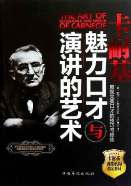

# 《卡耐基魅力口才与演讲的艺术》读后感

我发现最近看书都有一些原因，比方说我最近看了这本《卡耐基魅力口才与演讲的艺术》。

是来自于另外一本书介绍的。下面把这本书简单的总结一下，和往常一样，还是写一下自己的感想，以及书中比较有趣的地方。[toc]

<!--more-->
<h1>1. 恐惧心理</h1>
书中讲到一个秘密，即使对于<strong>职业演说家，他们也没有完全克服内心的恐惧</strong>，通常来说，在开始演讲时，内心都会有些害怕，通常可以从它们的开头几句话里听出来，或者表现出来，只不过他们作为职业演说家，更能很快进入镇定的状态。所以对于我们来说，也不要将恐惧想得太过严重。
<h1>2. 尊重他人，不当面指正他人的错误</h1>
这是第二章，成为说话高手的六项修炼中一个小节的名称。里面一句加粗了的字这么写道，<strong>我们在听到他人说话的时候，第一反应往往是进行判断或进行评价，而不是尽力去理解这些话</strong>。

因为当我们有某些想法，被别人质疑怀疑时候，由于他们直接指出我们的错误，或者与我们的意见相反，我们会觉得自尊心受到伤害，反而去极力维护他，从而内心产生对他人怀疑的反感。

书中的例子也写道，当一位学识渊博及有声望的人错误了，我们当面指正他，可能会使他非常的受到打击，所以有时候，在对方不知不觉中接受你的观点，反映出他的问题，比方说你可以这么说，我也许不对，我有另外的想法，这样等等，或许会收到神奇的效果，总之，无论何时何地，不会有人反对你说：我也许不对，让我们看看问题所在。
<h1>3. 坦承错误，以退为进，掌握主动权</h1>
这里讲了一个很有趣的故事，我简单复述。
<h2>3.1 警察，狗与我</h2>
有一天，我去公园里散步，牵着我的小狗，没想到在不远处遇到一位骑着马的警察，那位警察说，我不能这样不拴着狗链子散步，否则小狗咬到其他人，会给其他人带来伤害和恐吓。如果下次再看到你，我就会带你去和法官讲话。

没想到过了几天，我又碰到这位警察，然而我却没给狗拴狗链儿，也没有给狗戴上口笼，看到这位警察马上就要看到我了，我立马对他说，警官，你当场把我抓住，我犯了法，我没有推辞，更没有借口，你上星期警告过我，如果再把没有带口笼的狗带到这里，你就要惩罚我。

然而警官却用温柔的声调说，我知道周围没有人的时候，就这样一只小狗在那跑，也许这是一件不错的事情，但是我却义正言辞的说，这是犯法的。警察却小声的说，像这样的一条小狗不会咬人的，而我又坚持说，但他也许会伤害松鼠，没想到警察竟然说我过于认真了，然后他说道，你只要跑过这个土丘让我看不见他，我们就将这件事情忘了算了。

其实这个故事非常有意思，这一小节有一段加粗的文字这么写道，<strong>假如我们知道自己免不了要受到责备的话</strong>，为什么不抢先一步，积极的主动认错呢？
<h2>3.2 裁缝店与衣服</h2>
还有一个故事，讲的是一个裁缝店的老板，由于经营有道，裁缝店的生意很好，一天一位贵妇人来到这里，要求赶做一套晚礼服，然而在这位裁缝老板做好衣服后，没想到这礼服的袖子比要求长了半寸，可是他已经没有时间去改了。当这位贵妇人来店里取她的晚礼服的时候，他没有发现这个问题，他反而穿上这件晚礼服，却连连称赞裁缝老板的高超手艺，不料等他准备按照原定价格进行付钱的时候，裁缝却拒绝接受，他却说道，我之所以不能收你的钱，是因为我犯了一个错误，我把你的晚礼服的袖子做长了半寸，如果我能再有一些时间的话，我将免费为你把它做成你需要的尺寸。然而，贵妇人对这件晚礼服已经很满意了，并不在乎袖子长那么半寸，他也无法说服裁缝接受这套礼服的钱，最后他只得让步，这位贵妇人回去给她的丈夫说，这位裁缝以后一定会出名，他认真的工作，精湛的技术，诚恳的态度，使我坚信这一点。

这里又有一句智慧之语，也是加粗的，这么写道，<strong>用争斗的方法，你永远不会得到满足，但用让步的方法，你的收获将比期望的更多</strong>。在这点上可能是针对商人这么说的，我想更有信用第一的意思。
<h1>4. 避免与人争论</h1>
成为说话高手的第三项，就是要<strong>避免与人争论</strong>。这里讲的是一个推销员的故事。

因为销售怀特汽车的推销员，他在进入一个总经理的办公室的时候，看到自己是怀特汽车推销员，便直接说怀特汽车各种不好的地方，转而去说另一个汽车很好。这时候我也同意他的观点，认为他说的那种汽车确实不错，而且质量可靠，而且推销员也很优秀。

然而我若是当年听到对方这么讲，我肯定会跟他大闹大吵一场，不过我这样说的话他也没有什么话可说，我同意他的看法，这样他也不会整个下午不停的说某某汽车最好。

因为如果我挑剔贬低，他也会辩护，就越坚信我竞争对手的产品。由于我也这样称赞他说的那家汽车公司，所以他无话可说，也没有在跟我进行争辩，所以之后我就开始推销我的这款汽车。
<h1>5. 寻找话题，鼓励对方多说自己的事</h1>
<strong>有时候弱化自己的成就会使人喜欢你</strong>，德国有句俗语，其大意是最大的快乐，便是从我们所羡慕的强者那里发现弱点，从而让我们得到满足。

法国哲学家罗斯法考说过，如果你想接触，比你的朋友表现得更加出色，但如果你想得到朋友，那就要让你的朋友表现得更出色，他的意思也就是在说，当你的朋友胜过你，是他们就会产生一种自重感，但是如果相反，他们就会产生一种自卑感，并且开始对你猜疑和嫉妒，这的确是一个真理，我们看一看一则关于职场中的故事。

有一位女士是纽约市人事局里，与别人关系融洽的工作介绍顾问，但是在一开始的几个月里，他一年一个朋友也没有，他说自己的工作干的很不错，也很骄傲，但奇怪的是同事们不愿意跟他分享。此后他少谈论自己，多听同事们说话，并且发现，其实他们也有许多值得夸耀的事情，对他们来说，把他们的事情告诉我，你听我的自私，更能让他们高兴现在每当一起聊天的时候，我都会让他们告诉我他们的故事，共同分享他们的故事，只有当他们问我的时候，我才略微谈了一下我自己。

因此有时弱化我们自己的成就，会使别人喜欢你，最大的快乐便是从我们羡慕的强者那里发现弱点，总让我们得到满足。
<h1>6. 心理引导，始终让对方做出肯定回答</h1>
<strong>有时候一个“不”的反应是最难克服的障碍，人只要一说出“不”，他的自尊心，就会促使他固执己见。</strong>

这里同样是讲两个故事，作为银行的职员，有时候需要让顾客填写表单，但是顾客不一定同意去填写，需要引导顾客去填写。毕竟一些问题涉及到了一些隐私。

银行的顾客要去银行进行开户，但需要填写一些表格，对于不同的人来说，有些问题愿意回答，然而有一些问题则不小，拒绝透露个人的隐私，遇到这样的情况，先前我会告诉井高，对方这样的话，不全部填写，就拒绝为你开户，然而现在对我来说，这样的态度，会使顾客感觉到不被重视。

所以跟他谈论银行的规定是没有必要的，反而告诉他，那些他拒绝填写的内容并不是绝对必要，但是我却引导他说，问到他，假如你去世了，你不希望把存在银行的钱转移给你的亲属吗？他回答道，当然想转移给自己的亲属，进一步的我继续说，教你最亲近的亲属的一些资料告诉我们，这样，即使你万一去世的时候，也可以准确无误的实现你的愿望，难道这不是一个很好的办法吗？他肯定的回答道，是的，就这样，我一步一步引导他，相信我们要这些资料的目的是为了他好，这样他的态度就转变了，而且不仅把全部资料告诉我了我们，还根据我的建议，开了一个信托账户，指定他的母亲为受益人，并爽快的填写了关于她母亲的详细资料。

其实这样看来像得到对方的肯定回答并不困难，只是我们忽略了如何去做，一般情况下大家都是希望对方同意自己的看法，如果对方不同意就行了，急切的驳倒对方，以获得对方认同，同时，他们或许认为这样能够显示出自己的高明和突出，然而事实却适得其反，所以最好的办法就是引导对方作出肯定的回答，也就是说出，是。

<strong>所以在跟人交谈的时候，不要一开始就谈论你们，可能有分歧的事情，可以先强调你们都同意的事情，然后并且不断的强调，在双方追求同一目标，再让对方知道，即使你们有分歧，也只是方法上的，而不是目标上的。</strong>
<h1>7. 掌握说话的主动权</h1>
如果想让我们的交谈变成一次<strong>卓有成效的谈话，那么就要想方设法的引导对方，或者巧设提问，或者选择对方感兴趣的话题，并暗中把谈话引向我们期望的方向，这样就能说服对方。</strong>

可以讲一个故事，是关于胡佛总统的，这位总统的沉默寡言让许多记者都望而却步，但一位芝加哥记者却做到了这点，而且与他谈了两个多小时。

那时候，他还不是这种总统，而只是共和党的总统候选人，一位年轻的记者，偶然的跟她坐在同一辆车上，并得到了采访他的机会，但是一开始他的一些提问，这位总统候选人总是简单的回答是，或者不是，并且长久的就陷入了沉思，这让这位记者感觉很尴尬，虽然他已经知道了这位总统候选人的习惯，但是他不得不一边问问题，一边想办法解决这样的状况。

等火车经过了贫穷而荒凉的内华达州的时候，这位记者突然提到了一个很好的话题，她望着窗外，好像自言自语的说道，在这个地方，人们应该还是用古老的方法来采矿吧，没想到这时候这位总统候选人说道，早就不用这种方法了，现在全国都在采用最新的采矿方法，接着，这位总统候选人的话匣子好像是被打开了一样，便滔滔不绝的谈论起来，从采矿到石油，从航空到邮政，那些跟这位总统候选人同意坐火车的人，都是有名望的人，但是这位总统候选人都对他们不理不睬，却偏偏跟赵瑞记者讲了两个多小时。

而这位记者本是一个默默无闻的记者，但却因为这件事情成为与这位总统谈话时称最长的记者，看来有时候话题，确实起着至关重要的作用，但是如果没有找到合适的话题，不难想象，结果一定不会理想。

此外，有效的控制话题，对付一个人来说，的确十分重要。用一个故事讲的是一位推销员，推销他们四吨的汽车，但实际上，这位被推销的顾客已经有了一辆两吨的汽车，而且认为，没有必要再有一辆四吨的汽车。

但这位推销员一开始也同意对方的观点，然后再询问，平时需要的汽车平均载重量是多少，但实际上顾客有时候会超过两吨的货物，而且在丘陵山地上的形式，比正常的情况要大，所以不同季节也会对汽车有不同的影响，超负荷的运转肯定是不好的，也会影响原本两吨汽车的寿命，最终他成功的把这样子的在中的角色推销给了顾客。
<h1>8. 施展你的独特声音魅力，语调可以让语言生动有趣</h1>
这两部分我合起来说，下面呢，是一些加粗了重点的描述。先说关于声音魅力的部分。

<strong>你的声音反映出你的感觉，心情和状态，是你说话中强有力必不可少的工具，此外声音的变化可以富有，变化和层次感，声音的高低会影响到听者的情绪，</strong>同时我觉得说话的人都这样的，声音高低也影响着听众对他的一个认识和感知，比方说，如果演讲者说话，人的声音比较小，就感觉让听者认为这个说话的人比较怯懦。

另一个是关于语调，语调就像说话者的表情一样，向对方传达着某种言外之意的感染力，当一个人的语气很热烈，即使你没有见到他，也可以判断出他很高兴，但是若一个人口气平淡，即使她告诉一件你值得高兴的事情，你也会认为这没什么好高兴的。

懂得说话的人，不仅会塑造自己的个性声音，使其悦耳动听，而且他们的语气和语调也很有感染力，总能拨动人的心弦，引起对方的共鸣。就比方说一个简单的语气词啊，运用不同的语调，可以分别表达出，明白了，没听清惊讶，终于知道了，等诸多意义，这正是富有变化的语调，使说话变得更加声情并茂。

很多时候，我们花费更多的心思去寻找谈话的内容，但是最终搞砸我们的却是自己的说话语调。简简单单拿起听筒，听到一个喂字，无需多说什么，这一个字里就反映出了对方是否有火一样的激情，是否怎样的一个状态都在这个声音的变化中。
<h1>9. 张弛有度说话不拖泥带水</h1>
我觉得这一章节更多的体现在，在职场当中说话，或者是给上下级再汇报，讲东西时候更要体现出这一点。

<strong>要给人一种干练明快的印象，那么必须掌握好说话的节奏，这也是说话节奏的魅力。有些时候我们可以说得快一些，有时候可以慢一些，对于重点的把控，可以通过这样的方式来进行控制。</strong>

其实我们说话，有一个要明确的目的的前提，就是社交语言要简洁精炼，并尽可能承载更多更有用的信息。

所以，
<ul>
	<li>第一点，我们要使表达的信息要直接直达主题，让对方直截了当的清楚你要表达的思想。</li>
	<li>第二点，是用最简洁的词汇，对于要陈述的重点词汇，句子越少越好，避免过多修饰，否则会影响你的表达。</li>
	<li>最后，就是明确中心思想，因为说话或许存在很多主题，这样的结果会使你和对方的精力被分散，就好像在写作文一样，你也需要去点题，把一个主题讲得很透彻，十分困难，所以你在说话过程当中，不可能把每个主题都讲透，否则会浅尝辄止，影响对方对你说话话题的理解与认识同时你的信息重点也不清晰，所以个别重点的部分你可以着重用细节去描述，但是有一个前提是不能影响你的主题表达。</li>
</ul>
<h1>10. 非语言信息比语言更富有内涵</h1>
说到这里，一个典型的例子是林肯总统喜欢用不同的姿势来与说话进行配合，比方他有时候会晃动脑袋，或者握紧拳头，举高双臂等等，让他<strong>表现出对表达主题的不同的情感</strong>。

我们知道，在这方面有面部表情，面部表情，一般情况下是微笑，微笑可以拉近你和对方的距离，这也是最简单有效的办法。

第二个方式则是身体姿势，最直接明了的就是首饰，首饰是最自由和强有力的体态语，也正是这个原因，人们往往也最容易犯错误。

要点总结如下，也是书中的内容：

第一点，不要过多的重复同一手势，那会使人感到枯燥；
第二点，不要用肘部作短而急速的动作，尝试一下肩部的动作，由肩部发出的动作看起来要好很多；
第三点，手势不要结束的太快。

相信注意了以上的几点，也可以更好的<strong>提升你说话的力度，塑造完美形象</strong>。
<h1>11. 使语言变得更有说服力</h1>
这部分更多的讲的是用的修辞手法，其实我们语文课本当中已经讲到了很多修辞手法，比方说反复，引用，反问，对比，排比等等，这些方法我们都知道。下面我举一个具体的例子，也是书中一个很有趣儿的故事。

有一次，拿破仑骄傲的对他的秘书说，你知道吗？你将永垂不朽，但是他的秘书并没有理解，问拿破仑为什么这么说？拿破仑说道，你不是我的秘书吗？他的秘书明白之后，反问拿破仑，那么亚历山大的秘书是谁？这个问题拿破仑并没有答上来，但是他赞扬秘书。

你能明白这段对话的奥妙吗？其实拿破仑的意思是说，正是因为这位秘书是自己的秘书，而他将会扬名，但是这位秘书表示，自己不愿意靠别人出名，所以反问拿破仑这么一句话，伟大的人物的秘书，不一定会出名，但是因为拿破仑是他的主帅，他并不能直接反驳拿破仑的观点，所以用巧妙的反问方法，表达了自己的看法。

<strong>有时候反问可以表达更多意思，如果你想说服一个人，最好的办法就是，举出例证反问对方，这样比正面辩论要有更大的说服力</strong>。
<h1>12. 当众说话，你欠缺的是什么</h1>
这部分其实在引言的时候出现了，是关于为演讲做好充分准备，并将恐惧降至最低的一些方法。

作者给出了下面几个在当众说话前需要准备的工作。

第一，按照你脑中的思想，自由的挥洒，虽然说充分准备，但并<strong>不是逐字逐句的背诵</strong>演讲词，这样很容易出现忘词儿的时候，导致大脑一片空白，如果这样准备，只会毁掉整场演讲而且因为是在背诵讲话稿，这样会使这个过程原本生动，有意思，富有感情变的，因为是背诵反而失去了活力。

第二点是演讲的内容通顺流畅。也就是说，要留心生活中有意义，给你指引的人生内涵的经验，<strong>对这些思想理念感悟进行汇集整理，将真正有用的，与你讲话题目有关的思考</strong>，整合到你的演讲当中，当你想好之后，这些题目酝酿成熟，也会自然发散出思想的芬芳，再把它们简要的写下来，只要能表达清楚概念，通过这些整理零散的片段，也很容易安排和组织。

第三点，<strong>演讲前的情景模拟训练</strong>。其实我认为这点也是很重要的，不只是作者，这里写道，之前我做过一些技术分享，大量的情景模拟，我感觉使我更加对这场演讲更有自信。

但是作者在这一点里讲到了，你可以找身边的朋友，听你讲故事，同时能观察对方对你演讲内容的看法和神态，说不定他们能提供一些有价值的建议，其实在这个过程中，如果你不对他预先说明，他可能并不知道你是在预言，即使对方知道也没关系，如果他真的感兴趣会说出类似于你说的真有趣这样的话，但是面对当众演讲，我们总是会被自己内心的胆怯所达到，这可不行，所以通过上面的方法，希望你也能迈出至关重要的第一步。

<audio style="display: none;" controls="controls"></audio>

<audio style="display: none;" controls="controls"></audio>
