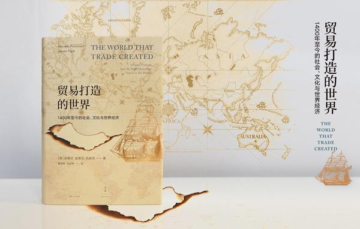

# 《贸易打造的世界》读后感

贸易打造的世界这本书的副标题是1400年至今的社会文化与世界经济，作者是美国作家彭木兰，以及史蒂文托皮克。由黄中宪，吴莉苇翻译。

这本书给我的直观感受是，我们生活中的很多小东西，虽然不起眼，比方可口可乐以及马铃薯，象牙还有贝壳当然还包括茶叶，咖啡这些生活中的小东西，它们都有各自的历史，背后的故事，这些故事体现了在人类历史上很可能充斥了“奴隶”，“压迫”，“殖民地”等等字眼，但也在历史长河中一点点体现了在贸易中的价值与带给人们的作用，没有它们，可能现在我们还消费不起，反而这些商品很有可能是奢侈品的代名词。

写这个读书笔记，我是翻着目录来看的。也是对思想上的一个回顾，这次读书<!--more-->笔记不像往常：对特别感兴趣的页码进行记录，然后再每一页去回顾写下来。这样子有些慢。这次还是看到什么想到什么就记下什么吧。

一开始文章说的市场准则的形成，讲了福建人贸易网络，福建人是很早就出海经商做贸易的地方人。他们去一些海外的国家，提供了大量人力无论是种植园工厂，作为工人，亦或是码头或是船上的贸易。记得前一阵子有一个来自澳洲的小伙子，他说那边就有不少福建人。

再就是中国朝贡的制度，说到这里，我不禁就想到了鸦片战争，这本书中写道，鸦片战争其实迟早都会发生，只是借用鸦片这个容易上瘾的商品是打入了，打开了中国的大门。为什么会这样？是因为两个原因，一是在十六十七世纪茶叶咖啡，作为欧洲贵族的饮料。因为当时欧洲本地没有条件生产茶叶，大量的茶叶需要从中国进口，导致大量白银流入中国（而咖啡，英国有自己的殖民地种植园，用于种植可可）。另一个原因是，欧洲列强们普遍认为中国清朝在很多地方上都比较不讲理，比方说，他们认为去见皇帝需要跪拜，这种很失身份，或者说太把自己高看了，认为清朝皇帝不把他们放在眼中，有贬低看不起别人的意思，也想给这种行为一种教训。

其实第二个，理由多少有些牵强，无论如何，他们都会找到打开中国大门的东西，让白银再回流回来。当然后来欧洲的东印度公司，在其他地方将中国的茶叶得以成功栽种，从18世纪左右，茶叶也有一部分来自于殖民地的生产。

还有一个好玩的地方在于货币这种东西，我指的是纸币，在公元100年，中国就发行了自己的纸钞，然而这种东西传入欧洲也是1000年之后的事情。看来当时我们国家的贸易还是很发达。其实货币这种东西在很多地方都不同，可能比方之前说的，贝壳，茶叶等一些商品，在很多地方本身就作为交换别的货物的货币，如丝绸。当然后来银矿、金矿的发现，让墨西哥成为银币生产的大国，但是很奇怪在于，他们本国生产的银币随着大部分的进口，银币流往国外，本国反而银币越来越少，最后也随着开采，银矿基本开采没有了。当然后来发现的金矿，让金币也取而代之。用货物去交换而不是货币一直都存在，到21世纪中亚的一些国家尤其是盛产石油而贫瘠的国家，用石油去和别人做交换，用以换取进口商品或美元。

历史上最有名的公司，应该就属英国东印度公司了，它其实算是第一个跨国公司，且有自己的法人，在这之前很多公司有自己的生命时间，比方说大家共同出资去外地经商这个团队会有一个最终解散的时间，在这个解散时间前，这个商队都有用共同的一个商号进行商业贸易活动，在最后解散时，会按先前定义的利益分配进行最终的分配，虽然东印度公司也在一开始的时候有定下21年后解散，但他有法人，也有自己的股东，投资者，更重要的是大量的利益，让这家公司的生命得以延长。

东印度公司为了使英国他们派出自己的人，去外地殖民更顺利地进行经商贸易，往往为了融入当地的社会与文化，不仅会与当地有权势的人狼狈为奸，更有的会娶当地的女人，作为自己的妻子，当然他们很可能已经在本地有了妻子，其实娶了当地女人做妻子的英国人，看不起当地人。但是他们通过这种方法，打入当地的文化，以适应更好的与他们进行交流，无论是语言抑或是文化，目的还是为了可以更好的进行贸易赚钱，本身当地的女子，也愿意和有权势的英国人结婚。当然，这也带来另一个问题，因为英国殖民者在当地生活，他们本身就不适应当地的生活，尤其是气候。虽然迎娶了当地的女人，但它们的寿命并不长，可能二三十岁就死掉了。当地的女人继承了他在海外赚的钱，有了更多的钱，可能在也会做贸易经商，甚至一生可能会有三四个英国男人作为其丈夫。女子继承了男人的钱，比英国男人更会打理商业运作，而且本身英国人也看不起商业买卖，这也给这些女子展现自己的机会。
