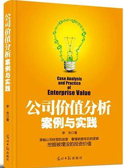

# Reading

# 《公司价值分析》读后感

又花了四天时间，看完了这本名叫《公司价值分析案例与实践》的书，这本书的作者名叫李杰。应该是一位职业投资人出身。此外，他还有一本书，在这之前出版过，名叫股市进阶之道。我也看了这本书在豆瓣上的评分是在8.8分以上。

此外，这本名叫公司价值分析案例与实践的这本书的副标题叫做穿越公司经营的迷雾，看懂数据背后的逻辑，挖掘被埋没的投资价值。正如副标题所言，里面列举了很多公司，也是一些有特点的公司，从软件公司广联达到一些工业方面的公司都有涉及，当然也包括制药公司等等。

看这本书，给我最直观的一个感受就是原本我不太关心的一些公司，只是从身边的朋友，比方说，我有一个学长，就是在广联达工作，我的印象中他是一家建筑行业垄断的公司，他在很多省市都设置有自己的开发部门，主要是对接各个地方建筑上的一些造价需求特定情况，当然也有对应的销售部门。

之前去过学长的公司年会，当时还拿了他们年会活动上发放的纪念水杯。给我的感觉就是这家公司比较积极向上，尤其是企业文化。当然我也听说他们公司在14到16年那阵子，有一个叫做精兵强将的计划，也就是说降低每年招入的人员提升现有人员的工作技能，以减少在人员上的支出。

而且这个计划看来实行的还不错，因为本身这本书更多的偏向于讲这家公司的发展经营的一些东西，我也收获了很多，它里面讲到了软件公司的一般商业模式，比方说产品方式就是说制作出具体的产品，然后进行销售，还有一种项目型，这种方式就有点类似于甲方乙方，我们作为乙方去到甲方的公司，或者以远程协助的方式，按照他们的要求，完成相应的开发任务，一般来说，这种开发任务所花费的精力和时间都比较长，比较大，但是也有一些好处，主要体现在后续的维护和服务上，因为一开始选择了我们，在它后面可能大概率都会继续选择我们的服务，进而可以实现增值服务等等。以上介绍的是前两种经常见到的方式当然还有第三种叫做平台型，这种方式而言是最好的一种模式，他是将自己的产品放在网站上，然后用户自己下载，在我的理解看来，有时候这种平台型反而更是一种类似于像淘宝这样的，很多用户去使用的时候，不仅是直接通过网页端去使用，而且还有对应配套的教学使用的视频，用户如果有问题不了解，可以在线提问一会儿看已有的学习视频，进行学习，相对而言产品型，它的载体可能就不是把安装或者用户使用的文件放在网站上，而是放到优盘里或者是刻录到光盘里。当然现在而言，很少用到光盘或者优盘了，大部分都是通过网站或者是单独发送邮件的这样的方式来交付产品。

在一家公司发展的过程中，本身自己的定位是很重要的，结合最近在微信读书听的一本书，这本书讲的就是定位的问题，主要的案例就是以很多美国的公司对于自己自身的定位，通过自己对当前市场以及自己生产的产品的了解，对客户和自己的产品进行定位，因为只有进行了定位，抓住主要问题，我们才可以更专心，更很好的利用资源去解决客户或者当前市场急需的产品或者问题。

就拿广联达来说，我记得书中有列举公司在11年到14年人员的变动情况，也正是因为前两年所招入的人员比较多，因而13年和14年实行精兵强将计划，进一步让员工之间进行磨合，同时提高大家的工作技能水平也提高各个小团队leader的管理能力。而且本身在这一项人员管理上面，前两年的支出比较高。

除了以上自身的问题，当然只是很小的一部分，还有很多，尤其重要的就是自身发展的问题，因为本身处于垄断的地位，市场第二或者之后的公司，比方说有鲁班软件公司，他们也在做建筑造价估价这一方面的软件，但是和作为市场第一的广联达而言，差距实在太大。

但是也不得不说，建筑造价估价在这一方面的利润率就是从上游中游到下游这种个建筑而言，建筑造价作为提前预估的这一过程的利润率是很低的，而目前的造价估价软件的盈利，大部分的方式就是通过走量的形式去盈利这长久来说是不健康，或者说不利于公司未来发展的，即使现在是垄断地位。

所以广联达高层在这方面比较有远见，在一年还是12年左右，已经开始涉及施工方面的需求，而且已经有了一些效果具体而言就是利润率这方面，而且每年的增速很高，可以肯定的是在未来这方面肯定会超过现金造假股价这一建筑过程当中的利润。

这不禁让我想到了现在的格力。如果说空调行业能想到的就是格力，还有海尔，但是为什么格力在空调行业要远超过海尔呢，而且格力本身在空调销售这方面要比海尔更赚钱，那是因为海尔在销售一台空调，利润率只有1%，而格力是5%。这还是因为定位的问题，格力公司在一开始就瞄准了空调行业，我想肯定也是做了大量的工作，无论是市场调研还是其他等等，定位自己在空调行业集中资源解决问题生产产品使上下游打通降低自身的成本，从而相比海尔，既做空调，又做电冰箱等家电而言，肯定更加专注所带来的利润率肯定更高。

但是我也觉得凡事都要两个方面来考虑。就好比这本书，作者最后讲到股票投资上要尽可能去分摊风险，怎么说呢，作者是一种以长期持有作为自己的投资理念的人，即使如此，他也会选择20只股票以上作为自己的股票池。然后根据他们的状态进行动态调整，但是更多的是长期持有。最主要的就是说这20只股票所属在不同的行业，这样就相当于分担了风险，如果都属于一个行业，如果这一行业不看好，而且前景不好，当前市场需求低迷很有可能，这就会造成这当前持有的所有股票都会暴跌。而如果选择很多不同行业的股票，那么就会分摊这样的风险，当然也有可能说，如果这个行业发展好，整体上涨也是可能的。

在这个案例里，我就想到了海尔，可能是想尽可能分摊风险，当然各有利弊，格力一开始就专注于做空调，前期肯定做了大量工作，估值一直的，这样的方法是冒险进取的方法，但是如果成功一开始做好了准备，那么就有了信念，有了准备那么何尝不去孤注一掷去搏一下呢。

就目前而言，格力的空调年销售已经达到一个增长瓶颈，空调也不可能成为下一个公司的未来趋势。目前格力也在寻找下一个增长点。在这一点上，董明珠作出了自己的表率。我也是听理财频道的分享了解到的董明珠想让格力集团去投资做汽车的一家公司。然而股东会，大家不同意，只好作罢，结果等到第二年，董明珠自己用真金白银投资坐汽车的那家公司十个亿，等到第三年开股东大会的时候，董明珠再次提出，格力集团将重点研发工作投入到做汽车相关的产品上的时候，股东大会集体同意投资那家做汽车的公司200个亿。

这里面我就学到了，如果公司已经到达一个增长瓶颈，也就是说到达一个自己的天花板，那么寻找下一个发力点就是很重要的。广联达也是，他发现自己在估价，这一方面是整个上下游当中比较低利润的点，而同时其他的就是说建筑施工这个过程自己每一年的利润都在上升的时候，发觉可能是下一个增长的突破点，那么就每一年逐年增加在这方面的支出和研发，相信未来一定会发展得更好。

下面是关于这本书，最后几个章节中，作者对于炒股自己的认识和理解，这点很有意思，我觉得有必要记录一下。

不努力，再好的戏也出不来，作者认为，初学者最大的问题是已知信息都不掌握，说白了，就是根本不去查资料，看年报，看券商报告，也就是说让一个完全不懂公司分析的人去做股票，但是如果把过去3到5年的年报，以及投资互动中的问题浏览一遍，也能做到对公司基本信息的丰富了解，哪怕这种了解是碎片化和表象层面的，但这一步骤就可以淘汰八成以上的股民。

此外，因为看的资料相当多，各种零碎的认识，缺乏系统的观点，不知道哪些信息的权重更大，也不知道如何将已知的各种公司信息和数据转化为可制造公司经营态势的判断，在这一点上，既取决于悟性，也取决于是否能够坚持学习，还有不断实践，再往后就是从可知，进而上升到位置的层次，这不仅需要长期跟踪公司，形成一种直觉，更需要一种强大的商业判断力，这不是这本书可以解决的。所以说第一步还是要脚踏实地，自己来看自己花的努力花功夫去学习相关的案例，尤其是，嗯，这样的公司分析案例，虽然可能有些案例比较零散，缺乏系统的模板和标准化的思路，但是作者的这本书已经给出了完整的标准化分析模板。

下面是高效运用框架的几个窍门。

在使用价值分析框架的时候，一般是按照下面这套程序来处理。 第一点，先打开最近的年报或半年报，大致浏览公司当期业务发展情况，公司对业务发展描述，重点记录，目前公司业务结构，比方什么产品占收入比重多少？每个分类产品的毛利率情况，当期的增速情况，通过了解业务结构，可以大概知道未来1到2年内主要的增长会在哪里？有时候需要看一些研究报告，即使一项业务吹得天花乱坠，但其业务当期占比收入的比重可能才百分之一，即使这项业务激动人心，但短期内都不会有财务贡献，可以作为加分项，但不能作为价值投资依据，所以这一步先要找到未来短中期内业绩增长主要靠什么力量拉动

第二点，大量阅读券商报告，不同券商报告可能会披露某一方面的业务信息，大量阅读可以短时间了解相关公司最关键的问题，也能了解行业相关的关键数据，比如市场空间，市场格局等等，在阅读报告的时候，按照价值分析模板的分类方法，把一个零散的信息记录下来，放到合适的归类中去，一般十篇报告读下来，大部分信息类别都可以找到有效信息，这个时候文档基本还是乱糟糟的，但不要紧，或许还会进行整体的梳理工作，这一步是先尽可能的搜集重要信息，避免重大信息空白

第三点，接下来是填上基本生意特征表，通过这些数据，一方面是可以更准确把握省生意特征，比如是高利润型的还是高周转率型的，这反映了这个行业哪些业务特点？经营性现金流好不好等等问题，另一方面还可以发现问题，比如发现某一年的毛利率或者营业增长情况出现异常，为什么会这样？这些问题指引下去，翻开对应年份的年报和相关资料，往往就会有意外的发现，另一种值得注意的情况是某些指标的趋势性变动，比如费用率呈现连续的下降，或者毛利率呈现趋势性的提升，这些都需要搞清楚原因，看看这些趋势是否可以持续，是否已经到了某种拐点？

第四点，上述基础工作做好后，就可以开始梳理信息，这部分重点是把归类好的各种信息联系起来，思考这些信息中有什么才是主要矛盾，比如在产品和需求拉动力成本和费用端，产能和并购端这三者关系短，中期来说，哪一个是业绩的主要驱动力？或者这三个的结合是否印证较为清晰的业务业绩增长的确定性和弹性，特别是综合了这么多的基本面信息，财务数据之后，这个公司有多接近高价值特征？

第五点做完上面工作，下一步就是估值，估值是一个困扰人的问题，但精确估值又不可能，目前采用比较多的简单方法是首先判断它本质上属于溢价还是折价，这部分理论可以参考作者先前的一本叫做股市进阶之道的书籍其次，注意两个数据，一个是国外同行的估值水平，另一个是这个公司在特定时期的历史估值区间，国外同行一般都已经到达成熟期及发展过程中经历的估值波动期间，以及最终可获得的估值水平，是有很强的参考意义，公司自身历史估值区间也是如此，特别是一些特殊时期的固执，这里比较幸运的是，最近一次典型的情况就出现在2012年末。当年宏观经济下滑速度快，中小企业也正好处于杀估值的默契，这个时候估值水平也是可以反映问题，当然，历史估值区间的参考要注意两个问题，一个是这个公司状态有无发生变化，比如五年前他是典型成长股，现在进入成熟期，那么以前的估值区间就不具有参考性了，另外就是选取的时间段要排除特异性，比如把07年牛市高峰的估值作为一个常态来参考，显然就是不合适的。

第六点，在上述工作完成的过程中或者完成后，依然会碰到一些难以理解的问题，这就需要与公司沟通，甚至有机会进行现场调研，如果没有机会，那就可以再把投资互动平台里的问题过一遍，有必要可以通过这个平台给公司提问一些问题，此外还可以在网络上找其他投资人，看看他们的看法，看看自己的分析，有无重大的思维盲点，有无重要的信息被遗漏，可以借鉴别人的一些逻辑，但不能照搬别人的结论

第七点等陷入浩如烟海的公司资料中，就不要纠结方方面面，永远把焦点放在五个问题上，第一公司处于哪个经营周期呢？是已经接近成熟期了，还是处于发展的中初中阶段呢，第二，它是否具有牢靠的竞争优势，这种竞争优势到底是基于本质上的差异化，还是基于高效经营的量变到质变。第三，他在中长期投资的逻辑支点是否清晰？是否与社会发展的大势相符合第四，他在短中期经营上的主要变量因素是什么？这些变量因素是否容易衡量。第五，他的管理层是否让你有信心？

总之，一个真正的好公司，其生意一定具有相当长的可延续性和长线逻辑的支撑，其业务一定是清晰，简单，易理解的关键变量，一定不能太多，太乱而难以把握，其管理层一定是诚实进取，让人有信心的，而一个真正好的投资机会，一定不需要复杂的估值计算及投资价值，一定是随着时间的延长而愈发突出，拥有它，哪怕是股市关闭两年，也一定应该让你睡得很安稳。

如何更好的把握经营的实质 我们做公司分析时要注意一点，那就是最重要的是去把握公司经营的实质，而不能向券商报告，泛泛罗列数据和整合已知信息什么事经营的实质呢，举一个例子，那就是一个公司，当年的业绩增长了20%，那么这个成绩是否好呢？如果紧盯着这个数字，很难回答这个问题，需要把它放到三个视角去理解

第一，要把经营结果放在一定的背景下去理解。 第二，要把经营结果放在其生命周期中去理解。 第三，要把经营结果结合其生意特征去理解。 任何公司经营都不可能是在真空中进行，所以某一阶段业绩是在什么行业背景下产生，要比简单的数字更能说明问题，比如2014年广联达的业绩来看比较普通，营业收入增速26%并不突出，但如果考虑到这一成绩，在近年来房地产投资增速萎靡的情景下面实现的，并且是在其营业规模已经达到十几亿比同行业同业的竞争对手，营业规模高，一个数量级的基础上实现的，那么这个数字就不简单了，再考虑到14年新业务增长十分迅速，但这一增幅是在销售费用增速大幅下降，并且远低于销售收入增幅的背景下实现的这一特征，十分明显的表现出了日益强大的客户粘性，同样是这样的业绩，如果在固定资产投资增速十分迅猛，销售费用大幅增长的背景下实现的，那么这种增长的素质就差得多，一般而言，如果想看的一个公司经营的成色，你一定要关注，整个行业低迷是其他的表现，以及他的管理团队怎样应对这种挑战，这比行业形势一片大好时，更容易识别公司的素质。

本书后面还有一些关于选择股票的问题如何选择好公司好生意，这点我就不再记录了，如果再需要去查阅相关资料，那么就再次翻阅这本书即可，因为后面的内容比较结构化，不适合做阅读笔记，整体来说，这本书给我的收获很大，之前很多问题没有考虑到，读过这本书，尤其是相关大量的案例之后，有了一个更清晰的认识，对于识别一家公司的好坏，对于这家公司在不同环境情景下的分析。
