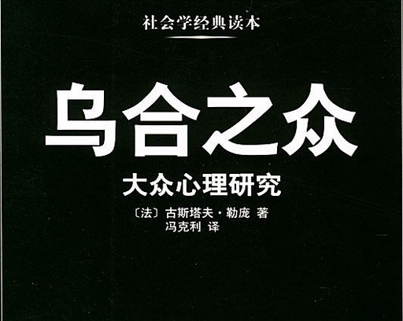

# 《乌合之众》读后感

最近看的这本书名叫乌合之众，讲的是大众心理研究，花了三天时间看完，总体来说，很多地方看不懂，因为本身比较偏理论。

但是其中还是有一些很有意思的地方，好在这些地方都是以故事为主我还能勉强看懂，我在这里记录如下。[toc]<!--more-->
<h1>集体心里</h1>
群体表现出来比较惊人的特点，这点体现在无论单个的人的性格和智商差异有多大，都会促使群体中的成员得到一种共性，也就是集体心理，这种心理会使他们的表现和孤立时的个体不同，这点尤其是在智商等等体现出来，就好比是一群完全不同的细胞，组成一个新的生命体，这个新的生命体与单个细胞完全不同。

哲学家赫伯特斯宾塞认为形成的群体的心理其表现为构成因素的总和和平均值，但事实并非如此，实际上，新物质的特性完全不同于构成它的那些物质，就像某些化学元素，化学中的碱和酸为例，反应后形成的一种全新物质，这种物质与碱和酸完全不同。
<h1>集体易受暗示和轻信</h1>
这里只有一个集体幻觉的例子。一艘护航舰寻找一场风暴中与他失散的巡洋舰，一个阳光灿烂的白天，已被执勤兵发现一艘遇难船只的信号并指给其他船员看。很多船员顺着信号看去，他们看到发出遇难信号的船，拖着一只载满了人的木筏。

但却不知道这其实是集体幻觉，船长上将放下一艘船去营救遇难者，然而接近目标的时候，官兵们才发现，所谓听到一大群活着的人伸着手，夹杂着很多混乱的声音和歇斯底里的哀求信号，实际上只是不过几根长满树叶的树枝，而且他们不得不承认刚才出现的那一幕是群体性的幻觉。

这个过程当中我们可以看到信号在群体中相互传递以至传染的过程，这似是而非的暗示，就能被所有官兵接受，从而产生集体幻觉。

除此之外，群体中出现这样荒诞的一幕，现实中存在的事情被无端歪曲而无关的幻觉中，笼罩了整个真相的原来本面。<strong>群体中并不需要很多人，几个人聚起就可以成为一个群体，即使群体中是很多，都是聪明人，但他们的聪明表现仍然脱离不了群体的特点。只要被群体同化，原本在他们每个人身上所表现出成熟的判断和敏锐的洞察力都会荡然无存</strong>。

此外，再有一个例子就是历史中的著名人物，如何拉克利特，释迦摩尼或者穆罕默德他们伟大的事迹和生平，我们真正能够了解多少，反而极有可能没有丝毫的了解。

这样说是因为他们伟大的事迹，对我们现在来说毫不相干，我们所关心的那些伟人，在大众神话中呈现出什么形象，打动群体心灵的神话中的英雄，而不是一时的真实英雄，就好比刚刚我们举出的集体幻觉的例子。
<h1>群体的想象力</h1>
这件事情非常有趣儿，因为我也想到了父母给我讲过的一些故事就是真实的以前演一些电影或者话剧的时候，对于一些反派的角色，当这些反派的角色扮演者走在大街上的时候，因为当时演得太过逼真，有些人竟然去打他们，或者是骂他们。

这就体现了群体的想象力，书中也写道，因为一些反面角色演得出神入化，可能导致在现实生活中，这些演员的实际扮演者，不得不提防那些仍然沉浸在戏剧里的观众们的义愤填膺式的疯狂报复，这我们不难理解，群体并不能区分虚幻和现实的不同，他们的心里一直都在被虚幻的东西所操控，而做出某些极端的事情。

群体的想象力的作用是多么强大呀，他经常被一些侵略者当作至高无上的权力来把握，也同时被这个国家这个阶级机器当作强大的威力来使唤。

在历史上，利用学习的想象力，产生巨大影响的事例屡见不鲜，尤其是一些重大的历史事件，如佛教，基督教和伊斯兰教的兴起，宗教改革，法国大革命，以及我们这个时代社会主义的崛起。

当然，那些<strong>时代的英雄，伟大政客，以及臭名昭著的独裁者，他们无一例外的很好利用的群体，群众想象力，这个强大的武器，把它变成巩固自己至高无上的权力的基础</strong>，<strong>拿破仑曾经在国会中说道，终止了旺代战争，是因为我改宗天主教，征服了埃及人，是因为我信了穆斯林，感召了意大利，是因为我信奉了教皇，当然，如果我想征服犹太人，我肯定会去重修所罗门的神庙</strong>，拿破仑就是这样一个自从亚历山大和凯撒以来最伟大的人，因为<strong>他终其一生都在考虑怎样去影响群众的想象力，怎样去把它变成自己手中的权力</strong>？无论是胜利还是失败，杀戮还是传教，演说还是战斗，至死不渝。
<h1>群体信仰所采取的宗教形式</h1>
这里不得不谈一下群体的信任，他有着盲目服从，残忍的偏执以及要求狂热的宣传等宗教感情特点，因此可以说，一切信念都具有宗教的形式，人们喜欢为自己建立一位神或者类似的东西，无论是不是盲目的。

比如受群体所拥戴的英雄，在这个群体看来，就是一个真正的神。就像拿破仑当年那样，一个比任何神都更频繁地受到崇拜，更轻松的把人置之于死地的神。即便是基督教的神或者异教徒的神，对处在他们掌握中的人，也从未有过如此绝对的统治。

探究这原因，我们会发现，一切宗教活动是<del>线条的</del>创立者之所以能够离主角皆因为他成功的激起了群众想入非非的感情，他们使群众在崇拜和服从中找到自己的幸福，随时准备为自己的偶像赴汤蹈火，这在任何时代均无例外，历史在健忘的人类世界中，总是不断的重复。德 库朗热，在论述罗马高卢人的杰作中指出，维持着罗马帝国的根本不是武力，而是它所激发出的一种虔诚的赞美之情，他这样写道，一种在民众中受到憎恶的统治形式，就能维持了五个世纪之久，世界上还不曾有过类似的现象，帝国的区区30个军团，如何能让一亿人俯首帖耳，这真是不可思议，他们服从的原因不是帝国的武力，皇帝是罗马伟业的人格化象征，他就像神一样，受到全体人民的一致崇拜，在他的疆域之内，即使最小的城镇，也有末代皇帝的祭坛，从当时的历史中你可以看到，在帝国的一端到另一端，到处都可以看到一种新的宗教的信息，他的神就是皇帝本人。在基督教之前，他们就建起了和里昂城附近的庙宇，相似的纪念奥古斯都皇帝的神殿。在60座城市所代表的整个高卢地区，祭祀是当地的首要任务，有统一的高度，城市选出，所以把这一切归因于畏惧和奴性是不可能的，没有哪一个民族能全都是努力的游戏，不可能是长达三个世纪的努力，这一点历史已经清楚的告诉了我们，所以崇拜君主的并不是那些廷臣，而是罗马自己<del>容易</del>，他们的不是他人，而是他们自己本身。
<h1>政治和社会制度</h1>
当想要找到影响群众的某种工具时，也只能从制度中找到，比如美国这个高度繁荣的民主制国家，依靠着民主制度得以发生而拥有同种制度的国家，比如西班牙的欧洲共和国，生活极其困顿，我们不得不承认一种制度，与国家的兴衰毫无关系，每个民族都有自己的性格，并且有着与其性格相配套的制度，而且<del>红</del>，毫无疑问的是基于残暴强行建起来的制度，最终带来的也只是残破动荡，而不会拥有理想之中的美好，因为制度只是意识形态上的形式，所以他也并不具有实体化的作用力，因为它本身不具备这种能力，群众头脑产生影响的只是外在的幻想和词语，并且这些词语依靠着他自身强大的荒诞性，引发了各种各样让人瞠目的现象。
<h1>群体的意见与信念中的教育</h1>
怎么才能收到专业教育的人的智力取得提高呢，对此泰纳先生说的就非常的出色。

一般来说，关键是形成于一个人的自然而然的切身体验中的，要强化观念的培养，就需要年轻人适合在工厂矿山、法庭、建筑工地还有医院等场景中间进行体验，获取大量具体的感官印象。他们应该与顾客，工人和其他劳动者在一起做事体验，不论他们的事情做得怎么样，只要采取这种同吃同住同做事的方式，他们就能这些从视觉，听觉，触觉，甚至味觉感受到各种细节，产生自己相应我深或浅的日志，年轻人在不知不觉中获得这些信息，心里总会有些想法，回去默默琢磨，就会产生新的思路，带着他们的大脑去开始新的组合，改进创新和发明。

法国的年轻人恰恰给他们最能出成果的年纪，阻隔了这些细节的接触，原因在于他们人生美好的7，8年，在时间都是被圈定在学校里，丧失了所有切身体验的机会，没有了这些不可或缺的学习因素，自然而然，他们对于世间的人和事，对于把握这些人和事的各种办法，就不可能有准确而鲜明的理解。

对于这点，我的理解是可以更早的出去实习去进行锻炼虽然说在书本上是系统的学习，然而在实际当中，实际工作中，可能我们只需要最常用，最基本知识的那少许。而且这样也更好的培养我们更快适应工作当中的场景和正确面对工作之后的一种心态。
<h1>群体意见的直接因素中的形象，词语和套话</h1>
政治家必须得善于使用换汤不换药的手段，恰当选择说服民众群体跟着他走。泰纳明确的指出，雅各宾党人，正是披着自由博爱的羊皮，干出了大屠杀的罪恶勾当，统治者驾驭<del>指导</del>这门艺术遇到的最大困难之一就是在同一个社会，同一个词，对于不同的社会阶层，往往有不同的含义，表面上看他们用词相同，其实他们说着不同含义的语言。

一旦群体对某些词语已经极度厌恶，而又因为特殊原因而无法改变这一事实，当时真正的政治家就会采取紧急措施，在不刺激群体的情况下变换说法，托克维尔在这方面是行家里手，用新名称代替那些，能够让群众想起不利形象的名称，因为它们的新鲜，能防止这种联想，地租变成了土地税，盐赋变成了盐税，徭役变成了间接摊派，如此等等。

时间是造成词语含义变化的主因，再联系到种族因素，同一时期，同一种族中组织不同的人使用的相同词语的含义也大相径庭，若非博闻强识之人，不可能准确理解这些，所以往往群众使用最多的那些字，在不同的民族中，有着最不相同的含义，例如在今天人们生活中频频出现的民主和社会主义，这两个词就属于这种情况。
<h1>群体意见的直接因素中的理性</h1>
群体从来不受理性的指引，引导人们走向文明的，正是幻觉引起的激情和愚蠢顽固。

理性基本撑不起什么作用，这些幻觉是支配着我们无意识力量的产物，所以是必不可少的，每个种族的精神成分当中，都携带着它命运的定律，并由于他的一种冲动不管这种冲动是否合理，都要服从这些定律，很多时候看起来好像各民族都受到一种神秘力量的控制，就好像是让橡果成长为橡树，或者让学生按照各自轨道运行的力量。

要想认识这种力量，就应该对着一个民族，整个进化过程进行研究，只研究这一过程中的某些事件是不够的，考虑这些事情，而忽略整个过程，我们就无法认识力量，只会错误，认为历史是有很多偶然事件组成的。

就好比一个加利利的木匠，他不可能变成一个持续2000年之久的神，更不能成为文明的基础，从阿拉伯沙漠走出来的人，征服希腊罗马的大部分地区，并建立起比亚历山大等领土更大的帝国，似乎也是天方夜谭，对于一个炮兵中尉来说，想在一个欧洲已经十分发达，各地都有着森严的等级的时代，政府很多国家和民族似乎不太可能。

所以理性最好的去处就是留给责任，我们没有必要坚持让他<del>通知人</del>，与其说理性，并不是所有文明的主要动力，倒不如说，即便有理性存在，感情，比如说尊严，自我牺牲等依然是文明的动力。
<h1>群体的领袖</h1>
群众领袖想要得到别人的绝对服从，就一定要有非常专制的权威，很多人发现，用不着任何后盾，他们的权威就可以轻而易举的让工人阶级中最暴躁的人对自己唯命是从，工时和比例，打工的开始和结束，全是他们的一句话。

现在由于政府甘心忍受别人的怀疑，让自己的力量越来越弱，所以这些领袖和鼓动家正在慢慢倾向于谋取政府的位置，由于这些新组织的暴动，所以群众的态度比政府统治时要温顺很多，如果由于某种突发事件，领袖退出了舞台，群众就会回归最开始那种一盘散沙的状态，比如说这次巴黎公共雇员的罢工，那两位领头的被抓起来以后，参与罢工的人马上一哄而散，<strong>在群众的灵魂当中，当奴才的愿望要远远超过对自由的渴望，他们已经习惯了服从，不管谁是主子，他们都会自觉的卑躬屈膝</strong>。
<h1>群体意见的多变</h1>
群众的观点越来越有变成政治最高准则的趋势，他甚至有时让国家之间形成盟友，比如最新的法国和俄国结盟，差不多就是群众运动所产生的，现在一个非常怪异的问题，就是人们看到君主们表示愿意接受采访，好像他们也想将自己对某个问题发表的观点交由大众去评审，在政治事件上，不能掺杂太多的情感因素，过去这样说可能还有点道理，可是当动荡不安的群众的盲目决定，越来越影响到政治，而他们往往又不考虑理性的影响，只受情绪的支配时，这样说还合适吗？

说到曾经起到引领作用的报业，就好像原来的政府一样，在群众力量面前，他也开始低下自己高贵的头颅，倾听群众的意见，当然它依然影响面很广，可是这只是因为他对群众众多的意见进行反应的缘故，报业既然现在变成了，只能给大家提供咨询的机构，他就不再尝试着让人们接受某种新看法了，在大众思想不断变化的过程中，他也开始人云亦云，考虑到竞争，他也别无选择，因为他不想丢失掉更多的读者，曾经那些稳定而在群众中颇有影响的报纸。

被我们的前辈当做智慧的传播者，现在已经不存在了，就是具有了鲜明的时代特征，过去看来最有意义的新闻被拼凑在各种幽默主题，社会趣闻以及金融谎言之间，现在没有哪一家报纸会出钱供养他的写稿人表达自己的观点，因为对于那些只知道消息，对那些别人经过认真思考所得出的结论，通通表示适宜的读者，这种看法几乎没有价值。在20年的时间里，戏剧评论家或者也会面临同样的命运。
<h1>名为犯罪群体的群体</h1>
他们非常同情和理解巴黎工人的处境，在阿巴彦那些人中，有人偶然了解到囚犯，已经口渴了整整一天，他当即火冒三丈，并想将该狱卒就地正法，但在犯人们的求情下，他并没有真正将其付诸行动，当临时法庭宣告一名犯人无罪释放之后，所有人包括卫兵和刽子手，都狂喜的为他鼓掌，并给予他最热烈的拥抱，看到了吗？这群屠杀者对犯人的同情心简直泛滥到了一定地步但是这种同情心并不会阻挡他们杀人的刀刃，在屠杀过程中，他们以一种持续的近乎病态的情绪围在尸体旁，载歌载舞，甚是体贴入微的为女士提供长凳，以免她们观看处置贵族时因劳累而减弱她们的欢乐，这些屠夫完全没有自己正在犯罪的自觉性，他们只觉得被一种特殊的正义氛围环绕，心中充满了满足感。

这场屠杀清晰的体现出了只在群体头脑中存在的那种简单幼稚的推理思维，在处决了1200到1500个人民公敌之后，突然有人提出更为荒谬的建议，我们为什么要在监狱里养着老年人乞丐和流浪汉呢？他们实在太浪费空间了，把他们全部杀掉吧，此提议一出，立即赢得广泛的支持。
<h1>刑事案件的陪审团</h1>
一个出色的律师，他的主要目标就是打动陪审团，从而为自己的委托人争取更大的利益，他们不会作过多的论证，并且只是进行一些十分简单的推理。企图通过这种方式向打动其他群体一样，打动陪审团一位，因为赢得了一场行刑事诉讼官司而声名远播的英国律师归纳出了以下几条行为准则。

在当庭辩护时，<strong>只要留心陪审团的反应，就一定能抓住最有利的机会，律师要好好锻炼自己的眼光，并以这些经验观察陪审团在听到每句话时的表情，从而理解了解自己所说的辩词是否有效果</strong>，首先要做到的是确认，确认有多少，陪审团已经被自己的辩词所打动，这并不需要花费太多时间，其次他应该着力打动那些犹豫不决的人，弄清楚他们不愿放过被告的原因，第二点则是律师工作中十分重要，却也微妙的地方，因为那些陪审员不仅仅是出于正义感来指控某个人，在这个指控背后，可能有着成千上万个理由。

对于律师来说，最重要的就是取得培训团的青睐，和他成功的得到了陪审员的认可，说明他即将说服那个陪审员，这时无论他举出任何证据，都是具有信服力的，为了反映上述观点，下面举出一段关于拉肖的报道中揭露的趣文。

我们都知道，拉肖在刑事诉讼的审判过程中，会一直将视线锁定在两三个值得他关注的，影响力强大但又异常顽固的陪审员身上，一般，他的目标就是让这些很难说服的陪审员赞同他的观点，但在一次外省的诉讼中，他花费了大量的时间，展现出了自己最精彩的口才，但仍然有一个陪审员不为他所动，那个陪审员排名第七，仅仅是坐在第二排椅子上的一个人，然后在接下来接近绝望的瞬间，他终于发现了触动该陪审员的方式，他停下了自己慷慨激昂的陈词，然后对法官大人说道，法官大人能否命人将前面的窗帘拉上第七陪审员，好像被阳光折磨得十分痛苦，第七评审员同志稍微有些脸红，还微笑着感谢了拉肖，并成功的被拉到了他所在的阵营。
