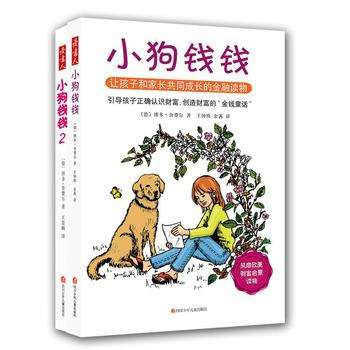

# 《小狗钱钱》读后感

就在看完没有回家的士兵这本书之后，我又看了这本名叫小狗钱钱的儿童读物。花了一天就看完了，因为本身比较好理解，页数又不多，字体很大。

总的来说，对我收获并不大，可能是因为先前看过了穷爸爸和富爸爸这本书。不过里面的一些东西还是很有意思，因为本身是针对儿童，所以我给出四颗星，毕竟我是成人了。

比方说它里面讲到72法则，还有一些好的习惯非常适合儿童，从小就开始培养，比方说一个叫做成功笔记本的习惯，去记录自己在某方面达成的成就，培养自己的自信心等等。下面我就开始一一讲解。[toc]<!--more-->
<h1>成功笔记本</h1>
这个笔记本用来去实现自己的目标中已经达成的事情，关于这些目标我做了哪些事情做成了？然后将这些已经完成的目标写在这个本子上。

这样每当我去翻这个本子的时候，我就会看到我为这个目标付出的诸多已经实现的努力。主要是培养孩子的自信心，甚至大一点，也是可以去做这样的事情的故事书中作者就提到其中一些大人也是这样去培养自己的信心。
<h1>目标存钱罐</h1>
这个目标存钱罐更多，给我一种感觉就是去储蓄为了一个目标进行存钱，故事的主人公，这个小女孩，她是为了可以在美国进行交换学生的项目，还有购买笔记本这两个目标而进行存钱。

不一定非要是存钱罐也可以是一些纸盒子等等故事的主人公，他就是用纸盒当做存钱罐并在上面写上笔记本还有留学交换这两个目标，把这两个目标写到存钱罐上，当有零钱或者自己打工赚的钱的时候就把钱存到里头。

而这不禁让我想到了目前支付宝或者是腾讯理财通里，你可以设置储蓄目标，它是以基金的形式去积累的。每个月或者每周以一种智能定投的方式去存钱，当然这本身也是一种理财的方式。
<h1>72法则</h1>
这个法则很有趣，而它主要有两个功能。

第一个是计算多少年之后，你的本金会翻一倍。计算方法就是使用72除以你的年收益率。这种方式计算的是以复利的形式得到的，就比方说年利率是16我无论存多少钱，四年之后，我的所有本金和利息将会翻番，比方说我存进去10万，年利率是16%，以这种拿到收益再进行存储的方式，那么四年之后就会有20万。

第二个是计算多少年后你的贷款会被偿还，这点我记不清了。除此之外，还有115法则，是计算多少年后，可以翻两番，用法如72法则，也是用115除以年利率。
<h1>
越努力越幸运</h1>
作者在书中以小孩子的口吻说道，那些复杂的事情都是会以简单的事情去做成的，但是以这种积少成多的方式完成，最后得到实现。或者那些困难的事情都会变成容易的事情，而慢慢得到实现。

故事的主人公在储蓄自己两个目标所需要的金钱这个过程中不仅自己去思考如何才能得到更多的收益，去找更多途径去，得到更多零花钱，无论是给邻居家照看小狗或者是和邻居成立这个投资委员会，他们都是在不断的思考，不断的想方法。

由于照顾的狗数量多了，那么也就需要在故派人手，虽然需要雇佣更多人手就是他的朋友们，但是也要考虑到这些朋友们是否擅长在这一点上，当然本身故事的作者为了简化这一点就假设他们都擅长照顾小狗，但是实际生活可能会比这更复杂。
<h1>投资的比例</h1>
书中也说道，我们不应该把所有的钱都用在与投资就一主人公这个小女孩为例，他每次存钱都会将一半的钱存在银行，然后再将百分之40用于去实现自己两个目标，剩下10%作为自己的零用钱。

成立投资委员会之后，由于基金的下跌，本认为不好的事情，又认为也是机会，这三个小孩，外加一个老太太本来认为应该再投入5000马克，去购买更多的基金份额但是考虑到也需要留下一些用于备用的现金反而只投资2500马克。同时也是考虑到这个基金还有下跌的风险，或者机会。

所以我们能看到在这样的过程中，资金的一个分配的一个比例，这是比较重要的，针对不同的人或者不同的年龄段来说，这个比例是不同的，当然在小狗钱钱这本书讲的比较浅一些，在其他的一些书中，这块儿讲的更详细，比方说聪明的投资者，这本书讲到，投资于股市当中的资金应该介于25%到75%之间。当然在实际当中肯定要不能这样考虑问题，需要结合自己的实际情况，即使有一些人说用一百减去你当前年龄作为投资股票的一个比例，但实际这也是不合理的，虽然年龄越小越低，承受风险的能力越大越强，但是这种计算比例的方法并没有考虑到实际人，他当前所处的一个环境，他的家庭背景等等工作环境等等，这些问题也是很重要的。

<audio style="display: none;" controls="controls"></audio>
