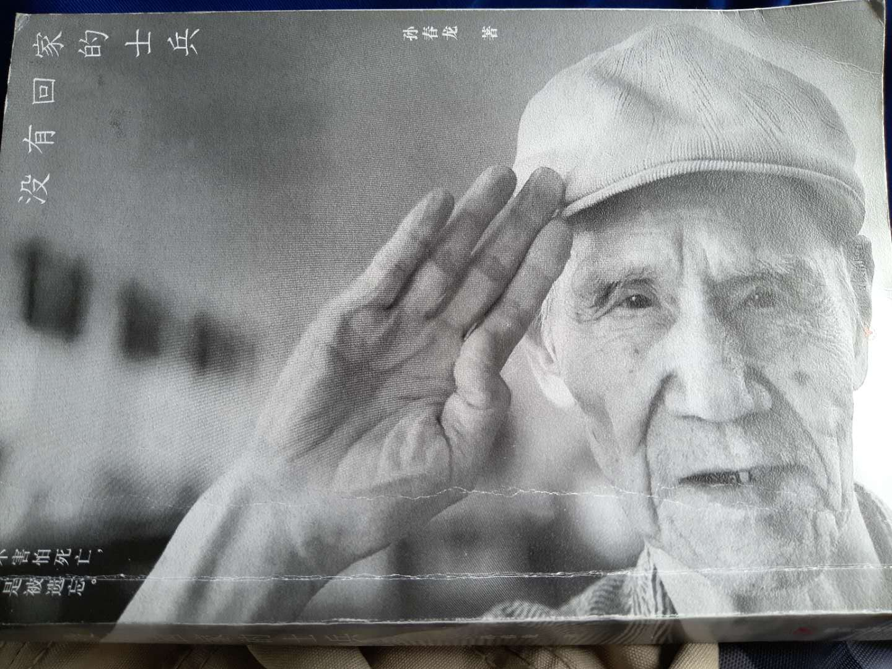
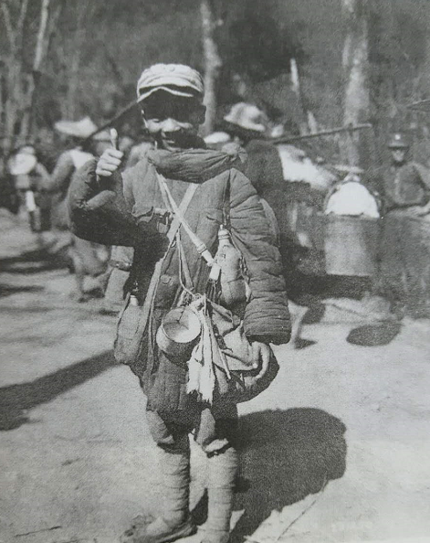

# 《没有回家的士兵》读后感

在喜马拉雅上听讲座，里面提到，美国的经济发展离不开战后美国强大的国运。现如今中国繁荣富强，国运昌盛，但这一切都是建立在上几代人的努力下的，用鲜血与泪水换来的，其实这些话对我而言，感触并不深，生下来就是太平盛世，安稳的生活压根想不到也不会去想那些兵荒马乱的时代，偶尔在电视上新闻里才能看到中东地方的混乱局势，哪能体会到爷爷那一辈是什么样的年代。

这些还是离我们太远，讲座里提到名为《没有回家的士兵》的一本书，在讲者的强烈推荐下当天就买来这本书，然后花了不到三天看完了。书中不成章节，都是以有关联度不高的小段故事为主。<!--more-->

感触最深的，即书封面那句：<strong>我们不害怕死亡，害怕而是被遗忘。</strong>

年纪轻轻就从军，为国征战近十载，都是在抗日杀敌，流血流泪，最终因为站错队伍沦为政治的牺牲品，文化大革命对在大陆的国民党家属进行迫害或者限制上学，遭人唾弃，无法找到工作养家糊口，甚至是长达二十多年的劳动改造等等。

他们同样是中华儿女，在人生中最宝贵的时间为保家卫国去抗日、抛头颅洒热血，有今天的美好生活，可谁又会想起他们当时呢？

在书开头的照片中，有一张照片。

这张照片的脚注是：李占宏（音Lee Chan-Hon）刚刚年满13岁，尽管已经在中国军队里服役两年，仍然是稚气十足，面对镜头做微笑状。1944年11月23日。

国民党抓壮丁时，不少都是在20~25岁的学生，正值青春年华，本应为大好前程在学校里学习，我记得故事中有一则是讲，在中学学校里讲演，希望有更多学生参与抗日，有些女学生被拒绝后竟然痛哭流涕，说到，都是中华儿女，为何女生就不行！

在看看自己，觉得羞愧难当。我想我们共同的祖国，国难面前，匹夫有责，无论老幼，看到日本人侵略占领自己国家的领土，对我国民烧杀抢掠无恶不作，我们还有什么理由不去保护祖国。但是这背后，是多少家庭的支离破碎，母亲看着自己的孩儿被抓壮丁带走，直到看不到了，孩儿却听到那撕心裂肺的哭喊声。

甚至，不少孩子在学校里，都没能给自己的父母说一声再见，就被国民党抓壮丁去了。

书中的故事我想大多是那一辈老人口述，他们大多是参与印度、缅甸战场。有一处记忆很深，在日本人穷凶极恶地追来时，前面是原始森林，已经没法再继续前进，剩下1500名伤兵和医务人员，宁为鬼雄，不做战俘，自焚而死。除过这1500人，剩下的都跑进了原始森林，毒蛇、蚂蟥、瘴气，毒虫，有一名士兵睡觉时，以为靠着一个树枝，没想到再也没有醒来，那其实是一条毒蛇，在他睡觉的时候缠住了他窒息而死。因为缺少补给，没有吃的，美军的精良装备，如大头皮鞋等都被吃到了肚子里，能吃的都吃完了，因为饥饿，不少人躺下就再也没醒来，最后为数不多的人走出了原始森林，看到了美军空投的补给，有的甚至因为太久没吃的，吃的太多反而噎死了。

不少人因为战争， 回不去自己的祖国，留在了缅甸娶妻生子，入赘穷苦人家。晚年也再也没有回到大陆，甚至因为缅甸政府，自己也害怕讲中文，自己的儿女也不会说。

书中后半部分，大多不仅是讲战争导致的家庭的分崩离析，更有这些老兵对大陆的思念之情，大部分因为钱的问题回不了家，更有一些经过志愿者的努力找到了家人，但是却不愿意回去，即使回去待了一阵，又回缅甸，因为对他们而言自己的父辈的地方就是家，然而，对于这些老兵自己的子女而言，因为在缅甸有了自己后来的家庭，他们于自己的子女就是家。

不少通过志愿者在大陆找到亲友的，真的是已经过了六七十年，他们甚至忘记了自己的名字，即使回到了大陆的家，父母业已离世，只能对着自己父母的坟头说话，恍如隔世，母亲送行似乎就在昨天，而今天，再回来，家里的老屋可能还在，父母却不在了，来大陆和父母的相见确实在坟头，合影留念。记得有讲到，一位老兵回到自己的故乡，在地上就是抓起一把土，塞到自己的嘴里，看到这里怎能不动容，这里怎么说都是生他养他的地方，不禁潸然泪下。

还在世的老兵，晚年的境遇非常苦惨，我还想起，前几年在路上走时，看到有乞丐在地上写到自己是国民党抗战老兵，或者是中国远征军，当时以为是骗子或者类似的，一般对这些乞丐都是不予理睬。到今天，我想到，这些很可能是真实的，而且看了这本书，我觉得不仅是自己，这个社会，这个让他们流过血的国家，就不应该让他们心寒。虽然成为政治牺牲品，但是他们心里却为此愧疚，认为自己是罪人，但我们知道，这不能怪他们。

其实，不少老兵最想要的不是救助给他们多少钱，而是一种精神需要，他们看到志愿者给他们送的抗日英雄这样的徽章，心里高兴地就像一个孩子，他们更想要的是国家、人民对他们的肯定，有一位中国远征军上访十几年，就是想要一个得到国家肯定的徽章，但当地政府却说，人家有是将军，你不是将军，他说：同样是为国流血，为什么只有将军才有！

2005年的时候，胡锦涛等国家领导人在迎接来大陆访问的老兵说道：“国民党抗日是在正面战场，而共产党是敌后战场”，这是对他们的肯定。2015年，纪念抗战胜利70周年阅兵，也安排国民党老兵受阅。

<strong>让浴血奋战保卫国家的将士晚年不再流泪，是一种国家道义。</strong>

对如今的我们来说，不能遗忘他们，更是一种道义。书中讲到，志愿者不是富有的人才能去捐助，普通人也可以，我记得之前电视上看过一位美国人，逢年过节就去拜访中国的抗日老兵，这点很感动。而作为国人的我来说，在这点上我是羞愧的。

缅甸有很多的日本人建立的纪念碑，而在这方面我们意识淡薄，作为战胜国却不如战败国如此铭记历史，这些老兵的遗骨还在缅甸，应该把他们接回来，建立更多的祠堂和纪念碑铭记。

今日，中国再次昂首，国运强盛，这离不开革命先辈，中国远征军，我将你们永远铭记！

<audio style="display: none;" controls="controls"></audio>

<audio style="display: none;" controls="controls"></audio>

<audio style="display: none;" controls="controls"></audio>

<audio style="display: none;" controls="controls"></audio>
