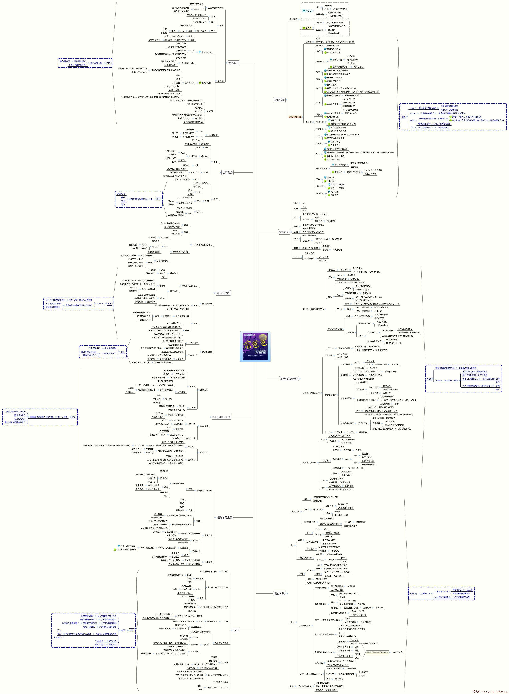

# 《穷爸爸富爸爸》读后感

这本书给我最大的感受是两点，我首先认识到一个图表，那就是资产以及负债表。再就是首先支付自己。<!--more-->

下面是我在网上找到的一个这本书的思维导图：

好了，开始正式来回顾我的读后感吧！

对于资产负债图表，拿到劳动性收入时，我们应该先满足自己的需要，这种需要，更多指的是投资资产，而不是支付负债，区分资产和负债同样重要。最后再去支付信用卡等其他的贷款，这样我们就有动力压力，去用自己的头脑，思考怎样才能去办成这个事情，怎样才能付得起剩余的负债。

跟我有同感的一点是，书中讲到了，如果没有钱，首先积累是一个办法，在积累劳动性收入的同时，我们还拥有的财富其实是自己的时间，以及自己的大脑，用时间去学习训练大脑。这也是作者对于财商教育的理解，谈一生当中不断的去参加相关的研讨班报名学习，以及去买相关的图书。这都是在投资，也是学习，学习一种新的思想致富的方法，开拓自己的视野与思路，从而训练自己的大脑。

此外，首先支付自己，给我了进一步的时间使用观念的思考，我觉得在很多地方都有共通之处，尤其是我们每一个人早上早起，有一句话说得好，一天之计在于晨，这个时间如果利用得好，将是一笔隐形的财富。就比方说我每天早上吃完饭之后都会读一个小时的书或者学习，或者类似的把它利用好，去做有意义的事情，做隐形的投资，而不是直接投入到工作中，在一点一滴去达成自己的事业，这里要区分清楚自己的职业工作和事业。

我们也知道四个象限，重要紧急，有一些重要，但不紧急的事情会影响到我们一生，甚至未来的时候，所以把你的时间投资用来学习，在早上最宝贵的时间，这部分时间不会被人影响，不会被人干扰，慢慢积累积累下这笔财产财富等到未来去收获它吧！

还有一个是关于投资方面的想法。我一直觉得看到股票在涨跌，总想去购买，有这种冲动，我看到他跌了，或者相比它最高点的时候也差很多，觉得目前可能是买入的最佳时机，但是想了想，你觉得它会涨，但是也有可能跌呀。我想的为什么是正确的？

作者说得好，投资可以关注一点，我想我对股票的理解是，我可以关注一只股票，但是要仔细看，善于分析，在出手前要分析它为什么会涨？或者为什么是跌，其实无论是涨跌，这些发生的过去也都会发生，可以分析一下过往的经历，这些历史数据在涨跌时候对应那个时间点发生的事件，新闻有哪些，我们可以参考去评估。如果单纯是感觉目前跌的很多而去购买，认为未来会涨，我觉得这不是一个很好的做法，更多的是要分析历史数据，以史为鉴。做更多的准备工作思考过去涨跌的缘由是什么？那么现在是否符合他过去涨跌的那个模式？

当然利用本身的信息，比方说更大的角度去思考这个问题，这支股票，那同行业的股票是否也是这样？同行业产业的状况是怎么样的？等等，这些问题我觉得都是有价值去思考的，而不是单纯的是通过它的走势来判断分析。

但是即使如此，我觉得我做的还不够多，怎么说呢？以上我说的大家都可以做到，如果大家都可以做到的话，大家可能都会这样想，不敢说都会，不过不少人可能会这样去分析去想，进而去买入或者卖出。

作者提到了内线交易，或者叫内幕交易，知道内情的人会更早地知道涨跌的信息会更容易捕获这样的信息，更好的获利，或者更早的抽身，结交这样的相关公司的朋友咨询，或许有助于你判断，但是可遇不可求。

其实我们每天都在做着选择，这个选择，你可以甚至想象成是股市交易当中的买入和卖出。然而在我们生活中选择的时候，我们会经过细致的思考，哪怕没有细致的思考，也经过了一番思考。

然而在股市交易当中，我们可能有时候是一时冲动，并没有仔细分析而去做交易，这样似乎并不是明智的，单纯凭着走势图去分析，没有错，但是我觉得可以结合更多的信息再进行考虑，就好比我们生活中的选择一样，这样做出的选择更有理由不是吗？

但是我想这些想法，大部分人都是会看新闻或者相关事件公司的报道去做选择，我觉得在这方面我还需要进一步的去理解，进一步的去想去思考，也没有更多的点可以去东西别人看不到的地方，只有发现这些，才能收获别人没有的东西。

<audio style="display: none;" controls="controls"></audio>

<audio style="display: none;" controls="controls"></audio>
